# 23642711_VoThiTuyetNgan_CABSYSTEM
**Bước 1: Hiểu nghiệp vụ**
1. Vấn đề hiện tại:
- Việc phân công tài xế chủ yếu được thực hiện thủ công
- Khách hàng khó theo dõi trạng thái chuyến đi 
- Thông tin thanh toán chưa được quản lý tập trung 
- Bộ phận vận hành gặp khó khăn khi muốn mở rộng hệ thống
2. Lý do xây dựng hệ thống mới:
- Tự động hóa quá trình tìm kiếm và phân công tài xế.
- Giúp khách hàng đặt xe và theo dõi chuyến đi dễ dàng.
- Quản lý tập trung khách hàng, tài xế, chuyến đi và thanh toán.
- Nâng cao khả năng mở rộng hệ thống khi nhu cầu tăng.
- Tăng tính ổn định, bảo mật và khả năng kiểm soát.
- Cho phép doanh nghiệp dễ dàng bổ sung dịch vụ, phương thức thanh toán và kênh thông báo mới trong tương lai.
3. Mục tiêu của hệ thống
- Xây dựng nền tảng đặt xe phục vụ khách hàng, tài xế và nhân viên vận hành.
- Tự động hóa quy trình từ đặt xe → tìm tài xế → thực hiện chuyến → tính cước → thanh toán → đánh giá.
- Cải thiện tốc độ và hiệu quả phân công tài xế.
- Quản lý tập trung dữ liệu và hỗ trợ báo cáo hoạt động kinh doanh.
- Đảm bảo hệ thống ổn định, bảo mật và có khả năng mở rộng.
- Tạo nền tảng linh hoạt để phát triển thêm các tính năng trong tương lai.
4. Ai sẽ tham gia và sử dụng hệ thống?
- Khách hàng: đặt xe, theo dõi chuyến, thanh toán và đánh giá.
- Tài xế: nhận chuyến, cập nhật trạng thái và thông tin vị trí.
- Nhân viên vận hành: quản lý khách hàng, tài xế, phương tiện và chuyến đi.
- Ban lãnh đạo: theo dõi báo cáo, doanh thu và hiệu quả hoạt động.
5. Hệ thống mới mang lại giá trị kinh doanh gì?
- Giảm chi phí và thời gian vận hành nhờ tự động hóa.
- Tăng doanh thu nhờ phục vụ được nhiều khách hàng hơn.
- Nâng cao trải nghiệm khách hàng thông qua đặt xe và theo dõi chuyến theo thời gian thực.
- Tăng hiệu quả sử dụng tài xế nhờ cơ chế tìm và ưu tiên tài xế phù hợp.
- Giúp doanh nghiệp quản lý và ra quyết định tốt hơn nhờ dữ liệu và báo cáo.
- Tạo nền tảng có thể mở rộng quy mô và phát triển dịch vụ mới trong tương lai.

**Bước 2: Xác định stakeholder trong hệ thống**

|        Stakeholder      |                                                       Vai trò                                                                                |
|-------------------------|----------------------------------------------------------------------------------------------------------------------------------------------|
| Khách hàng              | Đăng ký/đăng nhập, quản lý thông tin cá nhân, đặt xe, theo dõi chuyến đi, thanh toán, xem lịch sử và đánh giá tài xế.                        |
| Tài xế                  | Quản lý hồ sơ và phương tiện, cập nhật trạng thái hoạt động, nhận/từ chối chuyến, cập nhật trạng thái chuyến và vị trí.                      | 
| Nhân viên vận hành      | Quản lý khách hàng, tài xế, phương tiện và chuyến đi; theo dõi chuyến đang diễn ra; xử lý các trường hợp chuyến bị lỗi và tra cứu giao dịch. | 
| Ban lãnh đạo            | Theo dõi báo cáo về số lượng chuyến, doanh thu, tỷ lệ hoàn thành, tỷ lệ hủy và hiệu quả hoạt động của tài xế; đưa ra quyết định quản lý.     |
| Nhà cung cấp thanh toán | Xử lý các giao dịch thanh toán trực tuyến.                                                                                                   |
| Nhà cung cấp thông báo  | Cung cấp các kênh gửi thông báo đến khách hàng và tài xế, đồng thời hỗ trợ mở rộng thêm các kênh trong tương lai.                            |

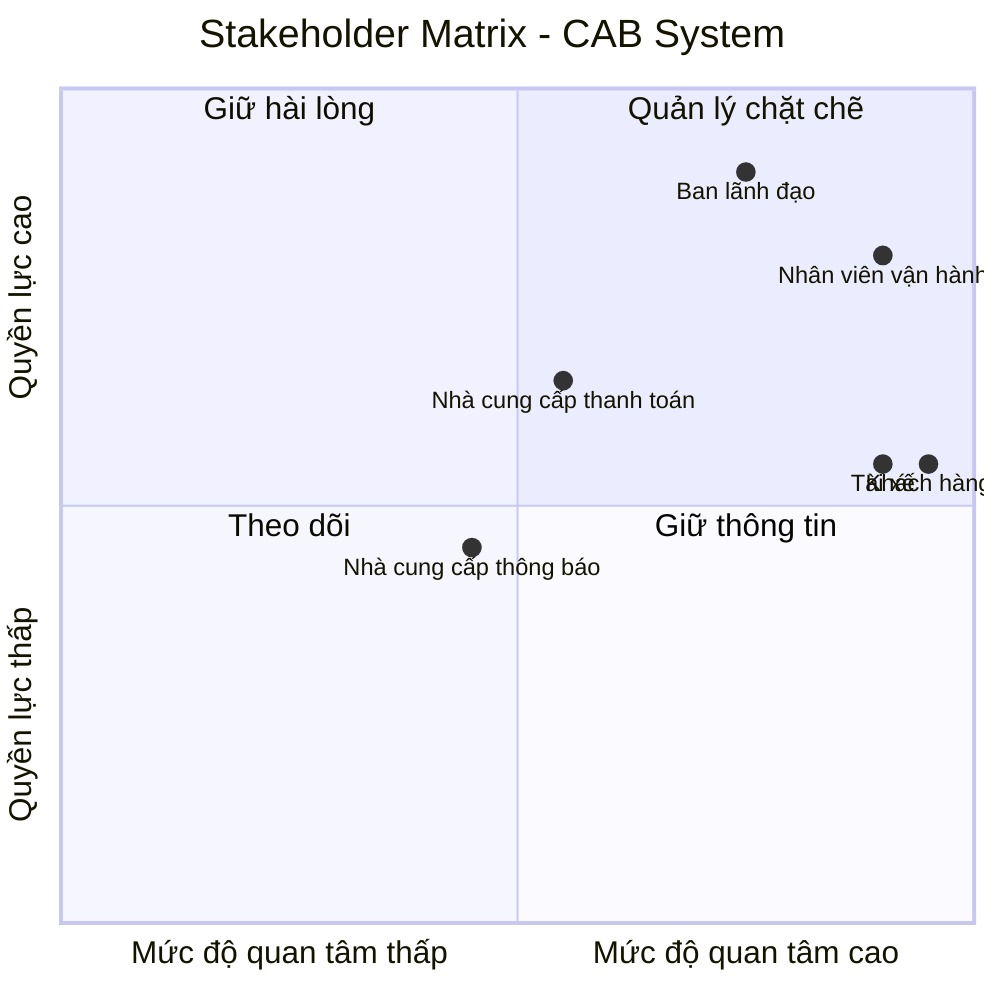
``` mermaid
quadrantChart
    title Stakeholder Matrix - CAB System
    x-axis "Mức độ quan tâm thấp" --> "Mức độ quan tâm cao"
    y-axis "Quyền lực thấp" --> "Quyền lực cao"

    quadrant-1 "Quản lý chặt chẽ"
    quadrant-2 "Giữ hài lòng"
    quadrant-3 "Theo dõi"
    quadrant-4 "Giữ thông tin"

    "Ban lãnh đạo": [0.75, 0.90]
    "Nhân viên vận hành": [0.90, 0.80]
    "Khách hàng": [0.95, 0.55]
    "Tài xế": [0.90, 0.55]
    "Nhà cung cấp thanh toán": [0.55, 0.65]
    "Nhà cung cấp thông báo": [0.45, 0.45]
``` 

**Bước 3: Mục đích của nghiệp vụ**
1. Tối ưu hóa và tự động hóa quy trình vận hành

Tự động hóa luồng phân công: Loại bỏ việc phân công thủ công từ tổng đài bằng cơ chế tự động tìm và ưu tiên tài xế phù hợp dựa trên vị trí GPS, loại xe và trạng thái sẵn sàng.

Tự động chuyển tiếp yêu cầu: Tự động luôn chuyển chuyến đi sang tài xế tiếp theo nếu tài xế đầu tiên từ chối hoặc không phản hồi, giúp khách hàng không phải tạo lại yêu cầu.

Rút ngắn thời gian chờ: Giảm tối đa thời gian chờ xe (ETA) của khách hàng nhờ cơ chế ưu tiên tài xế gần nhất.

2. Nâng cao trải nghiệm người dùng và linh hoạt thanh toán

Theo dõi thời gian thực: Cho phép khách hàng theo dõi vị trí tài xế, hành trình di chuyển và thời gian dự kiến đến ngay trên ứng dụng.

Đa dạng phương thức thanh toán: Hỗ trợ linh hoạt cả Thanh toán tiền mặt (trả trực tiếp cho tài xế) và Thanh toán điện tử / Chuyển khoản (tích hợp cổng thanh toán bên ngoài an toàn, không lưu trữ dữ liệu thẻ nhạy cảm).

Thông báo tức thời: Cung cấp hệ thống thông báo đa kênh (App Push, SMS, Email) ở các mốc quan trọng: nhận chuyến, tài xế đến, hoàn thành và kết quả thanh toán.

Đánh giá dịch vụ: Thu thập phản hồi và đánh giá từ khách hàng sau mỗi chuyến đi để nâng cao chất lượng tài xế.

3. Đảm bảo hiệu năng cao và chịu tải thời điểm nhu cầu tăng cao

Chịu tải cao đồng thời: Đảm bảo hệ thống hoạt động ổn định, mượt mà ngay cả khi có số lượng lớn khách hàng và tài xế cùng truy cập vào các khung giờ cao điểm (giờ tan tầm, thời tiết xấu, lễ tết).

Kiến trúc độc lập (Decoupled Architecture): Cách ly rủi ro để khi xảy ra sự cố ở các chức năng phụ như thanh toán hay thông báo thì luồng đặt xe cốt lõi vẫn hoạt động bình thường.

Mở rộng linh hoạt trong tương lai: Tạo tiền đề kỹ thuật để dễ dàng bổ sung thêm loại hình dịch vụ mới, phương thức thanh toán mới hoặc nhà cung cấp thông báo mới mà không phải xây dựng lại toàn bộ hệ thống.

4. Quản lý tập trung và hỗ trợ ra quyết định kinh doanh

Tập trung dữ liệu master: Quản lý tập trung toàn bộ thông tin khách hàng, tài xế, phương tiện, chuyến đi và lịch sử giao dịch trên một giao diện quản trị duy nhất.

Báo cáo và đo lường: Cung cấp cho Ban lãnh đạo hệ thống báo cáo chuyên sâu về doanh thu, tổng số chuyến, tỷ lệ hoàn thành, tỷ lệ hủy chuyến và hiệu suất hoạt động của tài xế.

Bảo mật và truy vết: Phân quyền truy cập theo vai trò (RBAC) để kiểm soát các thao tác nhạy cảm của nhân viên vận hành, đồng thời ghi nhận vết hệ thống (Audit Logs) phục vụ tra cứu khi xảy ra sự cố.

**Bước 4: Xác định phạm vi cần làm cho dự án trong 7 tuần**

**4.1. Phạm vi thực hiện**
a. Xác thực và quản lý người dùng (Authentication):
- Đăng ký, đăng nhập, đăng xuất.
- Xác thực người dùng.
- Phân quyền theo vai trò.

b. Hệ thống quản lý khách hàng:
- Quản lý thông tin khách hàng.
- Đặt xe.
- Theo dõi chuyến đi.
- Xem lịch sử chuyến đi.
- Đánh giá tài xế.

c. Hệ thống quản lý tài xế:
- Quản lý thông tin tài xế và phương tiện.
- Cập nhật trạng thái sẵn sàng.
- Nhận hoặc từ chối chuyến.
- Cập nhật trạng thái chuyến đi.

d. Hệ thống quản lý đặt xe và chuyến đi:
- Tiếp nhận yêu cầu đặt xe.
- Tìm và phân công tài xế phù hợp.
- Theo dõi trạng thái chuyến.
- Xử lý trường hợp tài xế từ chối hoặc không phản hồi.

e. Hệ thống tính cước và thanh toán:
- Tính số tiền chuyến đi.
- Hỗ trợ thanh toán tiền mặt.
- Hỗ trợ thanh toán điện tử thông qua nhà cung cấp bên ngoài.

f. Hệ thống thông báo:
- Thông báo các trạng thái chính của chuyến đi cho khách hàng và tài xế.

g. Hệ thống quản lý vận hành:
- Nhân viên vận hành quản lý khách hàng, tài xế, phương tiện và chuyến đi.
- Theo dõi và hỗ trợ xử lý các chuyến gặp sự cố.

**4.2. Ngoài phạm vi**
- AI/ML và các chức năng dự đoán nâng cao.
- Tính giá động.
- Khuyến mãi, tích điểm và chương trình thành viên.
- Phân tích dữ liệu nâng cao.
- Mở rộng nhiều loại hình dịch vụ.

### **4.3. Luồng cốt lõi trong 7 tuần**

| **Tuần**   | **Nội dung thực hiện**                                       |
| ---------- | ------------------------------------------------------------ |
| **Tuần 1** | Phân tích yêu cầu, xác định phạm vi và stakeholder           |
| **Tuần 2** | Phân tích nghiệp vụ, xác định quy trình và yêu cầu chức năng |
| **Tuần 3** | Thiết kế hệ thống và cơ sở dữ liệu                           |
| **Tuần 4** | Xây dựng module xác thực & quản lý người dùng                |
| **Tuần 5** | Xây dựng module quản lý khách hàng, tài xế & đặt xe          |
| **Tuần 6** | Xây dựng module chuyến đi, thanh toán & thông báo            |
| **Tuần 7** | Kiểm thử, sửa lỗi, hoàn thiện và triển khai hệ thống         |

**Bước 5: Chuyển các yêu cầu đó thành yêu cầu nghiệp vụ**

| **STT** | **Giai đoạn**      | **Quy trình nghiệp vụ**   | **Bước thực hiện**                                                         | **Tác nhân**                                | **Module hệ thống**    | **Thực thể dữ liệu**           |
| ------: | ------------------ | ------------------------- | -------------------------------------------------------------------------- | ------------------------------------------- | ---------------------- | ------------------------------ |
|       1 | Xác thực           | Đăng ký tài khoản         | Nhập thông tin → Kiểm tra → Tạo tài khoản                                  | Khách hàng, Tài xế                          | Xác thực & người dùng  | Người dùng                     |
|       2 | Xác thực           | Đăng nhập                 | Nhập tài khoản → Xác thực → Đăng nhập                                      | Khách hàng, Tài xế, NV vận hành             | Xác thực & người dùng  | Người dùng                     |
|       3 | Quản lý khách hàng | Cập nhật thông tin        | Xem → Chỉnh sửa → Lưu thông tin                                            | Khách hàng                                  | Quản lý khách hàng     | Khách hàng                     |
|       4 | Quản lý tài xế     | Quản lý tài xế            | Tạo/Cập nhật hồ sơ → Cập nhật phương tiện → Cập nhật trạng thái            | NV vận hành, Tài xế                         | Quản lý tài xế         | Tài xế, Phương tiện            |
|       5 | Đặt xe             | Tạo yêu cầu đặt xe        | Nhập điểm đón, điểm đến, loại xe → Gửi yêu cầu                             | Khách hàng                                  | Đặt xe                 | Yêu cầu đặt xe                 |
|       6 | Đặt xe             | Tìm tài xế                | Nhận yêu cầu → Tìm tài xế phù hợp → Ưu tiên tài xế gần                     | Hệ thống                                    | Phân công tài xế       | Yêu cầu đặt xe, Tài xế, Vị trí |
|       7 | Đặt xe             | Phân công tài xế          | Gửi yêu cầu → Tài xế nhận/từ chối → Tìm tài xế tiếp theo                   | Hệ thống, Tài xế                            | Phân công tài xế       | Chuyến đi, Tài xế              |
|       8 | Đặt xe             | Thông báo kết quả         | Tài xế nhận → Thông báo khách hàng / Không tìm được → Thông báo khách hàng | Hệ thống, Khách hàng                        | Thông báo              | Thông báo                      |
|       9 | Thực hiện chuyến   | Nhận chuyến               | Nhận thông báo → Xem thông tin → Chấp nhận/Từ chối                         | Tài xế                                      | Quản lý chuyến đi      | Chuyến đi, Tài xế              |
|      10 | Thực hiện chuyến   | Theo dõi chuyến           | Xem vị trí tài xế → Theo dõi trạng thái → Cập nhật thời gian đến           | Khách hàng                                  | Quản lý chuyến đi      | Chuyến đi, Vị trí              |
|      11 | Thực hiện chuyến   | Cập nhật trạng thái       | Đến điểm đón → Đón khách → Đang di chuyển → Hoàn thành                     | Tài xế                                      | Quản lý chuyến đi      | Chuyến đi                      |
|      12 | Vận hành           | Giám sát chuyến           | Xem chuyến đang diễn ra → Kiểm tra trạng thái → Hỗ trợ xử lý lỗi           | NV vận hành                                 | Quản lý vận hành       | Chuyến đi, Tài xế              |
|      13 | Thanh toán         | Tính cước                 | Hoàn thành chuyến → Xác định số tiền phải trả                              | Hệ thống                                    | Tính cước & thanh toán | Chuyến đi, Cước                |
|      14 | Thanh toán         | Thanh toán                | Chọn tiền mặt/điện tử → Thực hiện thanh toán → Ghi nhận kết quả            | Khách hàng, Tài xế, Nhà cung cấp thanh toán | Thanh toán             | Giao dịch                      |
|      15 | Thanh toán         | Xử lý thanh toán thất bại | Giao dịch thất bại → Thông báo → Thực hiện thanh toán lại                  | Khách hàng, Hệ thống                        | Thanh toán             | Giao dịch                      |
|      16 | Thông báo          | Gửi thông báo             | Phát sinh sự kiện → Xác định người nhận → Gửi thông báo                    | Hệ thống, KH, Tài xế                        | Thông báo              | Thông báo                      |
|      17 | Sau chuyến         | Lịch sử & đánh giá        | Hoàn thành chuyến → Xem lịch sử → Đánh giá tài xế                          | Khách hàng                                  | Lịch sử & đánh giá     | Chuyến đi, Đánh giá            |
|      18 | Báo cáo            | Báo cáo hoạt động         | Tổng hợp dữ liệu → Thống kê chuyến, doanh thu → Xem báo cáo                | NV vận hành, Ban lãnh đạo                   | Báo cáo & quản lý      | Chuyến đi, Giao dịch, Báo cáo  |

## **Bước 6: Phân Rã Chi Tiết Yêu Cầu Chức Năng (Functional Requirements Breakdown)**
| STT | Nhóm chức năng     | Yêu cầu chức năng                                   | Tác nhân                            |
| --: | ------------------ | --------------------------------------------------- | ----------------------------------- |
|   1 | Xác thực           | Đăng ký tài khoản                                   | Khách hàng, Tài xế                  |
|   2 | Xác thực           | Đăng nhập hệ thống                                  | Khách hàng, Tài xế, NV vận hành     |
|   3 | Xác thực           | Đăng xuất hệ thống                                  | Khách hàng, Tài xế, NV vận hành     |
|   4 | Xác thực           | Xác thực và phân quyền người dùng theo vai trò      | Hệ thống                            |
|   5 | Quản lý khách hàng | Xem và cập nhật thông tin cá nhân                   | Khách hàng                          |
|   6 | Quản lý khách hàng | Tạo yêu cầu đặt xe                                  | Khách hàng                          |
|   7 | Quản lý khách hàng | Theo dõi trạng thái chuyến đi                       | Khách hàng                          |
|   8 | Quản lý khách hàng | Xem lịch sử chuyến đi và đánh giá tài xế            | Khách hàng                          |
|   9 | Quản lý tài xế     | Xem và cập nhật hồ sơ tài xế                        | Tài xế, NV vận hành                 |
|  10 | Quản lý tài xế     | Quản lý thông tin phương tiện                       | Tài xế, NV vận hành                 |
|  11 | Quản lý tài xế     | Cập nhật trạng thái sẵn sàng                        | Tài xế                              |
|  12 | Quản lý tài xế     | Nhận chuyến                                         | Tài xế                              |
|  13 | Quản lý tài xế     | Từ chối chuyến                                      | Tài xế                              |
|  14 | Quản lý chuyến đi  | Tiếp nhận và xử lý yêu cầu đặt xe                   | Hệ thống                            |
|  15 | Quản lý chuyến đi  | Tìm kiếm và phân công tài xế phù hợp                | Hệ thống                            |
|  16 | Quản lý chuyến đi  | Xử lý trường hợp tài xế không phản hồi hoặc từ chối | Hệ thống                            |
|  17 | Quản lý chuyến đi  | Cập nhật và theo dõi trạng thái, vị trí chuyến đi   | Tài xế, Hệ thống                    |
|  18 | Quản lý vận hành   | Theo dõi và quản lý các chuyến đang diễn ra         | NV vận hành                         |
|  19 | Quản lý vận hành   | Hỗ trợ xử lý chuyến đi gặp sự cố                    | NV vận hành                         |
|  20 | Quản lý vận hành   | Tra cứu thông tin giao dịch                         | NV vận hành                         |
|  21 | Tính cước          | Tính cước chuyến đi                                 | Hệ thống                            |
|  22 | Thanh toán         | Lựa chọn và thực hiện thanh toán                    | Khách hàng, Tài xế                  |
|  23 | Thanh toán         | Xử lý và ghi nhận kết quả thanh toán                | Hệ thống, Nhà cung cấp thanh toán   |
|  24 | Thanh toán         | Xử lý giao dịch thất bại và thanh toán lại          | Hệ thống, Khách hàng                |
|  25 | Thông báo          | Gửi thông báo về trạng thái chuyến đi và thanh toán | Hệ thống, Nhà cung cấp thông báo    |
|  26 | Báo cáo            | Tổng hợp, thống kê và xem báo cáo hoạt động         | Hệ thống, NV vận hành, Ban lãnh đạo |

# Bước 7: Use case tổng quát

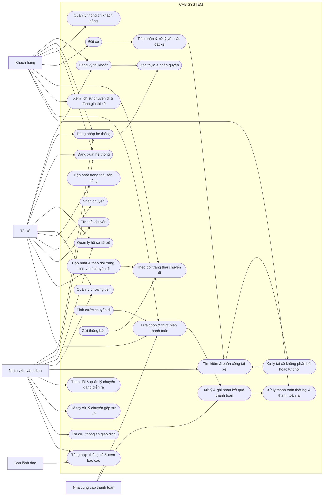
```mermaid
flowchart LR
    KH["Khách hàng"]
    TX["Tài xế"]
    NV["Nhân viên vận hành"]
    LD["Ban lãnh đạo"]
    TT["Nhà cung cấp thanh toán"]

    subgraph CAB["CAB SYSTEM"]
        UC1(["Đăng ký tài khoản"])
        UC2(["Đăng nhập hệ thống"])
        UC3(["Đăng xuất hệ thống"])
        UC4(["Xác thực & phân quyền"])

        UC5(["Quản lý thông tin khách hàng"])
        UC6(["Đặt xe"])
        UC7(["Theo dõi trạng thái chuyến đi"])
        UC8(["Xem lịch sử chuyến đi & đánh giá tài xế"])

        UC9(["Quản lý hồ sơ tài xế"])
        UC10(["Quản lý phương tiện"])
        UC11(["Cập nhật trạng thái sẵn sàng"])
        UC12(["Nhận chuyến"])
        UC13(["Từ chối chuyến"])

        UC14(["Tiếp nhận & xử lý yêu cầu đặt xe"])
        UC15(["Tìm kiếm & phân công tài xế"])
        UC16(["Xử lý tài xế không phản hồi hoặc từ chối"])
        UC17(["Cập nhật & theo dõi trạng thái, vị trí chuyến đi"])

        UC18(["Theo dõi & quản lý chuyến đang diễn ra"])
        UC19(["Hỗ trợ xử lý chuyến gặp sự cố"])
        UC20(["Tra cứu thông tin giao dịch"])

        UC21(["Tính cước chuyến đi"])
        UC22(["Lựa chọn & thực hiện thanh toán"])
        UC23(["Xử lý & ghi nhận kết quả thanh toán"])
        UC24(["Xử lý thanh toán thất bại & thanh toán lại"])

        UC25(["Gửi thông báo"])

        UC26(["Tổng hợp, thống kê & xem báo cáo"])
    end

    KH --> UC1
    KH --> UC2
    KH --> UC3
    KH --> UC5
    KH --> UC6
    KH --> UC7
    KH --> UC8
    KH --> UC22
    KH --> UC24

    TX --> UC1
    TX --> UC2
    TX --> UC3
    TX --> UC9
    TX --> UC10
    TX --> UC11
    TX --> UC12
    TX --> UC13
    TX --> UC17
    TX --> UC22

    NV --> UC2
    NV --> UC3
    NV --> UC9
    NV --> UC10
    NV --> UC15
    NV --> UC18
    NV --> UC19
    NV --> UC20
    NV --> UC26

    LD --> UC26

    TT --> UC22
    TT --> UC23

    UC1 --> UC4
    UC2 --> UC4
    UC6 --> UC14
    UC14 --> UC15
    UC15 --> UC16
    UC16 --> UC15
    UC17 --> UC7
    UC21 --> UC22
    UC22 --> UC23
    UC23 --> UC24
    UC25 --> UC7
```

# Bước 8: Đặc tả Use Case

## 1. Đặc tả Use Case Đăng ký tài khoản

| | |
|---|---|
| **Tên use case:** | **Đăng ký tài khoản** |
| **Actor:** | Khách hàng, Tài xế |
| **Mô tả:** | Cho phép khách hàng hoặc tài xế tạo tài khoản mới để sử dụng hệ thống. |
| **Tiền điều kiện (Precondition):** | Người dùng chưa có tài khoản trên hệ thống. |
| **Hậu điều kiện (Postcondition):** | Tài khoản được tạo thành công và thông tin được lưu vào hệ thống. |
| **Luồng sự kiện chính (Basic flow)** | |
| **Actor: Người dùng** | **Hệ thống** |
| 1. Chọn chức năng Đăng ký tài khoản. | 2. Hiển thị giao diện đăng ký. |
| 3. Nhập thông tin đăng ký. | 4. Kiểm tra tính hợp lệ của thông tin. |
| 5. Nhấn Đăng ký. | 6. Kiểm tra tài khoản đã tồn tại hay chưa. |
| | 7. Tạo tài khoản và thông báo đăng ký thành công. |
| **Luồng sự kiện thay thế (Alternate flow)** | |
| 3.1 Nếu thông tin không hợp lệ, hệ thống thông báo lỗi và yêu cầu nhập lại. | |
| 6.1 Nếu tài khoản đã tồn tại, hệ thống thông báo tài khoản đã tồn tại và yêu cầu đăng ký lại. | |

## 2. Đặc tả Use Case Đăng nhập hệ thống

| | |
|---|---|
| **Tên use case:** | **Đăng nhập hệ thống** |
| **Actor:** | Khách hàng, Tài xế, Nhân viên vận hành |
| **Mô tả:** | Cho phép người dùng đăng nhập vào hệ thống bằng thông tin tài khoản đã đăng ký. |
| **Tiền điều kiện (Precondition):** | Người dùng đã có tài khoản hợp lệ. |
| **Hậu điều kiện (Postcondition):** | Người dùng đăng nhập thành công và được chuyển đến giao diện phù hợp với vai trò. |
| **Luồng sự kiện chính (Basic flow)** | |
| **Actor: Người dùng** | **Hệ thống** |
| 1. Chọn chức năng Đăng nhập. | 2. Hiển thị giao diện đăng nhập. |
| 3. Nhập tên đăng nhập và mật khẩu. | 4. Kiểm tra thông tin đăng nhập. |
| 5. Nhấn Đăng nhập. | 6. Xác thực tài khoản và phân quyền người dùng. |
| | 7. Cho phép truy cập hệ thống theo vai trò. |
| **Luồng sự kiện thay thế (Alternate flow)** | |
| 4.1 Nếu thông tin đăng nhập không chính xác, hệ thống thông báo lỗi và yêu cầu nhập lại. | |
| 6.1 Nếu tài khoản không có quyền truy cập, hệ thống thông báo không thể truy cập chức năng. | |

## 3. Đặc tả Use Case Đăng xuất hệ thống

| | |
|---|---|
| **Tên use case:** | **Đăng xuất hệ thống** |
| **Actor:** | Khách hàng, Tài xế, Nhân viên vận hành |
| **Mô tả:** | Cho phép người dùng kết thúc phiên làm việc trên hệ thống. |
| **Tiền điều kiện (Precondition):** | Người dùng đã đăng nhập hệ thống. |
| **Hậu điều kiện (Postcondition):** | Phiên đăng nhập được kết thúc và người dùng được đưa về màn hình đăng nhập. |
| **Luồng sự kiện chính (Basic flow)** | |
| **Actor: Người dùng** | **Hệ thống** |
| 1. Chọn chức năng Đăng xuất. | 2. Hiển thị yêu cầu xác nhận đăng xuất. |
| 3. Xác nhận đăng xuất. | 4. Kết thúc phiên đăng nhập. |
| | 5. Chuyển về giao diện đăng nhập. |
| **Luồng sự kiện thay thế (Alternate flow)** | |
| 3.1 Người dùng chọn Hủy, hệ thống giữ nguyên phiên đăng nhập và quay lại giao diện hiện tại. | |

## 4. Đặc tả Use Case Xác thực và phân quyền người dùng theo vai trò

| | |
|---|---|
| **Tên use case:** | **Xác thực và phân quyền người dùng theo vai trò** |
| **Actor:** | Hệ thống |
| **Mô tả:** | Hệ thống xác thực tài khoản và xác định quyền truy cập dựa trên vai trò của người dùng. |
| **Tiền điều kiện (Precondition):** | Người dùng đã cung cấp thông tin tài khoản hợp lệ. |
| **Hậu điều kiện (Postcondition):** | Người dùng được xác định đúng vai trò và quyền truy cập. |
| **Luồng sự kiện chính (Basic flow)** | |
| **Actor: Hệ thống** | **Hệ thống** |
| 1. Tiếp nhận thông tin tài khoản. | 2. Kiểm tra thông tin tài khoản. |
| | 3. Xác định vai trò người dùng. |
| | 4. Cấp quyền truy cập tương ứng. |
| **Luồng sự kiện thay thế (Alternate flow)** | |
| 2.1 Nếu thông tin tài khoản không hợp lệ, hệ thống từ chối xác thực. | |
| 4.1 Nếu người dùng không có quyền truy cập chức năng, hệ thống từ chối truy cập. | |

## 5. Đặc tả Use Case Quản lý thông tin khách hàng

| | |
|---|---|
| **Tên use case:** | **Quản lý thông tin khách hàng** |
| **Actor:** | Khách hàng |
| **Mô tả:** | Cho phép khách hàng xem và cập nhật thông tin cá nhân. |
| **Tiền điều kiện (Precondition):** | Khách hàng đã đăng nhập. |
| **Hậu điều kiện (Postcondition):** | Thông tin cá nhân được cập nhật thành công nếu có thay đổi. |
| **Luồng sự kiện chính (Basic flow)** | |
| **Actor: Khách hàng** | **Hệ thống** |
| 1. Chọn chức năng Thông tin cá nhân. | 2. Hiển thị thông tin khách hàng. |
| 3. Chọn cập nhật thông tin. | 4. Hiển thị biểu mẫu cập nhật. |
| 5. Nhập thông tin mới và nhấn Lưu. | 6. Kiểm tra thông tin cập nhật. |
| | 7. Lưu thông tin và thông báo cập nhật thành công. |
| **Luồng sự kiện thay thế (Alternate flow)** | |
| 6.1 Nếu thông tin không hợp lệ, hệ thống thông báo lỗi và yêu cầu nhập lại. | |
| 5.1 Khách hàng không lưu thay đổi, hệ thống giữ nguyên thông tin hiện tại. | |

## 6. Đặc tả Use Case Đặt xe

| | |
|---|---|
| **Tên use case:** | **Đặt xe** |
| **Actor:** | Khách hàng |
| **Mô tả:** | Cho phép khách hàng tạo yêu cầu chuyến đi bằng cách nhập thông tin chuyến xe và lựa chọn loại xe. |
| **Tiền điều kiện (Precondition):** | Khách hàng đã đăng nhập và không có chuyến đang thực hiện. |
| **Hậu điều kiện (Postcondition):** | Yêu cầu đặt xe được tạo thành công. |
| **Luồng sự kiện chính (Basic flow)** | |
| **Actor: Khách hàng** | **Hệ thống** |
| 1. Chọn chức năng Đặt xe. | 2. Hiển thị giao diện đặt xe. |
| 3. Nhập điểm đón, điểm đến và chọn loại xe. | 4. Kiểm tra thông tin chuyến đi. |
| | 5. Hiển thị thông tin cước dự kiến. |
| 6. Chọn phương thức thanh toán. | 7. Ghi nhận thông tin đặt xe. |
| 8. Nhấn Tìm chuyến. | 9. Tạo yêu cầu chuyến và chuyển sang tìm tài xế. |
| **Luồng sự kiện thay thế (Alternate flow)** | |
| 4.1 Nếu địa điểm không hợp lệ, hệ thống thông báo lỗi và yêu cầu nhập lại. | |
| 6.1 Nếu khách hàng chọn phương thức thanh toán khác, hệ thống ghi nhận phương thức đã chọn. | |
| 9.1 Nếu không thể tạo yêu cầu, hệ thống thông báo lỗi và yêu cầu thử lại. | |

## 7. Đặc tả Use Case Theo dõi trạng thái chuyến đi

| | |
|---|---|
| **Tên use case:** | **Theo dõi trạng thái chuyến đi** |
| **Actor:** | Khách hàng |
| **Mô tả:** | Cho phép khách hàng theo dõi trạng thái và vị trí của chuyến đi. |
| **Tiền điều kiện (Precondition):** | Khách hàng đã đăng nhập và có chuyến đang thực hiện. |
| **Hậu điều kiện (Postcondition):** | Khách hàng xem được trạng thái và thông tin vị trí chuyến đi. |
| **Luồng sự kiện chính (Basic flow)** | |
| **Actor: Khách hàng** | **Hệ thống** |
| 1. Chọn chuyến đang thực hiện. | 2. Hiển thị thông tin chuyến. |
| 3. Xem trạng thái chuyến đi. | 4. Cập nhật trạng thái và vị trí chuyến đi. |
| | 5. Hiển thị thông tin mới nhất cho khách hàng. |
| **Luồng sự kiện thay thế (Alternate flow)** | |
| 4.1 Nếu không nhận được dữ liệu vị trí, hệ thống thông báo tạm thời không thể cập nhật vị trí. | |

## 8. Đặc tả Use Case Xem lịch sử chuyến đi và đánh giá tài xế

| | |
|---|---|
| **Tên use case:** | **Xem lịch sử chuyến đi và đánh giá tài xế** |
| **Actor:** | Khách hàng |
| **Mô tả:** | Cho phép khách hàng xem các chuyến đã thực hiện và đánh giá tài xế sau chuyến đi. |
| **Tiền điều kiện (Precondition):** | Khách hàng đã đăng nhập và có lịch sử chuyến đi. |
| **Hậu điều kiện (Postcondition):** | Đánh giá của khách hàng được ghi nhận nếu khách hàng thực hiện đánh giá. |
| **Luồng sự kiện chính (Basic flow)** | |
| **Actor: Khách hàng** | **Hệ thống** |
| 1. Chọn Lịch sử chuyến đi. | 2. Hiển thị danh sách chuyến đã thực hiện. |
| 3. Chọn một chuyến đi. | 4. Hiển thị chi tiết chuyến đi. |
| 5. Chọn chức năng Đánh giá tài xế. | 6. Hiển thị biểu mẫu đánh giá. |
| 7. Chọn mức đánh giá và nhập nhận xét. | 8. Kiểm tra và lưu đánh giá. |
| | 9. Thông báo đánh giá thành công. |
| **Luồng sự kiện thay thế (Alternate flow)** | |
| 7.1 Nếu nội dung đánh giá không hợp lệ, hệ thống thông báo lỗi và yêu cầu nhập lại. | |
| 5.1 Nếu khách hàng đã đánh giá chuyến đi, hệ thống hiển thị đánh giá đã có. | |

## 9. Đặc tả Use Case Quản lý hồ sơ tài xế

| | |
|---|---|
| **Tên use case:** | **Quản lý hồ sơ tài xế** |
| **Actor:** | Tài xế, Nhân viên vận hành |
| **Mô tả:** | Cho phép xem và cập nhật thông tin hồ sơ tài xế. |
| **Tiền điều kiện (Precondition):** | Tài khoản đã đăng nhập và có quyền quản lý hồ sơ. |
| **Hậu điều kiện (Postcondition):** | Thông tin hồ sơ tài xế được cập nhật thành công. |
| **Luồng sự kiện chính (Basic flow)** | |
| **Actor: Tài xế/NV vận hành** | **Hệ thống** |
| 1. Chọn hồ sơ tài xế. | 2. Hiển thị thông tin hồ sơ. |
| 3. Chọn cập nhật thông tin. | 4. Hiển thị biểu mẫu cập nhật. |
| 5. Nhập thông tin và nhấn Lưu. | 6. Kiểm tra thông tin. |
| | 7. Lưu thông tin và thông báo thành công. |
| **Luồng sự kiện thay thế (Alternate flow)** | |
| 6.1 Nếu thông tin không hợp lệ, hệ thống thông báo lỗi và yêu cầu nhập lại. | |

## 10. Đặc tả Use Case Quản lý phương tiện

| | |
|---|---|
| **Tên use case:** | **Quản lý phương tiện** |
| **Actor:** | Tài xế, Nhân viên vận hành |
| **Mô tả:** | Cho phép quản lý thông tin phương tiện được sử dụng cho chuyến xe. |
| **Tiền điều kiện (Precondition):** | Người dùng đã đăng nhập và có quyền quản lý phương tiện. |
| **Hậu điều kiện (Postcondition):** | Thông tin phương tiện được thêm hoặc cập nhật thành công. |
| **Luồng sự kiện chính (Basic flow)** | |
| **Actor: Tài xế/NV vận hành** | **Hệ thống** |
| 1. Chọn Quản lý phương tiện. | 2. Hiển thị thông tin phương tiện. |
| 3. Nhập hoặc cập nhật thông tin phương tiện. | 4. Kiểm tra thông tin. |
| 5. Nhấn Lưu. | 6. Lưu thông tin và thông báo thành công. |
| **Luồng sự kiện thay thế (Alternate flow)** | |
| 4.1 Nếu thông tin phương tiện không hợp lệ, hệ thống thông báo lỗi và yêu cầu nhập lại. | |

## 11. Đặc tả Use Case Cập nhật trạng thái sẵn sàng

| | |
|---|---|
| **Tên use case:** | **Cập nhật trạng thái sẵn sàng** |
| **Actor:** | Tài xế |
| **Mô tả:** | Cho phép tài xế cập nhật trạng thái sẵn sàng hoặc không sẵn sàng nhận chuyến. |
| **Tiền điều kiện (Precondition):** | Tài xế đã đăng nhập. |
| **Hậu điều kiện (Postcondition):** | Trạng thái sẵn sàng của tài xế được cập nhật. |
| **Luồng sự kiện chính (Basic flow)** | |
| **Actor: Tài xế** | **Hệ thống** |
| 1. Chọn trạng thái hoạt động. | 2. Hiển thị trạng thái hiện tại. |
| 3. Chọn Sẵn sàng hoặc Không sẵn sàng. | 4. Cập nhật trạng thái tài xế. |
| | 5. Thông báo cập nhật thành công. |
| **Luồng sự kiện thay thế (Alternate flow)** | |
| 4.1 Nếu tài xế đang thực hiện chuyến, hệ thống không cho chuyển sang trạng thái sẵn sàng mới và thông báo lý do. | |

## 12. Đặc tả Use Case Nhận chuyến

| | |
|---|---|
| **Tên use case:** | **Nhận chuyến** |
| **Actor:** | Tài xế |
| **Mô tả:** | Cho phép tài xế nhận yêu cầu chuyến được hệ thống phân công. |
| **Tiền điều kiện (Precondition):** | Tài xế đang sẵn sàng và có yêu cầu chuyến được gửi đến. |
| **Hậu điều kiện (Postcondition):** | Chuyến được xác nhận cho tài xế. |
| **Luồng sự kiện chính (Basic flow)** | |
| **Actor: Tài xế** | **Hệ thống** |
| 1. Nhận thông báo yêu cầu chuyến. | 2. Hiển thị thông tin chuyến. |
| 3. Chọn Nhận chuyến. | 4. Kiểm tra trạng thái yêu cầu. |
| | 5. Ghi nhận tài xế nhận chuyến. |
| | 6. Cập nhật trạng thái chuyến và thông báo cho khách hàng. |
| **Luồng sự kiện thay thế (Alternate flow)** | |
| 4.1 Nếu chuyến đã được tài xế khác nhận, hệ thống thông báo chuyến không còn khả dụng. | |

## 13. Đặc tả Use Case Từ chối chuyến

| | |
|---|---|
| **Tên use case:** | **Từ chối chuyến** |
| **Actor:** | Tài xế |
| **Mô tả:** | Cho phép tài xế từ chối yêu cầu chuyến được gửi đến. |
| **Tiền điều kiện (Precondition):** | Tài xế đang sẵn sàng và nhận được yêu cầu chuyến. |
| **Hậu điều kiện (Postcondition):** | Yêu cầu được ghi nhận là bị tài xế từ chối và hệ thống tiếp tục xử lý yêu cầu. |
| **Luồng sự kiện chính (Basic flow)** | |
| **Actor: Tài xế** | **Hệ thống** |
| 1. Xem thông tin chuyến. | 2. Hiển thị thông tin chuyến. |
| 3. Chọn Từ chối chuyến. | 4. Xác nhận việc từ chối. |
| 5. Xác nhận Từ chối. | 6. Ghi nhận tài xế từ chối chuyến. |
| | 7. Chuyển yêu cầu sang bước tìm tài xế khác. |
| **Luồng sự kiện thay thế (Alternate flow)** | |
| 5.1 Tài xế chọn Hủy, hệ thống giữ nguyên yêu cầu chuyến. | |

## 14. Đặc tả Use Case Tiếp nhận và xử lý yêu cầu đặt xe

| | |
|---|---|
| **Tên use case:** | **Tiếp nhận và xử lý yêu cầu đặt xe** |
| **Actor:** | Hệ thống |
| **Mô tả:** | Hệ thống tiếp nhận yêu cầu đặt xe từ khách hàng và kiểm tra thông tin trước khi tìm tài xế. |
| **Tiền điều kiện (Precondition):** | Khách hàng đã tạo yêu cầu đặt xe. |
| **Hậu điều kiện (Postcondition):** | Yêu cầu hợp lệ được chuyển sang quá trình tìm và phân công tài xế. |
| **Luồng sự kiện chính (Basic flow)** | |
| **Actor: Hệ thống** | **Hệ thống** |
| 1. Tiếp nhận yêu cầu đặt xe. | 2. Kiểm tra thông tin yêu cầu. |
| | 3. Kiểm tra trạng thái khách hàng và chuyến hiện tại. |
| | 4. Tạo yêu cầu chuyến. |
| | 5. Chuyển yêu cầu sang chức năng tìm kiếm tài xế. |
| **Luồng sự kiện thay thế (Alternate flow)** | |
| 2.1 Nếu yêu cầu không hợp lệ, hệ thống từ chối yêu cầu và thông báo cho khách hàng. | |
| 3.1 Nếu khách hàng đang có chuyến chưa hoàn thành, hệ thống không tạo yêu cầu mới. | |

## 15. Đặc tả Use Case Tìm kiếm và phân công tài xế

| | |
|---|---|
| **Tên use case:** | **Tìm kiếm và phân công tài xế** |
| **Actor:** | Hệ thống |
| **Mô tả:** | Hệ thống tìm tài xế phù hợp dựa trên trạng thái, vị trí và yêu cầu chuyến đi. |
| **Tiền điều kiện (Precondition):** | Yêu cầu đặt xe hợp lệ đã được tạo. |
| **Hậu điều kiện (Postcondition):** | Một tài xế phù hợp được phân công cho chuyến đi. |
| **Luồng sự kiện chính (Basic flow)** | |
| **Actor: Hệ thống** | **Hệ thống** |
| 1. Nhận yêu cầu tìm tài xế. | 2. Lọc danh sách tài xế đang sẵn sàng. |
| | 3. Xác định tài xế phù hợp theo vị trí và loại xe. |
| | 4. Ưu tiên tài xế phù hợp và gần khách hàng. |
| | 5. Gửi yêu cầu chuyến đến tài xế. |
| **Luồng sự kiện thay thế (Alternate flow)** | |
| 2.1 Nếu không có tài xế sẵn sàng, hệ thống tiếp tục tìm kiếm trong thời gian quy định. | |
| 4.1 Nếu tài xế phù hợp không thể nhận chuyến, hệ thống chuyển sang tài xế phù hợp tiếp theo. | |

## 16. Đặc tả Use Case Xử lý tài xế không phản hồi hoặc từ chối

| | |
|---|---|
| **Tên use case:** | **Xử lý tài xế không phản hồi hoặc từ chối** |
| **Actor:** | Hệ thống |
| **Mô tả:** | Hệ thống xử lý yêu cầu khi tài xế không phản hồi hoặc từ chối chuyến. |
| **Tiền điều kiện (Precondition):** | Yêu cầu chuyến đã được gửi đến tài xế. |
| **Hậu điều kiện (Postcondition):** | Yêu cầu được chuyển cho tài xế khác hoặc kết thúc nếu không còn tài xế phù hợp. |
| **Luồng sự kiện chính (Basic flow)** | |
| **Actor: Hệ thống** | **Hệ thống** |
| 1. Theo dõi thời gian phản hồi của tài xế. | 2. Kiểm tra phản hồi của tài xế. |
| | 3. Xác định tài xế không phản hồi hoặc từ chối. |
| | 4. Chuyển yêu cầu sang tài xế phù hợp tiếp theo. |
| | 5. Gửi thông báo yêu cầu chuyến mới cho tài xế. |
| **Luồng sự kiện thay thế (Alternate flow)** | |
| 3.1 Nếu tài xế nhận chuyến, hệ thống kết thúc xử lý và cập nhật chuyến. | |
| 4.1 Nếu không còn tài xế phù hợp, hệ thống thông báo cho khách hàng không tìm thấy tài xế. | |

## 17. Đặc tả Use Case Cập nhật và theo dõi trạng thái, vị trí chuyến đi

| | |
|---|---|
| **Tên use case:** | **Cập nhật và theo dõi trạng thái, vị trí chuyến đi** |
| **Actor:** | Tài xế, Hệ thống |
| **Mô tả:** | Cho phép tài xế cập nhật trạng thái và vị trí trong quá trình thực hiện chuyến; hệ thống ghi nhận và cung cấp thông tin mới nhất. |
| **Tiền điều kiện (Precondition):** | Chuyến đã được phân công cho tài xế. |
| **Hậu điều kiện (Postcondition):** | Trạng thái và vị trí chuyến được cập nhật trên hệ thống. |
| **Luồng sự kiện chính (Basic flow)** | |
| **Actor: Tài xế** | **Hệ thống** |
| 1. Bắt đầu hoặc cập nhật trạng thái chuyến. | 2. Ghi nhận trạng thái chuyến. |
| 3. Cập nhật vị trí trong quá trình di chuyển. | 4. Ghi nhận vị trí tài xế. |
| | 5. Cập nhật thông tin chuyến trên hệ thống. |
| | 6. Cung cấp trạng thái và vị trí mới nhất cho người dùng có quyền theo dõi. |
| **Luồng sự kiện thay thế (Alternate flow)** | |
| 3.1 Nếu không nhận được dữ liệu vị trí, hệ thống thông báo tạm thời không thể cập nhật vị trí. | |
| 1.1 Nếu chuyến đã kết thúc, hệ thống không cho phép cập nhật trạng thái tiếp tục. | |

## 18. Đặc tả Use Case Theo dõi và quản lý các chuyến đang diễn ra

| | |
|---|---|
| **Tên use case:** | **Theo dõi và quản lý các chuyến đang diễn ra** |
| **Actor:** | Nhân viên vận hành |
| **Mô tả:** | Cho phép nhân viên vận hành theo dõi tình trạng các chuyến đang thực hiện. |
| **Tiền điều kiện (Precondition):** | Nhân viên vận hành đã đăng nhập và có quyền vận hành. |
| **Hậu điều kiện (Postcondition):** | Thông tin các chuyến đang diễn ra được hiển thị và theo dõi. |
| **Luồng sự kiện chính (Basic flow)** | |
| **Actor: NV vận hành** | **Hệ thống** |
| 1. Chọn danh sách chuyến đang diễn ra. | 2. Hiển thị danh sách chuyến. |
| 3. Chọn một chuyến. | 4. Hiển thị trạng thái, vị trí và thông tin chuyến. |
| 5. Theo dõi chuyến. | 6. Cập nhật dữ liệu chuyến theo thời gian. |
| **Luồng sự kiện thay thế (Alternate flow)** | |
| 2.1 Nếu không có chuyến đang diễn ra, hệ thống thông báo không có dữ liệu. | |

## 19. Đặc tả Use Case Hỗ trợ xử lý chuyến đi gặp sự cố

| | |
|---|---|
| **Tên use case:** | **Hỗ trợ xử lý chuyến đi gặp sự cố** |
| **Actor:** | Nhân viên vận hành |
| **Mô tả:** | Cho phép nhân viên vận hành tiếp nhận và hỗ trợ xử lý các sự cố phát sinh trong chuyến đi. |
| **Tiền điều kiện (Precondition):** | Nhân viên vận hành đã đăng nhập và có chuyến cần hỗ trợ. |
| **Hậu điều kiện (Postcondition):** | Sự cố được ghi nhận và có phương án xử lý phù hợp. |
| **Luồng sự kiện chính (Basic flow)** | |
| **Actor: NV vận hành** | **Hệ thống** |
| 1. Tiếp nhận thông tin sự cố. | 2. Hiển thị thông tin chuyến và sự cố. |
| 3. Kiểm tra thông tin sự cố. | 4. Ghi nhận nội dung xử lý. |
| 5. Thực hiện phương án hỗ trợ. | 6. Cập nhật kết quả xử lý. |
| **Luồng sự kiện thay thế (Alternate flow)** | |
| 3.1 Nếu thông tin chưa đầy đủ, nhân viên yêu cầu bổ sung thông tin. | |
| 5.1 Nếu không thể xử lý trực tiếp, hệ thống ghi nhận sự cố để chuyển cấp xử lý phù hợp. | |

## 20. Đặc tả Use Case Tra cứu thông tin giao dịch

| | |
|---|---|
| **Tên use case:** | **Tra cứu thông tin giao dịch** |
| **Actor:** | Nhân viên vận hành |
| **Mô tả:** | Cho phép nhân viên vận hành tra cứu thông tin giao dịch liên quan đến các chuyến đi. |
| **Tiền điều kiện (Precondition):** | Nhân viên vận hành đã đăng nhập. |
| **Hậu điều kiện (Postcondition):** | Thông tin giao dịch phù hợp với điều kiện tra cứu được hiển thị. |
| **Luồng sự kiện chính (Basic flow)** | |
| **Actor: NV vận hành** | **Hệ thống** |
| 1. Chọn chức năng Tra cứu giao dịch. | 2. Hiển thị giao diện tra cứu. |
| 3. Nhập điều kiện tra cứu. | 4. Tìm kiếm dữ liệu giao dịch. |
| | 5. Hiển thị kết quả tra cứu. |
| **Luồng sự kiện thay thế (Alternate flow)** | |
| 4.1 Nếu không tìm thấy giao dịch phù hợp, hệ thống thông báo không có dữ liệu. | |

## 21. Đặc tả Use Case Tính cước chuyến đi

| | |
|---|---|
| **Tên use case:** | **Tính cước chuyến đi** |
| **Actor:** | Hệ thống |
| **Mô tả:** | Hệ thống tính số tiền khách hàng cần thanh toán dựa trên thông tin chuyến đi và quy định cước. |
| **Tiền điều kiện (Precondition):** | Chuyến đi có đầy đủ thông tin cần thiết để tính cước. |
| **Hậu điều kiện (Postcondition):** | Số tiền cước được tính và ghi nhận cho chuyến đi. |
| **Luồng sự kiện chính (Basic flow)** | |
| **Actor: Hệ thống** | **Hệ thống** |
| 1. Tiếp nhận thông tin chuyến đi. | 2. Xác định loại xe và thông tin tính cước. |
| | 3. Tính cước chuyến đi. |
| | 4. Ghi nhận số tiền phải thanh toán. |
| | 5. Hiển thị cước cho người dùng. |
| **Luồng sự kiện thay thế (Alternate flow)** | |
| 2.1 Nếu thiếu thông tin tính cước, hệ thống thông báo không thể tính cước. | |

## 22. Đặc tả Use Case Lựa chọn và thực hiện thanh toán

| | |
|---|---|
| **Tên use case:** | **Lựa chọn và thực hiện thanh toán** |
| **Actor:** | Khách hàng, Tài xế, Nhà cung cấp thanh toán |
| **Mô tả:** | Cho phép người dùng lựa chọn phương thức và thực hiện thanh toán cho chuyến đi. |
| **Tiền điều kiện (Precondition):** | Chuyến đi đã có số tiền cước cần thanh toán. |
| **Hậu điều kiện (Postcondition):** | Yêu cầu thanh toán được gửi và kết quả được ghi nhận. |
| **Luồng sự kiện chính (Basic flow)** | |
| **Actor: Người dùng** | **Hệ thống** |
| 1. Chọn phương thức thanh toán. | 2. Hiển thị thông tin thanh toán. |
| 3. Xác nhận thanh toán. | 4. Gửi yêu cầu thanh toán. |
| | 5. Tiếp nhận kết quả từ phương thức thanh toán. |
| **Luồng sự kiện thay thế (Alternate flow)** | |
| 1.1 Nếu người dùng chọn tiền mặt, hệ thống ghi nhận phương thức thanh toán tiền mặt. | |
| 1.2 Nếu chọn thanh toán điện tử, hệ thống chuyển yêu cầu đến nhà cung cấp thanh toán. | |

## 23. Đặc tả Use Case Xử lý và ghi nhận kết quả thanh toán

| | |
|---|---|
| **Tên use case:** | **Xử lý và ghi nhận kết quả thanh toán** |
| **Actor:** | Hệ thống, Nhà cung cấp thanh toán |
| **Mô tả:** | Hệ thống tiếp nhận kết quả từ giao dịch thanh toán và cập nhật trạng thái thanh toán. |
| **Tiền điều kiện (Precondition):** | Có yêu cầu thanh toán được gửi đến hệ thống. |
| **Hậu điều kiện (Postcondition):** | Kết quả và trạng thái thanh toán được ghi nhận. |
| **Luồng sự kiện chính (Basic flow)** | |
| **Actor: Nhà cung cấp thanh toán** | **Hệ thống** |
| 1. Gửi kết quả giao dịch. | 2. Tiếp nhận kết quả thanh toán. |
| | 3. Kiểm tra thông tin giao dịch. |
| | 4. Cập nhật trạng thái thanh toán. |
| | 5. Lưu thông tin giao dịch. |
| **Luồng sự kiện thay thế (Alternate flow)** | |
| 3.1 Nếu thông tin giao dịch không hợp lệ, hệ thống không ghi nhận giao dịch và thông báo lỗi. | |

## 24. Đặc tả Use Case Xử lý thanh toán thất bại và thanh toán lại

| | |
|---|---|
| **Tên use case:** | **Xử lý thanh toán thất bại và thanh toán lại** |
| **Actor:** | Hệ thống, Khách hàng |
| **Mô tả:** | Cho phép hệ thống xử lý giao dịch thanh toán thất bại và khách hàng thực hiện thanh toán lại. |
| **Tiền điều kiện (Precondition):** | Giao dịch thanh toán trước đó không thành công. |
| **Hậu điều kiện (Postcondition):** | Giao dịch được thanh toán lại thành công hoặc được ghi nhận thất bại. |
| **Luồng sự kiện chính (Basic flow)** | |
| **Actor: Khách hàng** | **Hệ thống** |
| 1. Nhận thông báo thanh toán thất bại. | 2. Hiển thị nguyên nhân hoặc trạng thái thất bại. |
| 3. Chọn Thanh toán lại. | 4. Hiển thị các phương thức thanh toán. |
| 5. Chọn phương thức thanh toán. | 6. Gửi yêu cầu thanh toán lại. |
| | 7. Ghi nhận kết quả giao dịch. |
| **Luồng sự kiện thay thế (Alternate flow)** | |
| 3.1 Khách hàng không thanh toán lại, hệ thống giữ trạng thái chưa thanh toán. | |
| 7.1 Nếu thanh toán lại thất bại, hệ thống thông báo và giữ trạng thái thanh toán thất bại. | |

## 25. Đặc tả Use Case Gửi thông báo

| | |
|---|---|
| **Tên use case:** | **Gửi thông báo** |
| **Actor:** | Hệ thống, Nhà cung cấp thông báo |
| **Mô tả:** | Hệ thống gửi thông báo về trạng thái chuyến đi và kết quả thanh toán đến người dùng. |
| **Tiền điều kiện (Precondition):** | Có sự kiện cần gửi thông báo. |
| **Hậu điều kiện (Postcondition):** | Thông báo được gửi đến người nhận qua kênh phù hợp. |
| **Luồng sự kiện chính (Basic flow)** | |
| **Actor: Hệ thống** | **Hệ thống/Nhà cung cấp thông báo** |
| 1. Phát sinh sự kiện cần thông báo. | 2. Xác định người nhận và nội dung thông báo. |
| | 3. Xác định kênh gửi thông báo. |
| | 4. Gửi thông báo qua App Push, SMS hoặc Email. |
| | 5. Ghi nhận kết quả gửi. |
| **Luồng sự kiện thay thế (Alternate flow)** | |
| 4.1 Nếu kênh gửi không khả dụng, hệ thống thử kênh thông báo phù hợp khác. |
| 5.1 Nếu gửi thất bại, hệ thống ghi nhận trạng thái gửi thất bại. | |

## 26. Đặc tả Use Case Tổng hợp, thống kê và xem báo cáo

| | |
|---|---|
| **Tên use case:** | **Tổng hợp, thống kê và xem báo cáo** |
| **Actor:** | Hệ thống, Nhân viên vận hành, Ban lãnh đạo |
| **Mô tả:** | Cho phép hệ thống tổng hợp dữ liệu và cung cấp các báo cáo về hoạt động, chuyến đi, doanh thu và hiệu quả tài xế. |
| **Tiền điều kiện (Precondition):** | Dữ liệu hoạt động đã được ghi nhận và người dùng có quyền xem báo cáo. |
| **Hậu điều kiện (Postcondition):** | Báo cáo được tổng hợp và hiển thị theo yêu cầu. |
| **Luồng sự kiện chính (Basic flow)** | |
| **Actor: NV vận hành/Ban lãnh đạo** | **Hệ thống** |
| 1. Chọn chức năng Báo cáo. | 2. Hiển thị các loại báo cáo. |
| 3. Chọn loại báo cáo và khoảng thời gian. | 4. Tổng hợp dữ liệu. |
| | 5. Thống kê số lượng chuyến, doanh thu, tỷ lệ hoàn thành, tỷ lệ hủy và hiệu quả tài xế. |
| | 6. Hiển thị báo cáo. |
| **Luồng sự kiện thay thế (Alternate flow)** | |
| 4.1 Nếu không có dữ liệu trong khoảng thời gian đã chọn, hệ thống thông báo không có dữ liệu. |
| 3.1 Nếu người dùng không có quyền xem báo cáo, hệ thống từ chối truy cập. | |

# Bước 9: Phân tích quy trình nghiệp vụ

## **9.1. Quy trình nghiệp vụ Use Case “Đăng ký tài khoản”**

### Activity Diagram

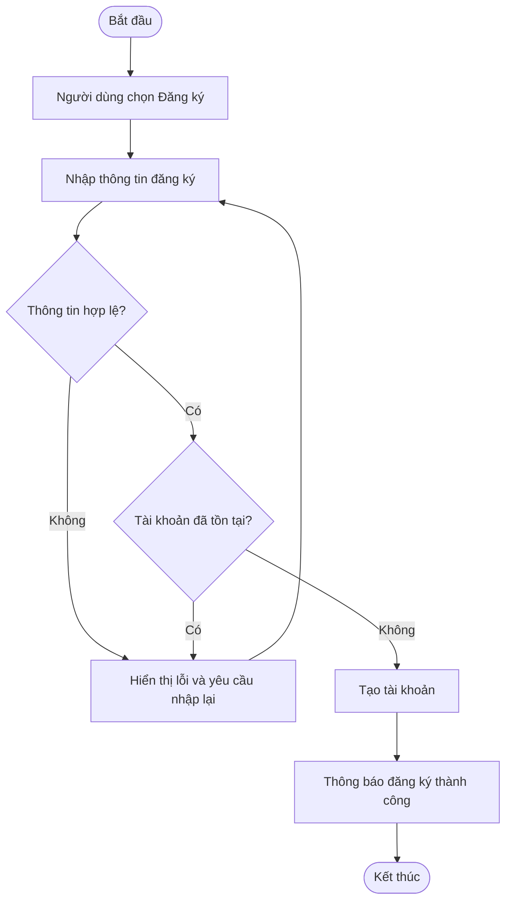
```mermaid
flowchart TD
    A([Bắt đầu]) --> B[Người dùng chọn Đăng ký]
    B --> C[Nhập thông tin đăng ký]
    C --> D{Thông tin hợp lệ?}
    D -- Không --> E[Hiển thị lỗi và yêu cầu nhập lại]
    E --> C
    D -- Có --> F{Tài khoản đã tồn tại?}
    F -- Có --> E
    F -- Không --> G[Tạo tài khoản]
    G --> H[Thông báo đăng ký thành công]
    H --> I([Kết thúc])
```

### Sequence Diagram

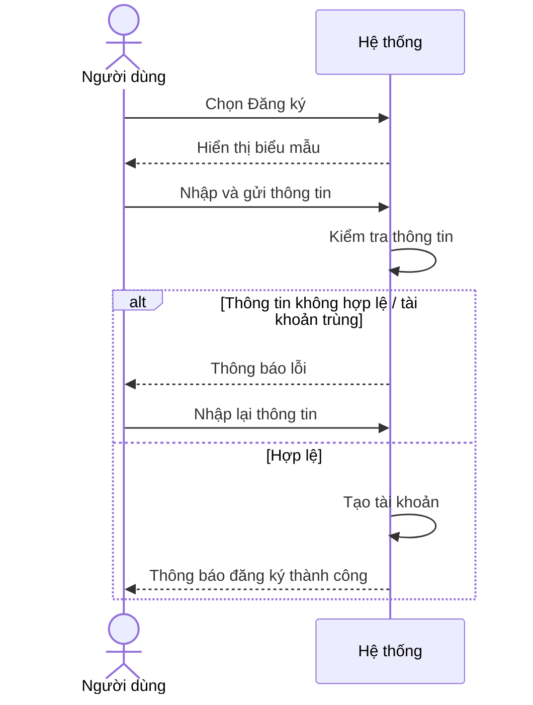
```mermaid
sequenceDiagram
    actor ND as Người dùng
    participant HT as Hệ thống
    ND->>HT: Chọn Đăng ký
    HT-->>ND: Hiển thị biểu mẫu
    ND->>HT: Nhập và gửi thông tin
    HT->>HT: Kiểm tra thông tin
    alt Thông tin không hợp lệ / tài khoản trùng
        HT-->>ND: Thông báo lỗi
        ND->>HT: Nhập lại thông tin
    else Hợp lệ
        HT->>HT: Tạo tài khoản
        HT-->>ND: Thông báo đăng ký thành công
    end
```

## **9.2. Quy trình nghiệp vụ Use Case “Đăng nhập hệ thống”**

### Activity Diagram

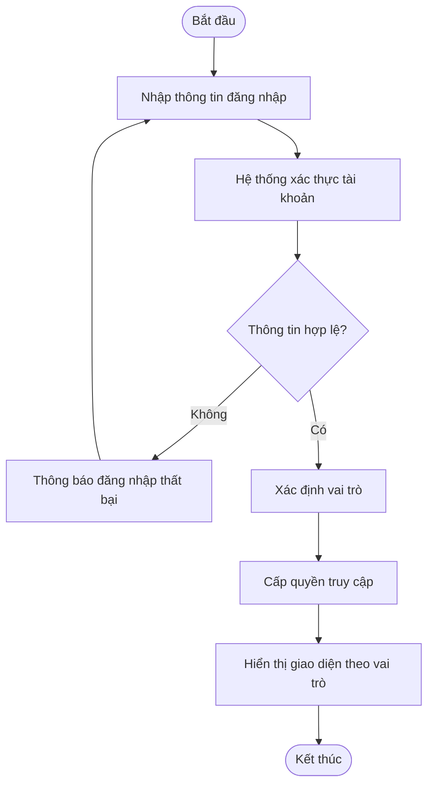
```mermaid
flowchart TD
    A([Bắt đầu]) --> B[Nhập thông tin đăng nhập]
    B --> C[Hệ thống xác thực tài khoản]
    C --> D{Thông tin hợp lệ?}
    D -- Không --> E[Thông báo đăng nhập thất bại]
    E --> B
    D -- Có --> F[Xác định vai trò]
    F --> G[Cấp quyền truy cập]
    G --> H[Hiển thị giao diện theo vai trò]
    H --> I([Kết thúc])
```

### Sequence Diagram

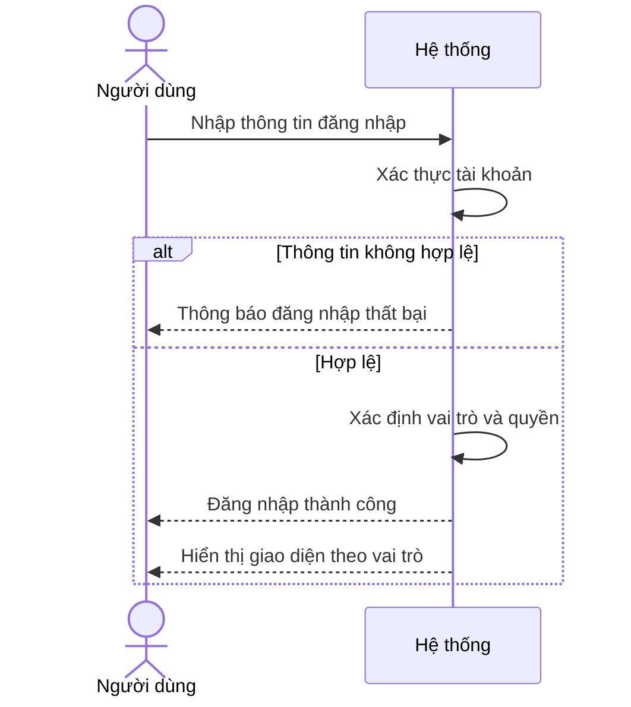
```mermaid
sequenceDiagram
    actor ND as Người dùng
    participant HT as Hệ thống
    ND->>HT: Nhập thông tin đăng nhập
    HT->>HT: Xác thực tài khoản
    alt Thông tin không hợp lệ
        HT-->>ND: Thông báo đăng nhập thất bại
    else Hợp lệ
        HT->>HT: Xác định vai trò và quyền
        HT-->>ND: Đăng nhập thành công
        HT-->>ND: Hiển thị giao diện theo vai trò
    end
```

## **9.3. Quy trình nghiệp vụ Use Case “Đăng xuất hệ thống”**

### Activity Diagram

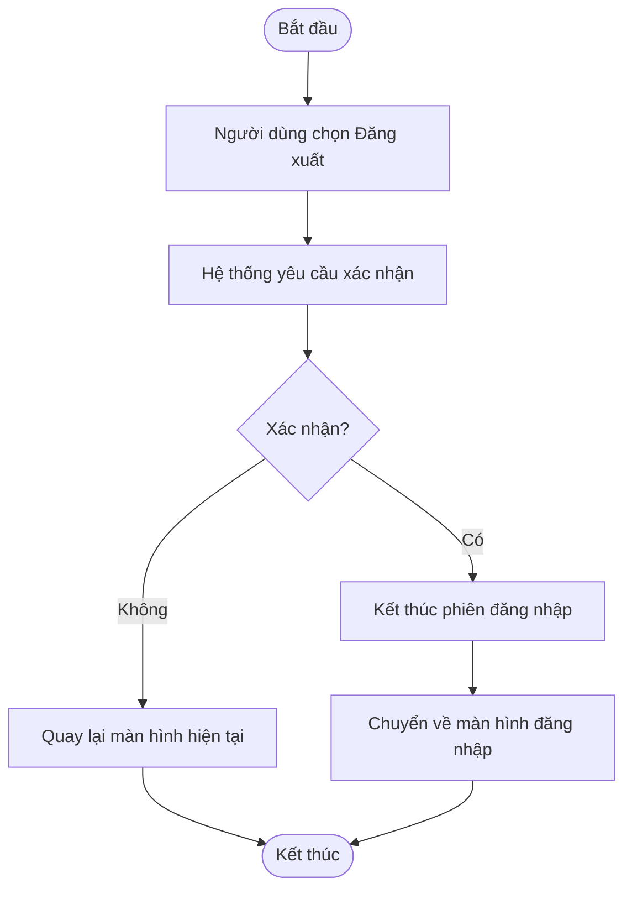
```mermaid
flowchart TD
    A([Bắt đầu]) --> B[Người dùng chọn Đăng xuất]
    B --> C[Hệ thống yêu cầu xác nhận]
    C --> D{Xác nhận?}
    D -- Không --> E[Quay lại màn hình hiện tại]
    E --> F([Kết thúc])
    D -- Có --> G[Kết thúc phiên đăng nhập]
    G --> H[Chuyển về màn hình đăng nhập]
    H --> F
```

### Sequence Diagram

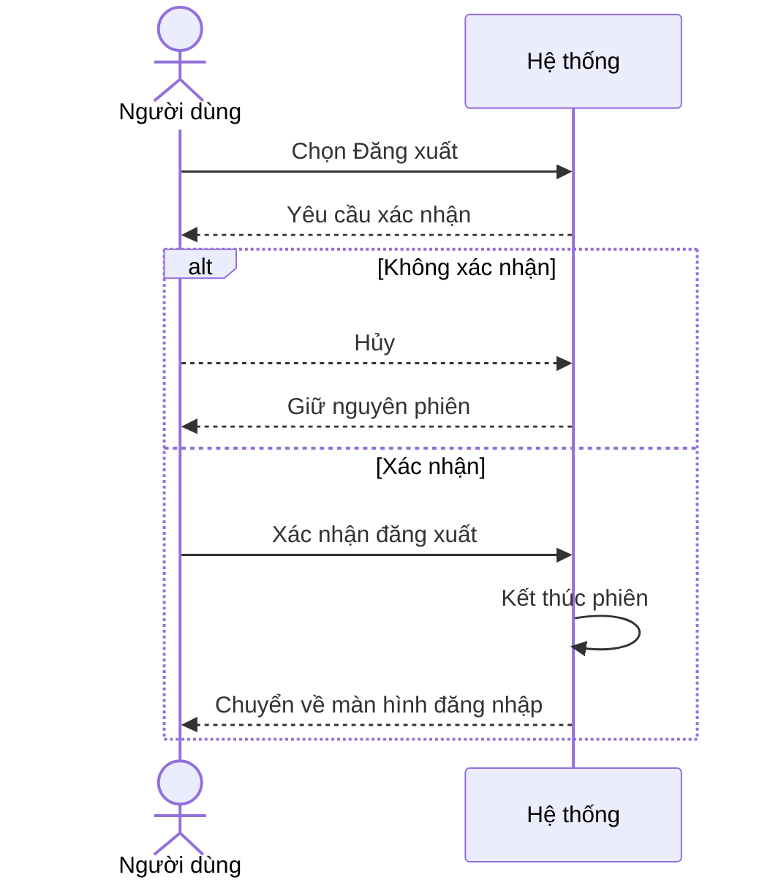
```mermaid
sequenceDiagram
    actor ND as Người dùng
    participant HT as Hệ thống
    ND->>HT: Chọn Đăng xuất
    HT-->>ND: Yêu cầu xác nhận
    alt Không xác nhận
        ND-->>HT: Hủy
        HT-->>ND: Giữ nguyên phiên
    else Xác nhận
        ND->>HT: Xác nhận đăng xuất
        HT->>HT: Kết thúc phiên
        HT-->>ND: Chuyển về màn hình đăng nhập
    end
```

## **9.4. Quy trình nghiệp vụ Use Case “Xác thực và phân quyền người dùng theo vai trò”**

### Activity Diagram

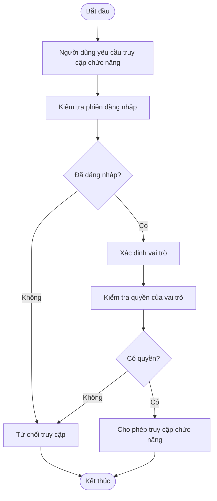
```mermaid
flowchart TD
    A([Bắt đầu]) --> B[Người dùng yêu cầu truy cập chức năng]
    B --> C[Kiểm tra phiên đăng nhập]
    C --> D{Đã đăng nhập?}
    D -- Không --> E[Từ chối truy cập]
    E --> F([Kết thúc])
    D -- Có --> G[Xác định vai trò]
    G --> H[Kiểm tra quyền của vai trò]
    H --> I{Có quyền?}
    I -- Không --> E
    I -- Có --> J[Cho phép truy cập chức năng]
    J --> F
```

### Sequence Diagram

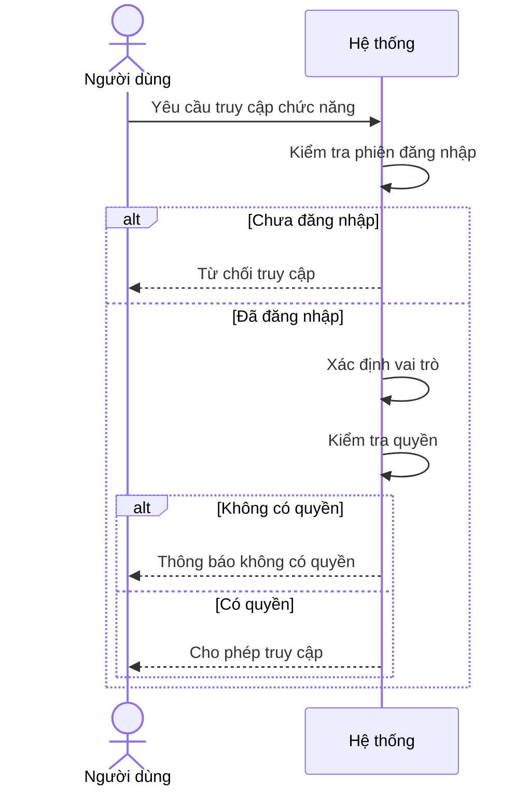
```mermaid
sequenceDiagram
    actor ND as Người dùng
    participant HT as Hệ thống
    ND->>HT: Yêu cầu truy cập chức năng
    HT->>HT: Kiểm tra phiên đăng nhập
    alt Chưa đăng nhập
        HT-->>ND: Từ chối truy cập
    else Đã đăng nhập
        HT->>HT: Xác định vai trò
        HT->>HT: Kiểm tra quyền
        alt Không có quyền
            HT-->>ND: Thông báo không có quyền
        else Có quyền
            HT-->>ND: Cho phép truy cập
        end
    end
```

## **9.5. Quy trình nghiệp vụ Use Case “Xem và cập nhật thông tin cá nhân”**

### Activity Diagram

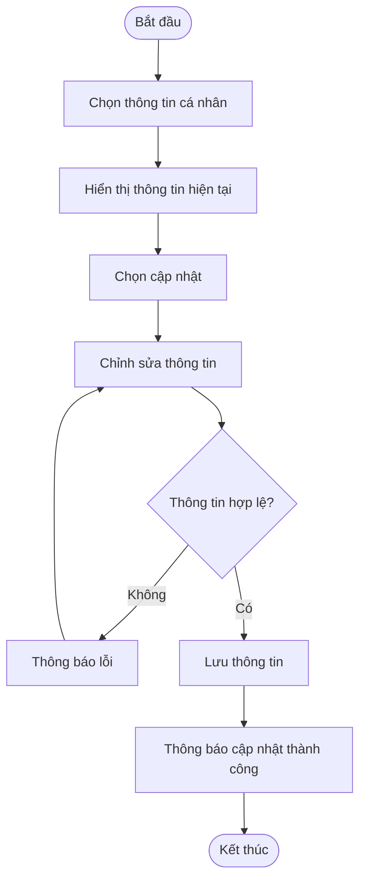
```mermaid
flowchart TD
    A([Bắt đầu]) --> B[Chọn thông tin cá nhân]
    B --> C[Hiển thị thông tin hiện tại]
    C --> D[Chọn cập nhật]
    D --> E[Chỉnh sửa thông tin]
    E --> F{Thông tin hợp lệ?}
    F -- Không --> G[Thông báo lỗi]
    G --> E
    F -- Có --> H[Lưu thông tin]
    H --> I[Thông báo cập nhật thành công]
    I --> J([Kết thúc])
```

### Sequence Diagram

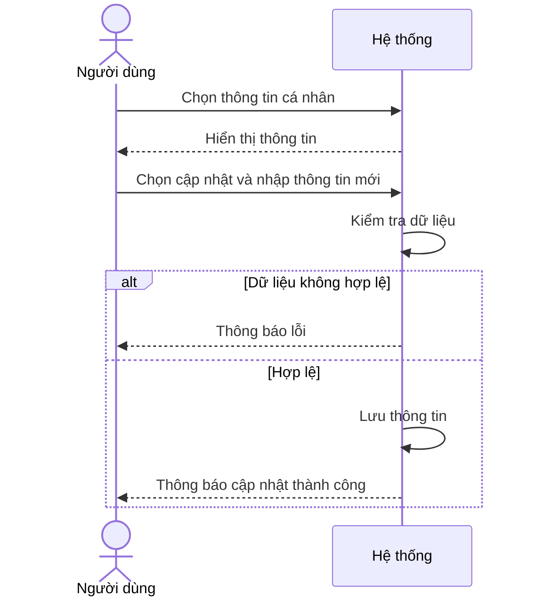
```mermaid
sequenceDiagram
    actor ND as Người dùng
    participant HT as Hệ thống
    ND->>HT: Chọn thông tin cá nhân
    HT-->>ND: Hiển thị thông tin
    ND->>HT: Chọn cập nhật và nhập thông tin mới
    HT->>HT: Kiểm tra dữ liệu
    alt Dữ liệu không hợp lệ
        HT-->>ND: Thông báo lỗi
    else Hợp lệ
        HT->>HT: Lưu thông tin
        HT-->>ND: Thông báo cập nhật thành công
    end
```

## **9.6. Quy trình nghiệp vụ Use Case “Tạo yêu cầu đặt xe”**

### Activity Diagram

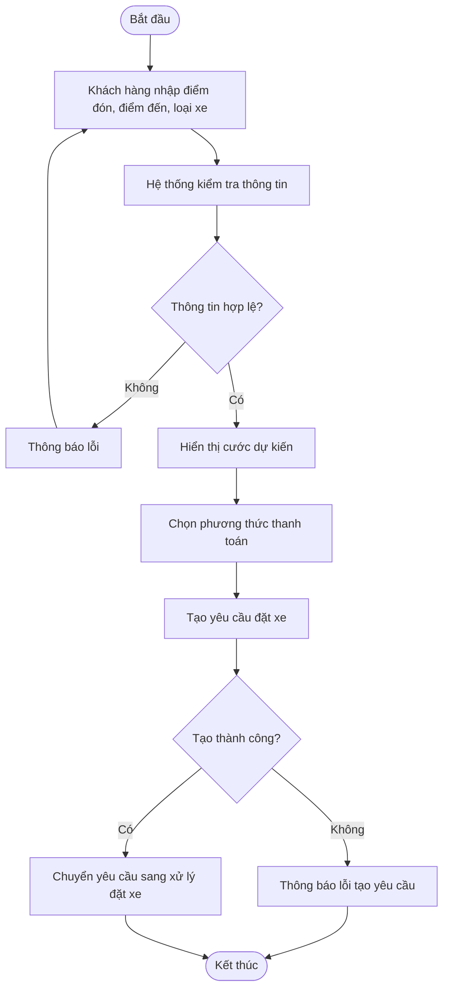
```mermaid
flowchart TD
    A([Bắt đầu]) --> B[Khách hàng nhập điểm đón, điểm đến, loại xe]
    B --> C[Hệ thống kiểm tra thông tin]
    C --> D{Thông tin hợp lệ?}
    D -- Không --> E[Thông báo lỗi]
    E --> B
    D -- Có --> F[Hiển thị cước dự kiến]
    F --> G[Chọn phương thức thanh toán]
    G --> H[Tạo yêu cầu đặt xe]
    H --> I{Tạo thành công?}
    I -- Không --> J[Thông báo lỗi tạo yêu cầu]
    J --> K([Kết thúc])
    I -- Có --> L[Chuyển yêu cầu sang xử lý đặt xe]
    L --> K
```

### Sequence Diagram

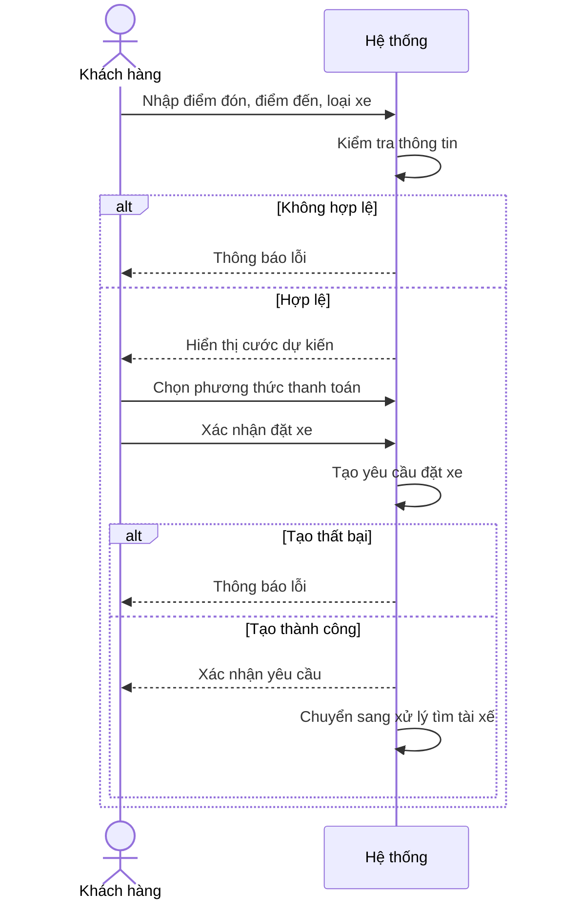
```mermaid
sequenceDiagram
    actor KH as Khách hàng
    participant HT as Hệ thống
    KH->>HT: Nhập điểm đón, điểm đến, loại xe
    HT->>HT: Kiểm tra thông tin
    alt Không hợp lệ
        HT-->>KH: Thông báo lỗi
    else Hợp lệ
        HT-->>KH: Hiển thị cước dự kiến
        KH->>HT: Chọn phương thức thanh toán
        KH->>HT: Xác nhận đặt xe
        HT->>HT: Tạo yêu cầu đặt xe
        alt Tạo thất bại
            HT-->>KH: Thông báo lỗi
        else Tạo thành công
            HT-->>KH: Xác nhận yêu cầu
            HT->>HT: Chuyển sang xử lý tìm tài xế
        end
    end
```

## **9.7. Quy trình nghiệp vụ Use Case “Theo dõi trạng thái chuyến đi”**

### Activity Diagram

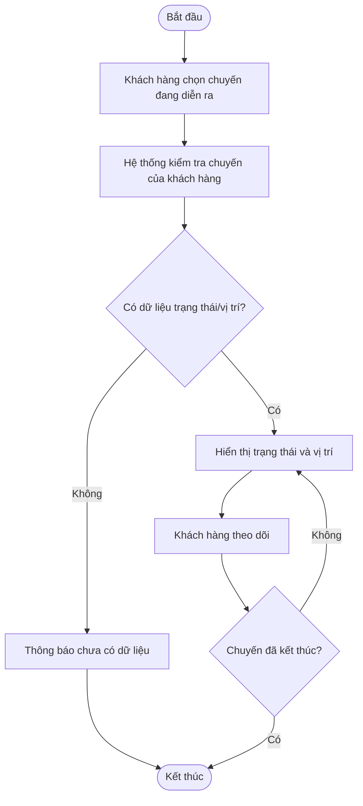
```mermaid
flowchart TD
    A([Bắt đầu]) --> B[Khách hàng chọn chuyến đang diễn ra]
    B --> C[Hệ thống kiểm tra chuyến của khách hàng]
    C --> D{Có dữ liệu trạng thái/vị trí?}
    D -- Không --> E[Thông báo chưa có dữ liệu]
    E --> F([Kết thúc])
    D -- Có --> G[Hiển thị trạng thái và vị trí]
    G --> H[Khách hàng theo dõi]
    H --> I{Chuyến đã kết thúc?}
    I -- Không --> G
    I -- Có --> F
```

### Sequence Diagram

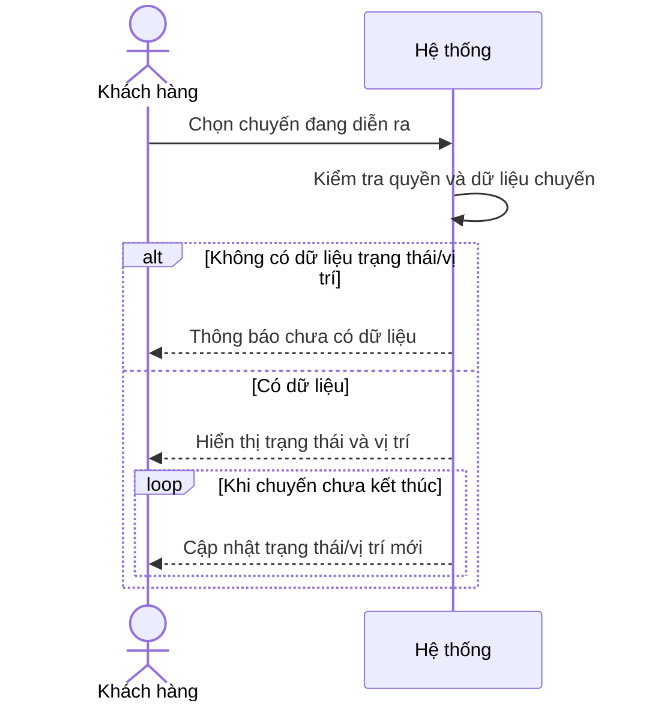
```mermaid
sequenceDiagram
    actor KH as Khách hàng
    participant HT as Hệ thống
    KH->>HT: Chọn chuyến đang diễn ra
    HT->>HT: Kiểm tra quyền và dữ liệu chuyến
    alt Không có dữ liệu trạng thái/vị trí
        HT-->>KH: Thông báo chưa có dữ liệu
    else Có dữ liệu
        HT-->>KH: Hiển thị trạng thái và vị trí
        loop Khi chuyến chưa kết thúc
            HT-->>KH: Cập nhật trạng thái/vị trí mới
        end
    end
```

## **9.8. Quy trình nghiệp vụ Use Case “Xem lịch sử chuyến đi và đánh giá tài xế”**

### Activity Diagram

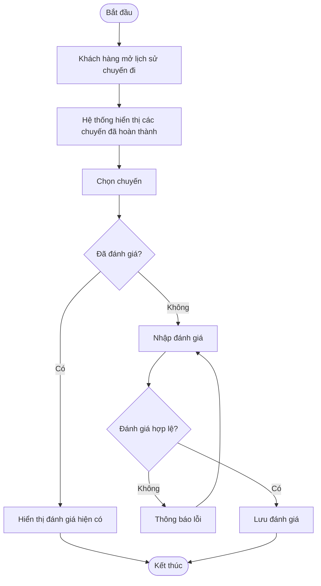
```mermaid
flowchart TD
    A([Bắt đầu]) --> B[Khách hàng mở lịch sử chuyến đi]
    B --> C[Hệ thống hiển thị các chuyến đã hoàn thành]
    C --> D[Chọn chuyến]
    D --> E{Đã đánh giá?}
    E -- Có --> F[Hiển thị đánh giá hiện có]
    F --> G([Kết thúc])
    E -- Không --> H[Nhập đánh giá]
    H --> I{Đánh giá hợp lệ?}
    I -- Không --> J[Thông báo lỗi]
    J --> H
    I -- Có --> K[Lưu đánh giá]
    K --> G
```

### Sequence Diagram

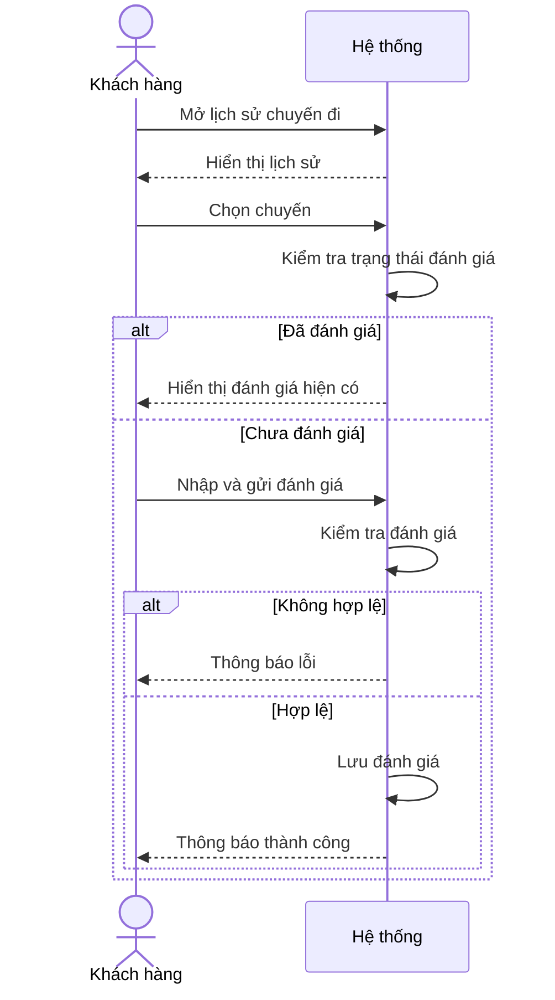
```mermaid
sequenceDiagram
    actor KH as Khách hàng
    participant HT as Hệ thống
    KH->>HT: Mở lịch sử chuyến đi
    HT-->>KH: Hiển thị lịch sử
    KH->>HT: Chọn chuyến
    HT->>HT: Kiểm tra trạng thái đánh giá
    alt Đã đánh giá
        HT-->>KH: Hiển thị đánh giá hiện có
    else Chưa đánh giá
        KH->>HT: Nhập và gửi đánh giá
        HT->>HT: Kiểm tra đánh giá
        alt Không hợp lệ
            HT-->>KH: Thông báo lỗi
        else Hợp lệ
            HT->>HT: Lưu đánh giá
            HT-->>KH: Thông báo thành công
        end
    end
```

## **9.9. Quy trình nghiệp vụ Use Case “Xem và cập nhật hồ sơ tài xế”**

### Activity Diagram

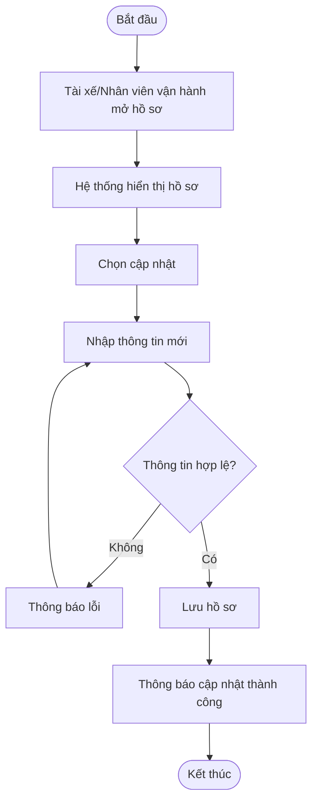
```mermaid
flowchart TD
    A([Bắt đầu]) --> B[Tài xế/Nhân viên vận hành mở hồ sơ]
    B --> C[Hệ thống hiển thị hồ sơ]
    C --> D[Chọn cập nhật]
    D --> E[Nhập thông tin mới]
    E --> F{Thông tin hợp lệ?}
    F -- Không --> G[Thông báo lỗi]
    G --> E
    F -- Có --> H[Lưu hồ sơ]
    H --> I[Thông báo cập nhật thành công]
    I --> J([Kết thúc])
```

### Sequence Diagram

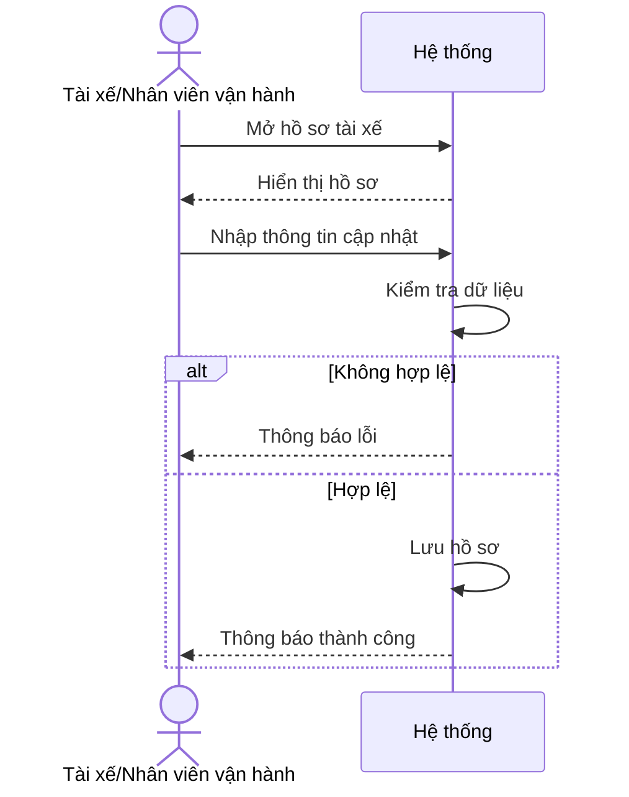
```mermaid
sequenceDiagram
    actor ND as Tài xế/Nhân viên vận hành
    participant HT as Hệ thống
    ND->>HT: Mở hồ sơ tài xế
    HT-->>ND: Hiển thị hồ sơ
    ND->>HT: Nhập thông tin cập nhật
    HT->>HT: Kiểm tra dữ liệu
    alt Không hợp lệ
        HT-->>ND: Thông báo lỗi
    else Hợp lệ
        HT->>HT: Lưu hồ sơ
        HT-->>ND: Thông báo thành công
    end
```

## **9.10. Quy trình nghiệp vụ Use Case “Quản lý thông tin phương tiện”**

### Activity Diagram

```mermaid
flowchart TD
    A([Bắt đầu]) --> B[Mở quản lý phương tiện]
    B --> C[Hiển thị phương tiện]
    C --> D[Thêm hoặc cập nhật phương tiện]
    D --> E[Nhập thông tin phương tiện]
    E --> F{Thông tin hợp lệ?}
    F -- Không --> G[Thông báo lỗi]
    G --> E
    F -- Có --> H[Lưu thông tin phương tiện]
    H --> I[Thông báo thành công]
    I --> J([Kết thúc])
```

### Sequence Diagram

```mermaid
sequenceDiagram
    actor ND as Tài xế/Nhân viên vận hành
    participant HT as Hệ thống
    ND->>HT: Mở quản lý phương tiện
    HT-->>ND: Hiển thị danh sách
    ND->>HT: Chọn thêm/cập nhật
    ND->>HT: Nhập thông tin phương tiện
    HT->>HT: Kiểm tra dữ liệu
    alt Không hợp lệ
        HT-->>ND: Thông báo lỗi
    else Hợp lệ
        HT->>HT: Lưu phương tiện
        HT-->>ND: Thông báo thành công
    end
```

## **9.11. Quy trình nghiệp vụ Use Case “Cập nhật trạng thái sẵn sàng”**

### Activity Diagram

```mermaid
flowchart TD
    A([Bắt đầu]) --> B[Tài xế chọn trạng thái]
    B --> C{Đang có chuyến?}
    C -- Có --> D[Không cho chuyển sang Sẵn sàng]
    D --> E([Kết thúc])
    C -- Không --> F[Cập nhật trạng thái Sẵn sàng/Không sẵn sàng]
    F --> G[Thông báo cập nhật thành công]
    G --> E
```

### Sequence Diagram

```mermaid
sequenceDiagram
    actor TX as Tài xế
    participant HT as Hệ thống
    TX->>HT: Chọn trạng thái sẵn sàng
    HT->>HT: Kiểm tra chuyến đang thực hiện
    alt Đang có chuyến
        HT-->>TX: Không cho chuyển sang Sẵn sàng
    else Không có chuyến
        HT->>HT: Cập nhật trạng thái
        HT-->>TX: Thông báo cập nhật thành công
    end
```

## **9.12. Quy trình nghiệp vụ Use Case “Nhận chuyến”**

### Activity Diagram

```mermaid
flowchart TD
    A([Bắt đầu]) --> B[Tài xế nhận yêu cầu chuyến]
    B --> C{Tài xế còn sẵn sàng và yêu cầu còn hiệu lực?}
    C -- Không --> D[Thông báo chuyến không còn khả dụng]
    D --> E([Kết thúc])
    C -- Có --> F[Chấp nhận chuyến]
    F --> G[Hệ thống gán chuyến cho tài xế]
    G --> H[Thông báo nhận chuyến thành công]
    H --> E
```

### Sequence Diagram

```mermaid
sequenceDiagram
    actor TX as Tài xế
    participant HT as Hệ thống
    TX->>HT: Chọn nhận chuyến
    HT->>HT: Kiểm tra trạng thái tài xế và yêu cầu
    alt Không còn khả dụng
        HT-->>TX: Thông báo chuyến không khả dụng
    else Còn khả dụng
        HT->>HT: Gán chuyến cho tài xế
        HT-->>TX: Thông báo nhận chuyến thành công
    end
```

## **9.13. Quy trình nghiệp vụ Use Case “Từ chối chuyến”**

### Activity Diagram

```mermaid
flowchart TD
    A([Bắt đầu]) --> B[Tài xế chọn từ chối chuyến]
    B --> C{Xác nhận từ chối?}
    C -- Không --> D[Giữ nguyên yêu cầu]
    D --> E([Kết thúc])
    C -- Có --> F[Ghi nhận tài xế từ chối]
    F --> G[Chuyển yêu cầu sang tìm tài xế khác]
    G --> H([Kết thúc])
```

### Sequence Diagram

```mermaid
sequenceDiagram
    actor TX as Tài xế
    participant HT as Hệ thống
    TX->>HT: Chọn từ chối chuyến
    HT-->>TX: Yêu cầu xác nhận
    alt Hủy từ chối
        TX-->>HT: Hủy
        HT-->>TX: Giữ nguyên yêu cầu
    else Xác nhận từ chối
        TX->>HT: Xác nhận
        HT->>HT: Ghi nhận từ chối
        HT->>HT: Tìm tài xế khác
        HT-->>TX: Thông báo đã ghi nhận
    end
```

## **9.14. Quy trình nghiệp vụ Use Case “Tiếp nhận và xử lý yêu cầu đặt xe”**

### Activity Diagram

```mermaid
flowchart TD
    A([Bắt đầu]) --> B[Hệ thống tiếp nhận yêu cầu đặt xe]
    B --> C[Kiểm tra thông tin khách hàng và chuyến]
    C --> D{Yêu cầu hợp lệ?}
    D -- Không --> E[Thông báo yêu cầu không hợp lệ]
    E --> F([Kết thúc])
    D -- Có --> G{Khách hàng đang có chuyến chưa hoàn thành?}
    G -- Có --> E
    G -- Không --> H[Tạo yêu cầu đặt xe]
    H --> I[Chuyển sang tìm và phân công tài xế]
    I --> F
```

### Sequence Diagram

```mermaid
sequenceDiagram
    participant KH as Khách hàng
    participant HT as Hệ thống
    KH->>HT: Gửi yêu cầu đặt xe
    HT->>HT: Kiểm tra khách hàng và thông tin chuyến
    alt Yêu cầu không hợp lệ / khách đang có chuyến
        HT-->>KH: Thông báo không thể tiếp nhận
    else Hợp lệ
        HT->>HT: Tạo yêu cầu đặt xe
        HT->>HT: Chuyển sang tìm tài xế
        HT-->>KH: Xác nhận đã tiếp nhận
    end
```

## **9.15. Quy trình nghiệp vụ Use Case “Tìm kiếm và phân công tài xế phù hợp”**

### Activity Diagram

```mermaid
flowchart TD
    A([Bắt đầu]) --> B[Nhận yêu cầu đặt xe hợp lệ]
    B --> C[Tìm tài xế đang sẵn sàng]
    C --> D{Có tài xế phù hợp?}
    D -- Không --> E[Thông báo chưa có tài xế phù hợp]
    E --> F([Kết thúc])
    D -- Có --> G[Lọc theo loại xe và vị trí]
    G --> H[Ưu tiên tài xế phù hợp/gần]
    H --> I[Gửi yêu cầu cho tài xế]
    I --> J[Chờ phản hồi]
    J --> K{Tài xế nhận?}
    K -- Có --> L[Phân công tài xế]
    L --> F
    K -- Không --> M[Chuyển sang tài xế phù hợp tiếp theo]
    M --> J
```

### Sequence Diagram

```mermaid
sequenceDiagram
    participant HT as Hệ thống
    actor TX as Tài xế
    participant KH as Khách hàng
    HT->>HT: Nhận yêu cầu hợp lệ
    HT->>HT: Tìm tài xế sẵn sàng
    alt Không có tài xế phù hợp
        HT-->>KH: Thông báo chưa có tài xế phù hợp
    else Có tài xế
        HT->>HT: Lọc theo loại xe và vị trí
        HT->>TX: Gửi yêu cầu nhận chuyến
        alt Tài xế nhận
            TX->>HT: Chấp nhận
            HT->>HT: Phân công tài xế
            HT-->>KH: Thông báo tài xế được phân công
        else Tài xế từ chối/không phản hồi
            HT->>HT: Chuyển sang tài xế tiếp theo
        end
    end
```

## **9.16. Quy trình nghiệp vụ Use Case “Xử lý trường hợp tài xế không phản hồi hoặc từ chối”**

### Activity Diagram

```mermaid
flowchart TD
    A([Bắt đầu]) --> B[Gửi yêu cầu cho tài xế]
    B --> C[Theo dõi phản hồi]
    C --> D{Tài xế phản hồi?}
    D -- Có --> E{Chấp nhận?}
    E -- Có --> F[Phân công tài xế]
    F --> G([Kết thúc])
    E -- Không --> H[Tìm tài xế tiếp theo]
    D -- Không --> I[Hết thời gian phản hồi]
    I --> H
    H --> J{Còn tài xế phù hợp?}
    J -- Có --> B
    J -- Không --> K[Thông báo khách hàng chưa tìm được tài xế]
    K --> G
```

### Sequence Diagram

```mermaid
sequenceDiagram
    participant HT as Hệ thống
    actor TX as Tài xế
    actor KH as Khách hàng
    HT->>TX: Gửi yêu cầu nhận chuyến
    HT->>HT: Theo dõi thời gian phản hồi
    alt Tài xế chấp nhận
        TX->>HT: Chấp nhận
        HT->>HT: Kết thúc tìm kiếm và phân công
    else Từ chối hoặc không phản hồi
        HT->>HT: Ghi nhận kết quả
        HT->>HT: Tìm tài xế phù hợp tiếp theo
        alt Còn tài xế
            HT->>TX: Gửi yêu cầu tiếp theo
        else Không còn tài xế
            HT-->>KH: Thông báo chưa tìm được tài xế
        end
    end
```

## **9.17. Quy trình nghiệp vụ Use Case “Cập nhật và theo dõi trạng thái, vị trí chuyến đi”**

### Activity Diagram

```mermaid
flowchart TD
    A([Bắt đầu]) --> B[Tài xế được phân công]
    B --> C[Tài xế cập nhật trạng thái/vị trí]
    C --> D[Hệ thống ghi nhận dữ liệu]
    D --> E{Chuyến đã kết thúc?}
    E -- Không --> F[Cung cấp dữ liệu cho người theo dõi]
    F --> C
    E -- Có --> G[Chốt trạng thái chuyến]
    G --> H[Không cho cập nhật tiếp]
    H --> I([Kết thúc])
```

### Sequence Diagram

```mermaid
sequenceDiagram
    actor TX as Tài xế
    participant HT as Hệ thống
    actor KH as Khách hàng
    TX->>HT: Cập nhật trạng thái/vị trí
    HT->>HT: Ghi nhận dữ liệu
    HT-->>KH: Cung cấp trạng thái/vị trí
    loop Khi chuyến chưa kết thúc
        TX->>HT: Cập nhật trạng thái/vị trí mới
        HT-->>KH: Cập nhật dữ liệu
    end
    TX->>HT: Cập nhật hoàn thành chuyến
    HT->>HT: Chốt trạng thái
    HT-->>TX: Không cho cập nhật thêm
```

## **9.18. Quy trình nghiệp vụ Use Case “Theo dõi và quản lý các chuyến đang diễn ra”**

### Activity Diagram

```mermaid
flowchart TD
    A([Bắt đầu]) --> B[Nhân viên vận hành mở danh sách chuyến]
    B --> C[Hệ thống kiểm tra quyền]
    C --> D{Có quyền?}
    D -- Không --> E[Từ chối truy cập]
    E --> F([Kết thúc])
    D -- Có --> G[Hiển thị các chuyến đang diễn ra]
    G --> H{Có chuyến?}
    H -- Không --> I[Thông báo không có dữ liệu]
    I --> F
    H -- Có --> J[Chọn chuyến cần theo dõi]
    J --> K[Xem và quản lý thông tin chuyến]
    K --> F
```

### Sequence Diagram

```mermaid
sequenceDiagram
    actor NV as Nhân viên vận hành
    participant HT as Hệ thống
    NV->>HT: Mở danh sách chuyến đang diễn ra
    HT->>HT: Kiểm tra quyền
    alt Không có quyền
        HT-->>NV: Từ chối truy cập
    else Có quyền
        HT->>HT: Truy vấn chuyến đang diễn ra
        alt Không có chuyến
            HT-->>NV: Thông báo không có dữ liệu
        else Có chuyến
            HT-->>NV: Hiển thị danh sách
            NV->>HT: Chọn chuyến
            HT-->>NV: Hiển thị thông tin chuyến
        end
    end
```

## **9.19. Quy trình nghiệp vụ Use Case “Hỗ trợ xử lý chuyến đi gặp sự cố”**

### Activity Diagram

```mermaid
flowchart TD
    A([Bắt đầu]) --> B[Nhân viên vận hành tiếp nhận yêu cầu hỗ trợ]
    B --> C[Kiểm tra thông tin sự cố]
    C --> D{Thông tin đầy đủ?}
    D -- Không --> E[Yêu cầu bổ sung thông tin]
    E --> C
    D -- Có --> F[Xác định hướng xử lý]
    F --> G{Có thể xử lý?}
    G -- Có --> H[Thực hiện xử lý]
    H --> I[Ghi nhận kết quả]
    I --> J[Thông báo kết quả]
    G -- Không --> K[Ghi nhận chưa thể xử lý trực tiếp]
    K --> J
    J --> L([Kết thúc])
```

### Sequence Diagram

```mermaid
sequenceDiagram
    actor NV as Nhân viên vận hành
    participant HT as Hệ thống
    NV->>HT: Tiếp nhận yêu cầu hỗ trợ
    NV->>HT: Kiểm tra thông tin sự cố
    alt Thông tin chưa đầy đủ
        HT-->>NV: Yêu cầu bổ sung thông tin
        NV->>HT: Bổ sung thông tin
    else Thông tin đầy đủ
        NV->>HT: Xác định hướng xử lý
        alt Có thể xử lý trực tiếp
            NV->>HT: Thực hiện xử lý
            HT->>HT: Ghi nhận kết quả
            HT-->>NV: Xác nhận đã ghi nhận
        else Không thể xử lý trực tiếp
            HT->>HT: Ghi nhận trạng thái cần hỗ trợ thêm
            HT-->>NV: Thông báo chưa thể xử lý trực tiếp
        end
    end
```

## **9.20. Quy trình nghiệp vụ Use Case “Tra cứu thông tin giao dịch”**

### Activity Diagram

```mermaid
flowchart TD
    A([Bắt đầu]) --> B[Nhân viên vận hành nhập tiêu chí tra cứu]
    B --> C[Hệ thống kiểm tra quyền]
    C --> D{Có quyền?}
    D -- Không --> E[Từ chối truy cập]
    E --> F([Kết thúc])
    D -- Có --> G[Tra cứu giao dịch]
    G --> H{Có kết quả?}
    H -- Không --> I[Thông báo không có giao dịch phù hợp]
    I --> F
    H -- Có --> J[Hiển thị thông tin giao dịch]
    J --> F
```

### Sequence Diagram

```mermaid
sequenceDiagram
    actor NV as Nhân viên vận hành
    participant HT as Hệ thống
    NV->>HT: Nhập tiêu chí tra cứu
    HT->>HT: Kiểm tra quyền
    alt Không có quyền
        HT-->>NV: Từ chối truy cập
    else Có quyền
        HT->>HT: Truy vấn giao dịch
        alt Không có kết quả
            HT-->>NV: Thông báo không có giao dịch phù hợp
        else Có kết quả
            HT-->>NV: Hiển thị thông tin giao dịch
        end
    end
```

## **9.21. Quy trình nghiệp vụ Use Case “Tính cước chuyến đi”**

### Activity Diagram

```mermaid
flowchart TD
    A([Bắt đầu]) --> B[Chuyến đi có đủ thông tin]
    B --> C[Hệ thống xác định loại xe và thông tin chuyến]
    C --> D{Đủ thông tin tính cước?}
    D -- Không --> E[Thông báo thiếu thông tin]
    E --> F([Kết thúc])
    D -- Có --> G[Áp dụng quy tắc tính cước]
    G --> H[Tính cước]
    H --> I[Lưu kết quả cước]
    I --> J[Hiển thị cước]
    J --> F
```

### Sequence Diagram

```mermaid
sequenceDiagram
    participant HT as Hệ thống
    HT->>HT: Kiểm tra thông tin chuyến
    alt Thiếu thông tin
        HT-->>HT: Ghi nhận chưa thể tính cước
    else Đủ thông tin
        HT->>HT: Xác định loại xe và dữ liệu chuyến
        HT->>HT: Áp dụng quy tắc tính cước
        HT->>HT: Tính và lưu cước
        HT-->>HT: Cập nhật cước cho chuyến
    end
```

## **9.22. Quy trình nghiệp vụ Use Case “Lựa chọn và thực hiện thanh toán”**

### Activity Diagram

```mermaid
flowchart TD
    A([Bắt đầu]) --> B[Khách hàng chọn phương thức thanh toán]
    B --> C{Thanh toán tiền mặt hay điện tử?}
    C -- Tiền mặt --> D[Ghi nhận phương thức tiền mặt]
    D --> E[Chuyển trạng thái thanh toán]
    C -- Điện tử --> F[Gửi yêu cầu đến nhà cung cấp thanh toán]
    F --> G[Nhận kết quả]
    G --> H{Thanh toán thành công?}
    H -- Có --> I[Ghi nhận thành công]
    H -- Không --> J[Ghi nhận thất bại]
    I --> K([Kết thúc])
    J --> K
    E --> K
```

### Sequence Diagram

```mermaid
sequenceDiagram
    actor KH as Khách hàng
    participant HT as Hệ thống
    participant NTT as Nhà cung cấp thanh toán
    KH->>HT: Chọn phương thức thanh toán
    alt Tiền mặt
        HT->>HT: Ghi nhận phương thức tiền mặt
        HT-->>KH: Ghi nhận thanh toán theo phương thức đã chọn
    else Thanh toán điện tử
        KH->>HT: Xác nhận thanh toán
        HT->>NTT: Gửi yêu cầu thanh toán
        NTT-->>HT: Trả kết quả
        alt Thành công
            HT->>HT: Ghi nhận thành công
            HT-->>KH: Thông báo thanh toán thành công
        else Thất bại
            HT->>HT: Ghi nhận thất bại
            HT-->>KH: Thông báo thanh toán thất bại
        end
    end
```

## **9.23. Quy trình nghiệp vụ Use Case “Xử lý và ghi nhận kết quả thanh toán”**

### Activity Diagram

```mermaid
flowchart TD
    A([Bắt đầu]) --> B[Nhận kết quả thanh toán]
    B --> C[Kiểm tra thông tin giao dịch]
    C --> D{Thông tin hợp lệ?}
    D -- Không --> E[Không ghi nhận kết quả hợp lệ]
    E --> F([Kết thúc])
    D -- Có --> G[Kiểm tra trạng thái thanh toán]
    G --> H[Cập nhật trạng thái]
    H --> I[Lưu giao dịch]
    I --> J([Kết thúc])
```

### Sequence Diagram

```mermaid
sequenceDiagram
    participant NTT as Nhà cung cấp thanh toán
    participant HT as Hệ thống
    NTT->>HT: Gửi kết quả thanh toán
    HT->>HT: Kiểm tra thông tin giao dịch
    alt Thông tin không hợp lệ
        HT-->>NTT: Không ghi nhận kết quả hợp lệ
    else Hợp lệ
        HT->>HT: Cập nhật trạng thái thanh toán
        HT->>HT: Lưu giao dịch
        HT-->>NTT: Xác nhận đã ghi nhận
    end
```

## **9.24. Quy trình nghiệp vụ Use Case “Xử lý giao dịch thất bại và thanh toán lại”**

### Activity Diagram

```mermaid
flowchart TD
    A([Bắt đầu]) --> B[Phát hiện giao dịch thanh toán thất bại]
    B --> C[Thông báo kết quả thất bại]
    C --> D{Khách hàng chọn thanh toán lại?}
    D -- Không --> E[Giữ trạng thái chưa thanh toán]
    E --> F([Kết thúc])
    D -- Có --> G[Gửi lại yêu cầu thanh toán]
    G --> H{Thanh toán lại thành công?}
    H -- Có --> I[Ghi nhận thanh toán thành công]
    I --> F
    H -- Không --> J[Giữ trạng thái thất bại]
    J --> F
```

### Sequence Diagram

```mermaid
sequenceDiagram
    actor KH as Khách hàng
    participant HT as Hệ thống
    participant NTT as Nhà cung cấp thanh toán
    HT-->>KH: Thông báo thanh toán thất bại
    alt Không thanh toán lại
        KH-->>HT: Hủy thanh toán lại
        HT->>HT: Giữ trạng thái chưa thanh toán
    else Thanh toán lại
        KH->>HT: Chọn thanh toán lại
        HT->>NTT: Gửi lại yêu cầu
        NTT-->>HT: Trả kết quả
        alt Thành công
            HT->>HT: Ghi nhận thành công
            HT-->>KH: Thông báo thành công
        else Tiếp tục thất bại
            HT->>HT: Giữ trạng thái thất bại
            HT-->>KH: Thông báo thất bại
        end
    end
```

## **9.25. Quy trình nghiệp vụ Use Case “Gửi thông báo về trạng thái chuyến đi và thanh toán”**

### Activity Diagram

```mermaid
flowchart TD
    A([Bắt đầu]) --> B[Phát sinh sự kiện chuyến đi/thanh toán]
    B --> C[Xác định người nhận]
    C --> D[Xác định nội dung và kênh thông báo]
    D --> E[Gửi thông báo]
    E --> F{Kênh chính khả dụng?}
    F -- Có --> G[Thông báo thành công]
    G --> H([Kết thúc])
    F -- Không --> I[Chuyển sang kênh phù hợp khác]
    I --> J{Gửi được?}
    J -- Có --> G
    J -- Không --> K[Ghi nhận trạng thái gửi thất bại]
    K --> H
```

### Sequence Diagram

```mermaid
sequenceDiagram
    participant HT as Hệ thống
    actor ND as Người nhận
    participant K as Kênh thông báo
    HT->>HT: Xác định sự kiện và người nhận
    HT->>HT: Xác định nội dung/kênh
    HT->>K: Gửi thông báo
    alt Kênh chính hoạt động
        K-->>ND: Nhận thông báo
        K-->>HT: Xác nhận gửi
    else Kênh chính không khả dụng
        HT->>K: Gửi qua kênh phù hợp khác
        alt Gửi thành công
            K-->>ND: Nhận thông báo
            K-->>HT: Xác nhận gửi
        else Gửi thất bại
            HT->>HT: Ghi nhận trạng thái gửi thất bại
        end
    end
```

## **9.26. Quy trình nghiệp vụ Use Case “Tổng hợp, thống kê và xem báo cáo hoạt động”**

### Activity Diagram

```mermaid
flowchart TD
    A([Bắt đầu]) --> B[Người dùng chọn loại báo cáo và thời gian]
    B --> C[Hệ thống kiểm tra quyền]
    C --> D{Có quyền?}
    D -- Không --> E[Từ chối truy cập]
    E --> F([Kết thúc])
    D -- Có --> G[Truy vấn dữ liệu]
    G --> H{Có dữ liệu?}
    H -- Không --> I[Thông báo không có dữ liệu]
    I --> F
    H -- Có --> J[Tổng hợp và thống kê]
    J --> K[Hiển thị báo cáo]
    K --> F
```

### Sequence Diagram

```mermaid
sequenceDiagram
    actor ND as Nhân viên vận hành/Ban lãnh đạo
    participant HT as Hệ thống
    ND->>HT: Chọn loại báo cáo và thời gian
    HT->>HT: Kiểm tra quyền
    alt Không có quyền
        HT-->>ND: Từ chối truy cập
    else Có quyền
        HT->>HT: Truy vấn dữ liệu
        alt Không có dữ liệu
            HT-->>ND: Thông báo không có dữ liệu
        else Có dữ liệu
            HT->>HT: Tổng hợp và thống kê
            HT-->>ND: Hiển thị báo cáo
        end
    end
```

# **Bước 10: Phân tích quy tắc nghiệp vụ**

Dựa trên các quy trình nghiệp vụ và 26 Use Case đã được phân tích ở các bước trước, các quy tắc nghiệp vụ của hệ thống được xác định như sau:

| STT | Nhóm quy tắc | Quy tắc nghiệp vụ                                                                                                                                           | Áp dụng cho                                         |
| --: | ------------ | ----------------------------------------------------------------------------------------------------------------------------------------------------------- | --------------------------------------------------- |
|   1 | Tài khoản    | Mỗi tài khoản phải có đầy đủ thông tin đăng ký hợp lệ và không được trùng với tài khoản đã tồn tại trong hệ thống.                                          | Đăng ký tài khoản                                   |
|   2 | Tài khoản    | Người dùng phải đăng nhập thành công trước khi sử dụng các chức năng yêu cầu xác thực.                                                                      | Các chức năng yêu cầu đăng nhập                     |
|   3 | Tài khoản    | Người dùng chỉ được truy cập các chức năng phù hợp với vai trò đã được hệ thống phân quyền.                                                                 | Xác thực và phân quyền người dùng theo vai trò      |
|   4 | Tài khoản    | Khi người dùng đăng xuất, phiên đăng nhập hiện tại phải được kết thúc.                                                                                      | Đăng xuất hệ thống                                  |
|   5 | Khách hàng   | Khách hàng không được tạo yêu cầu đặt xe mới khi đang có chuyến đi chưa hoàn thành.                                                                         | Tạo yêu cầu đặt xe                                  |
|   6 | Đặt xe       | Yêu cầu đặt xe phải có đầy đủ thông tin điểm đón, điểm đến và loại xe hợp lệ.                                                                               | Tạo yêu cầu đặt xe                                  |
|   7 | Đặt xe       | Hệ thống chỉ tạo yêu cầu đặt xe khi các thông tin đặt xe đã được kiểm tra và hợp lệ.                                                                        | Tạo yêu cầu đặt xe                                  |
|   8 | Tài xế       | Tài xế chỉ được nhận chuyến khi đang ở trạng thái sẵn sàng và yêu cầu chuyến vẫn còn hiệu lực.                                                              | Nhận chuyến                                         |
|   9 | Tài xế       | Tài xế đang thực hiện chuyến không được chuyển sang trạng thái sẵn sàng để nhận chuyến mới.                                                                 | Cập nhật trạng thái sẵn sàng                        |
|  10 | Phân công    | Khi tìm tài xế, hệ thống ưu tiên tài xế phù hợp với loại xe yêu cầu và có vị trí phù hợp với chuyến đi.                                                     | Tìm kiếm và phân công tài xế phù hợp                |
|  11 | Phân công    | Nếu tài xế được gửi yêu cầu không phản hồi hoặc từ chối trong thời gian quy định, hệ thống chuyển yêu cầu sang tài xế phù hợp tiếp theo.                    | Xử lý trường hợp tài xế không phản hồi hoặc từ chối |
|  12 | Phân công    | Một yêu cầu chuyến chỉ được gán cho một tài xế tại một thời điểm.                                                                                           | Tìm kiếm và phân công tài xế phù hợp                |
|  13 | Chuyến đi    | Chỉ tài xế được phân công cho chuyến mới được phép cập nhật trạng thái và vị trí của chuyến đó.                                                             | Cập nhật và theo dõi trạng thái, vị trí chuyến đi   |
|  14 | Chuyến đi    | Khi chuyến đi đã kết thúc, hệ thống không cho phép tiếp tục cập nhật trạng thái và vị trí của chuyến.                                                       | Cập nhật và theo dõi trạng thái, vị trí chuyến đi   |
|  15 | Chuyến đi    | Khách hàng chỉ được theo dõi thông tin của chuyến đi do chính mình đặt.                                                                                     | Theo dõi trạng thái chuyến đi                       |
|  16 | Cước phí     | Cước chuyến đi phải được tính dựa trên thông tin chuyến đi và loại xe theo quy định của hệ thống.                                                           | Tính cước chuyến đi                                 |
|  17 | Thanh toán   | Số tiền cước của chuyến đi phải được xác định trước khi thực hiện thanh toán.                                                                               | Lựa chọn và thực hiện thanh toán                    |
|  18 | Thanh toán   | Hệ thống phải ghi nhận phương thức thanh toán mà khách hàng lựa chọn.                                                                                       | Lựa chọn và thực hiện thanh toán                    |
|  19 | Thanh toán   | Đối với thanh toán điện tử, hệ thống phải nhận được xác nhận kết quả giao dịch từ nhà cung cấp thanh toán trước khi xử lý trạng thái thanh toán thành công. | Lựa chọn và thực hiện thanh toán                    |
|  20 | Thanh toán   | Khi giao dịch thanh toán thất bại, hệ thống phải thông báo cho khách hàng và cho phép khách hàng thực hiện thanh toán lại.                                  | Xử lý giao dịch thất bại và thanh toán lại          |
|  21 | Thanh toán   | Giao dịch chỉ được ghi nhận là thanh toán thành công khi hệ thống nhận được kết quả thanh toán hợp lệ.                                                      | Xử lý và ghi nhận kết quả thanh toán                |
|  22 | Thông báo    | Khi trạng thái chuyến đi hoặc kết quả thanh toán thay đổi, hệ thống phải gửi thông báo đến người dùng có liên quan.                                         | Gửi thông báo về trạng thái chuyến đi và thanh toán |
|  23 | Thông báo    | Nếu kênh thông báo chính không khả dụng, hệ thống có thể sử dụng một kênh thông báo phù hợp khác.                                                           | Gửi thông báo về trạng thái chuyến đi và thanh toán |
|  24 | Đánh giá     | Khách hàng chỉ được đánh giá tài xế sau khi chuyến đi đã hoàn thành.                                                                                        | Xem lịch sử chuyến đi và đánh giá tài xế            |
|  25 | Đánh giá     | Một chuyến đi chỉ được khách hàng đánh giá một lần.                                                                                                         | Xem lịch sử chuyến đi và đánh giá tài xế            |
|  26 | Vận hành     | Nhân viên vận hành chỉ được theo dõi và quản lý các chuyến đi thuộc phạm vi quyền hạn được cấp.                                                             | Theo dõi và quản lý các chuyến đang diễn ra         |
|  27 | Giao dịch    | Nhân viên vận hành chỉ được tra cứu thông tin giao dịch theo phạm vi quyền được cấp.                                                                        | Tra cứu thông tin giao dịch                         |
|  28 | Báo cáo      | Báo cáo chỉ được tổng hợp từ dữ liệu đã được hệ thống ghi nhận.                                                                                             | Tổng hợp, thống kê và xem báo cáo hoạt động         |
|  29 | Báo cáo      | Người dùng chỉ được xem các loại báo cáo phù hợp với quyền được cấp.                                                                                        | Tổng hợp, thống kê và xem báo cáo hoạt động         |
|  30 | Báo cáo      | Nếu khoảng thời gian được chọn không có dữ liệu, hệ thống phải thông báo không có dữ liệu thay vì tạo báo cáo không có cơ sở dữ liệu.                       | Tổng hợp, thống kê và xem báo cáo hoạt động         |

