# 23642711_VoThiTuyetNgan_CABSYSTEM
**Bước 1: Hiểu nghiệp vụ**
1. Vấn đề hiện tại:
- Việc phân công tài xế chủ yếu được thực hiện thủ công
- Khách hàng khó theo dõi trạng thái chuyến đi 
- Thông tin thanh toán chưa được quản lý tập trung 
- Bộ phận vận hành gặp khó khăn khi muốn mở rộng hệ thống
2. Lý do xây dựng hệ thống mới:
- Tự động hóa quá trình tìm kiếm và phân công tài xế.
- Giúp khách hàng đặt xe và theo dõi chuyến đi dễ dàng.
- Quản lý tập trung khách hàng, tài xế, chuyến đi và thanh toán.
- Nâng cao khả năng mở rộng hệ thống khi nhu cầu tăng.
- Tăng tính ổn định, bảo mật và khả năng kiểm soát.
- Cho phép doanh nghiệp dễ dàng bổ sung dịch vụ, phương thức thanh toán và kênh thông báo mới trong tương lai.
3. Mục tiêu của hệ thống
- Xây dựng nền tảng đặt xe phục vụ khách hàng, tài xế và nhân viên vận hành.
- Tự động hóa quy trình từ đặt xe → tìm tài xế → thực hiện chuyến → tính cước → thanh toán → đánh giá.
- Cải thiện tốc độ và hiệu quả phân công tài xế.
- Quản lý tập trung dữ liệu và hỗ trợ báo cáo hoạt động kinh doanh.
- Đảm bảo hệ thống ổn định, bảo mật và có khả năng mở rộng.
- Tạo nền tảng linh hoạt để phát triển thêm các tính năng trong tương lai.
4. Ai sẽ tham gia và sử dụng hệ thống?
- Khách hàng: đặt xe, theo dõi chuyến, thanh toán và đánh giá.
- Tài xế: nhận chuyến, cập nhật trạng thái và thông tin vị trí.
- Nhân viên vận hành: quản lý khách hàng, tài xế, phương tiện và chuyến đi.
- Ban lãnh đạo: theo dõi báo cáo, doanh thu và hiệu quả hoạt động.
5. Hệ thống mới mang lại giá trị kinh doanh gì?
- Giảm chi phí và thời gian vận hành nhờ tự động hóa.
- Tăng doanh thu nhờ phục vụ được nhiều khách hàng hơn.
- Nâng cao trải nghiệm khách hàng thông qua đặt xe và theo dõi chuyến theo thời gian thực.
- Tăng hiệu quả sử dụng tài xế nhờ cơ chế tìm và ưu tiên tài xế phù hợp.
- Giúp doanh nghiệp quản lý và ra quyết định tốt hơn nhờ dữ liệu và báo cáo.
- Tạo nền tảng có thể mở rộng quy mô và phát triển dịch vụ mới trong tương lai.

**Bước 2: Xác định stakeholder trong hệ thống**

|        Stakeholder      |                                                       Vai trò                                                                                |
|-------------------------|----------------------------------------------------------------------------------------------------------------------------------------------|
| Khách hàng              | Đăng ký/đăng nhập, quản lý thông tin cá nhân, đặt xe, theo dõi chuyến đi, thanh toán, xem lịch sử và đánh giá tài xế.                        |
| Tài xế                  | Quản lý hồ sơ và phương tiện, cập nhật trạng thái hoạt động, nhận/từ chối chuyến, cập nhật trạng thái chuyến và vị trí.                      | 
| Nhân viên vận hành      | Quản lý khách hàng, tài xế, phương tiện và chuyến đi; theo dõi chuyến đang diễn ra; xử lý các trường hợp chuyến bị lỗi và tra cứu giao dịch. | 
| Ban lãnh đạo            | Theo dõi báo cáo về số lượng chuyến, doanh thu, tỷ lệ hoàn thành, tỷ lệ hủy và hiệu quả hoạt động của tài xế; đưa ra quyết định quản lý.     |
| Nhà cung cấp thanh toán | Xử lý các giao dịch thanh toán trực tuyến.                                                                                                   |
| Nhà cung cấp thông báo  | Cung cấp các kênh gửi thông báo đến khách hàng và tài xế, đồng thời hỗ trợ mở rộng thêm các kênh trong tương lai.                            |

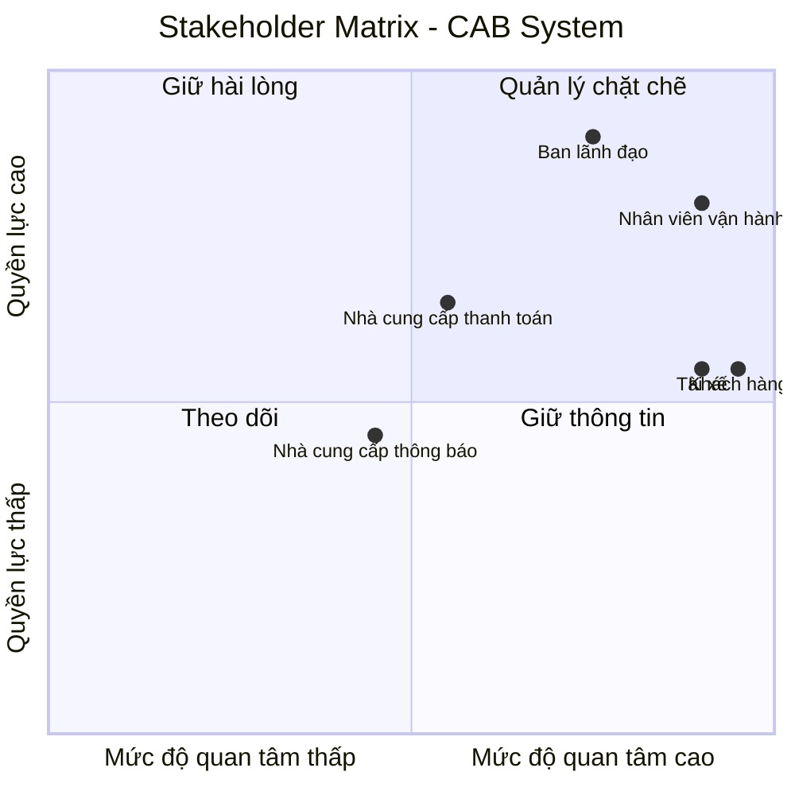
``` mermaid
quadrantChart
    title Stakeholder Matrix - CAB System
    x-axis "Mức độ quan tâm thấp" --> "Mức độ quan tâm cao"
    y-axis "Quyền lực thấp" --> "Quyền lực cao"

    quadrant-1 "Quản lý chặt chẽ"
    quadrant-2 "Giữ hài lòng"
    quadrant-3 "Theo dõi"
    quadrant-4 "Giữ thông tin"

    "Ban lãnh đạo": [0.75, 0.90]
    "Nhân viên vận hành": [0.90, 0.80]
    "Khách hàng": [0.95, 0.55]
    "Tài xế": [0.90, 0.55]
    "Nhà cung cấp thanh toán": [0.55, 0.65]
    "Nhà cung cấp thông báo": [0.45, 0.45]
``` 

**Bước 3: Mục đích của nghiệp vụ**
1. Tối ưu hóa và tự động hóa quy trình vận hành

Tự động hóa luồng phân công: Loại bỏ việc phân công thủ công từ tổng đài bằng cơ chế tự động tìm và ưu tiên tài xế phù hợp dựa trên vị trí GPS, loại xe và trạng thái sẵn sàng.

Tự động chuyển tiếp yêu cầu: Tự động luôn chuyển chuyến đi sang tài xế tiếp theo nếu tài xế đầu tiên từ chối hoặc không phản hồi, giúp khách hàng không phải tạo lại yêu cầu.

Rút ngắn thời gian chờ: Giảm tối đa thời gian chờ xe (ETA) của khách hàng nhờ cơ chế ưu tiên tài xế gần nhất.

2. Nâng cao trải nghiệm người dùng và linh hoạt thanh toán

Theo dõi thời gian thực: Cho phép khách hàng theo dõi vị trí tài xế, hành trình di chuyển và thời gian dự kiến đến ngay trên ứng dụng.

Đa dạng phương thức thanh toán: Hỗ trợ linh hoạt cả Thanh toán tiền mặt (trả trực tiếp cho tài xế) và Thanh toán điện tử / Chuyển khoản (tích hợp cổng thanh toán bên ngoài an toàn, không lưu trữ dữ liệu thẻ nhạy cảm).

Thông báo tức thời: Cung cấp hệ thống thông báo đa kênh (App Push, SMS, Email) ở các mốc quan trọng: nhận chuyến, tài xế đến, hoàn thành và kết quả thanh toán.

Đánh giá dịch vụ: Thu thập phản hồi và đánh giá từ khách hàng sau mỗi chuyến đi để nâng cao chất lượng tài xế.

3. Đảm bảo hiệu năng cao và chịu tải thời điểm nhu cầu tăng cao

Chịu tải cao đồng thời: Đảm bảo hệ thống hoạt động ổn định, mượt mà ngay cả khi có số lượng lớn khách hàng và tài xế cùng truy cập vào các khung giờ cao điểm (giờ tan tầm, thời tiết xấu, lễ tết).

Kiến trúc độc lập (Decoupled Architecture): Cách ly rủi ro để khi xảy ra sự cố ở các chức năng phụ như thanh toán hay thông báo thì luồng đặt xe cốt lõi vẫn hoạt động bình thường.

Mở rộng linh hoạt trong tương lai: Tạo tiền đề kỹ thuật để dễ dàng bổ sung thêm loại hình dịch vụ mới, phương thức thanh toán mới hoặc nhà cung cấp thông báo mới mà không phải xây dựng lại toàn bộ hệ thống.

4. Quản lý tập trung và hỗ trợ ra quyết định kinh doanh

Tập trung dữ liệu master: Quản lý tập trung toàn bộ thông tin khách hàng, tài xế, phương tiện, chuyến đi và lịch sử giao dịch trên một giao diện quản trị duy nhất.

Báo cáo và đo lường: Cung cấp cho Ban lãnh đạo hệ thống báo cáo chuyên sâu về doanh thu, tổng số chuyến, tỷ lệ hoàn thành, tỷ lệ hủy chuyến và hiệu suất hoạt động của tài xế.

Bảo mật và truy vết: Phân quyền truy cập theo vai trò (RBAC) để kiểm soát các thao tác nhạy cảm của nhân viên vận hành, đồng thời ghi nhận vết hệ thống (Audit Logs) phục vụ tra cứu khi xảy ra sự cố.

**Bước 4: Xác định phạm vi cần làm cho dự án trong 7 tuần**

**4.1. Phạm vi thực hiện**
a. Xác thực và quản lý người dùng (Authentication):
- Đăng ký, đăng nhập, đăng xuất.
- Xác thực người dùng.
- Phân quyền theo vai trò.

b. Hệ thống quản lý khách hàng:
- Quản lý thông tin khách hàng.
- Đặt xe.
- Theo dõi chuyến đi.
- Xem lịch sử chuyến đi.
- Đánh giá tài xế.

c. Hệ thống quản lý tài xế:
- Quản lý thông tin tài xế và phương tiện.
- Cập nhật trạng thái sẵn sàng.
- Nhận hoặc từ chối chuyến.
- Cập nhật trạng thái chuyến đi.

d. Hệ thống quản lý đặt xe và chuyến đi:
- Tiếp nhận yêu cầu đặt xe.
- Tìm và phân công tài xế phù hợp.
- Theo dõi trạng thái chuyến.
- Xử lý trường hợp tài xế từ chối hoặc không phản hồi.

e. Hệ thống tính cước và thanh toán:
- Tính số tiền chuyến đi.
- Hỗ trợ thanh toán tiền mặt.
- Hỗ trợ thanh toán điện tử thông qua nhà cung cấp bên ngoài.

f. Hệ thống thông báo:
- Thông báo các trạng thái chính của chuyến đi cho khách hàng và tài xế.

g. Hệ thống quản lý vận hành:
- Nhân viên vận hành quản lý khách hàng, tài xế, phương tiện và chuyến đi.
- Theo dõi và hỗ trợ xử lý các chuyến gặp sự cố.

**4.2. Ngoài phạm vi**
- AI/ML và các chức năng dự đoán nâng cao.
- Tính giá động.
- Khuyến mãi, tích điểm và chương trình thành viên.
- Phân tích dữ liệu nâng cao.
- Mở rộng nhiều loại hình dịch vụ.

### **4.3. Luồng cốt lõi trong 7 tuần**

| **Tuần**   | **Nội dung thực hiện**                                       |
| ---------- | ------------------------------------------------------------ |
| **Tuần 1** | Phân tích yêu cầu, xác định phạm vi và stakeholder           |
| **Tuần 2** | Phân tích nghiệp vụ, xác định quy trình và yêu cầu chức năng |
| **Tuần 3** | Thiết kế hệ thống và cơ sở dữ liệu                           |
| **Tuần 4** | Xây dựng module xác thực & quản lý người dùng                |
| **Tuần 5** | Xây dựng module quản lý khách hàng, tài xế & đặt xe          |
| **Tuần 6** | Xây dựng module chuyến đi, thanh toán & thông báo            |
| **Tuần 7** | Kiểm thử, sửa lỗi, hoàn thiện và triển khai hệ thống         |

**Bước 5: Chuyển các yêu cầu đó thành yêu cầu nghiệp vụ**

| **STT** | **Giai đoạn**      | **Quy trình nghiệp vụ**   | **Bước thực hiện**                                                         | **Tác nhân**                                | **Module hệ thống**    | **Thực thể dữ liệu**           |
| ------: | ------------------ | ------------------------- | -------------------------------------------------------------------------- | ------------------------------------------- | ---------------------- | ------------------------------ |
|       1 | Xác thực           | Đăng ký tài khoản         | Nhập thông tin → Kiểm tra → Tạo tài khoản                                  | Khách hàng, Tài xế                          | Xác thực & người dùng  | Người dùng                     |
|       2 | Xác thực           | Đăng nhập                 | Nhập tài khoản → Xác thực → Đăng nhập                                      | Khách hàng, Tài xế, NV vận hành             | Xác thực & người dùng  | Người dùng                     |
|       3 | Quản lý khách hàng | Cập nhật thông tin        | Xem → Chỉnh sửa → Lưu thông tin                                            | Khách hàng                                  | Quản lý khách hàng     | Khách hàng                     |
|       4 | Quản lý tài xế     | Quản lý tài xế            | Tạo/Cập nhật hồ sơ → Cập nhật phương tiện → Cập nhật trạng thái            | NV vận hành, Tài xế                         | Quản lý tài xế         | Tài xế, Phương tiện            |
|       5 | Đặt xe             | Tạo yêu cầu đặt xe        | Nhập điểm đón, điểm đến, loại xe → Gửi yêu cầu                             | Khách hàng                                  | Đặt xe                 | Yêu cầu đặt xe                 |
|       6 | Đặt xe             | Tìm tài xế                | Nhận yêu cầu → Tìm tài xế phù hợp → Ưu tiên tài xế gần                     | Hệ thống                                    | Phân công tài xế       | Yêu cầu đặt xe, Tài xế, Vị trí |
|       7 | Đặt xe             | Phân công tài xế          | Gửi yêu cầu → Tài xế nhận/từ chối → Tìm tài xế tiếp theo                   | Hệ thống, Tài xế                            | Phân công tài xế       | Chuyến đi, Tài xế              |
|       8 | Đặt xe             | Thông báo kết quả         | Tài xế nhận → Thông báo khách hàng / Không tìm được → Thông báo khách hàng | Hệ thống, Khách hàng                        | Thông báo              | Thông báo                      |
|       9 | Thực hiện chuyến   | Nhận chuyến               | Nhận thông báo → Xem thông tin → Chấp nhận/Từ chối                         | Tài xế                                      | Quản lý chuyến đi      | Chuyến đi, Tài xế              |
|      10 | Thực hiện chuyến   | Theo dõi chuyến           | Xem vị trí tài xế → Theo dõi trạng thái → Cập nhật thời gian đến           | Khách hàng                                  | Quản lý chuyến đi      | Chuyến đi, Vị trí              |
|      11 | Thực hiện chuyến   | Cập nhật trạng thái       | Đến điểm đón → Đón khách → Đang di chuyển → Hoàn thành                     | Tài xế                                      | Quản lý chuyến đi      | Chuyến đi                      |
|      12 | Vận hành           | Giám sát chuyến           | Xem chuyến đang diễn ra → Kiểm tra trạng thái → Hỗ trợ xử lý lỗi           | NV vận hành                                 | Quản lý vận hành       | Chuyến đi, Tài xế              |
|      13 | Thanh toán         | Tính cước                 | Hoàn thành chuyến → Xác định số tiền phải trả                              | Hệ thống                                    | Tính cước & thanh toán | Chuyến đi, Cước                |
|      14 | Thanh toán         | Thanh toán                | Chọn tiền mặt/điện tử → Thực hiện thanh toán → Ghi nhận kết quả            | Khách hàng, Tài xế, Nhà cung cấp thanh toán | Thanh toán             | Giao dịch                      |
|      15 | Thanh toán         | Xử lý thanh toán thất bại | Giao dịch thất bại → Thông báo → Thực hiện thanh toán lại                  | Khách hàng, Hệ thống                        | Thanh toán             | Giao dịch                      |
|      16 | Thông báo          | Gửi thông báo             | Phát sinh sự kiện → Xác định người nhận → Gửi thông báo                    | Hệ thống, KH, Tài xế                        | Thông báo              | Thông báo                      |
|      17 | Sau chuyến         | Lịch sử & đánh giá        | Hoàn thành chuyến → Xem lịch sử → Đánh giá tài xế                          | Khách hàng                                  | Lịch sử & đánh giá     | Chuyến đi, Đánh giá            |
|      18 | Báo cáo            | Báo cáo hoạt động         | Tổng hợp dữ liệu → Thống kê chuyến, doanh thu → Xem báo cáo                | NV vận hành, Ban lãnh đạo                   | Báo cáo & quản lý      | Chuyến đi, Giao dịch, Báo cáo  |


## **Bước 6: Phân rã các yêu cầu chức năng**

| **STT** | **Yêu cầu chức năng**         | **Các chức năng con cần thực hiện**                                                                                                                          |
| ------: | ----------------------------- | ------------------------------------------------------------------------------------------------------------------------------------------------------------ |
|   **1** | **Đăng ký tài khoản**         | Nhập thông tin → Kiểm tra thông tin → Tạo tài khoản → Thông báo đăng ký thành công                                                                           |
|   **2** | **Đăng nhập & xác thực**      | Nhập tài khoản/mật khẩu → Kiểm tra thông tin → Xác thực → Cấp quyền truy cập theo vai trò                                                                    |
|   **3** | **Quản lý khách hàng**        | Xem thông tin → Cập nhật thông tin cá nhân → Lưu thay đổi                                                                                                    |
|   **4** | **Quản lý tài xế**            | Tạo hồ sơ → Cập nhật thông tin → Quản lý phương tiện → Cập nhật trạng thái sẵn sàng                                                                          |
|   **5** | **Đặt xe**                    | Nhập điểm đón → Nhập điểm đến → Chọn loại xe → Kiểm tra thông tin → Gửi yêu cầu đặt xe                                                                       |
|   **6** | **Tìm tài xế**                | Xác định vị trí khách hàng → Lọc tài xế đang sẵn sàng → Kiểm tra loại xe → Tính khoảng cách → Ưu tiên tài xế phù hợp/gần khách hàng → Gửi yêu cầu cho tài xế |
|   **7** | **Phân công tài xế**          | Gửi chuyến cho tài xế → Chờ phản hồi → Tài xế chấp nhận → Xác nhận chuyến; nếu từ chối/không phản hồi → Tìm tài xế khác                                      |
|   **8** | **Thông báo nhận chuyến**     | Gửi thông báo cho tài xế → Thông báo tài xế nhận chuyến cho khách hàng → Cập nhật trạng thái chuyến                                                          |
|   **9** | **Theo dõi chuyến đi**        | Xác định vị trí tài xế → Hiển thị vị trí → Cập nhật trạng thái → Hiển thị thời gian dự kiến đến                                                              |
|  **10** | **Thực hiện chuyến**          | Tài xế đến điểm đón → Cập nhật “đã đến” → Đón khách → Cập nhật “đã đón” → Di chuyển → Hoàn thành chuyến                                                      |
|  **11** | **Giám sát chuyến**           | Nhân viên xem chuyến đang diễn ra → Kiểm tra vị trí/trạng thái → Hỗ trợ khi chuyến gặp sự cố                                                                 |
|  **12** | **Tính cước**                 | Xác định loại dịch vụ → Lấy thông tin chuyến → Tính số tiền → Hiển thị số tiền cần thanh toán                                                                |
|  **13** | **Thanh toán**                | Chọn phương thức → Thanh toán tiền mặt hoặc điện tử → Gửi yêu cầu thanh toán → Nhận kết quả giao dịch                                                        |
|  **14** | **Xử lý thanh toán thất bại** | Kiểm tra kết quả → Thông báo thất bại → Cho phép thực hiện lại theo chính sách                                                                               |
|  **15** | **Thông báo**                 | Xác định sự kiện → Xác định người nhận → Gửi thông báo → Ghi nhận trạng thái gửi                                                                             |
|  **16** | **Lịch sử chuyến đi**         | Lưu thông tin chuyến → Tìm kiếm lịch sử → Xem chi tiết chuyến → Xem số tiền đã thanh toán                                                                    |
|  **17** | **Đánh giá tài xế**           | Kiểm tra chuyến đã hoàn thành → Nhập đánh giá/rating → Lưu đánh giá                                                                                          |
|  **18** | **Quản lý & báo cáo**         | Tổng hợp dữ liệu → Thống kê số chuyến → Doanh thu → Tỷ lệ hoàn thành/hủy → Hiệu quả tài xế                                                                   |

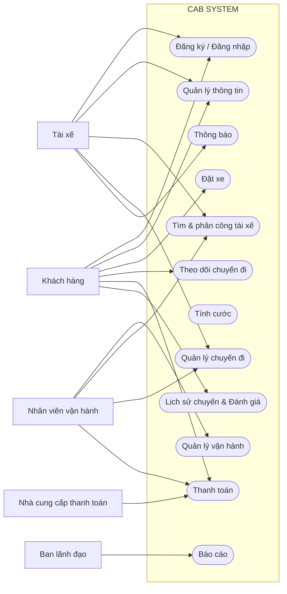
``` mermaid
flowchart LR
    KH["Khách hàng"]
    TX["Tài xế"]
    NV["Nhân viên vận hành"]
    LD["Ban lãnh đạo"]
    TT["Nhà cung cấp thanh toán"]

    subgraph CAB["CAB SYSTEM"]
        UC1(["Đăng ký / Đăng nhập"])
        UC2(["Quản lý thông tin"])
        UC3(["Đặt xe"])
        UC4(["Tìm & phân công tài xế"])
        UC5(["Theo dõi chuyến đi"])
        UC6(["Quản lý chuyến đi"])
        UC7(["Tính cước"])
        UC8(["Thanh toán"])
        UC9(["Thông báo"])
        UC10(["Lịch sử chuyến & Đánh giá"])
        UC11(["Quản lý vận hành"])
        UC12(["Báo cáo"])
    end

    KH --> UC1
    KH --> UC2
    KH --> UC3
    KH --> UC5
    KH --> UC8
    KH --> UC10

    TX --> UC1
    TX --> UC2
    TX --> UC4
    TX --> UC6
    TX --> UC9

    NV --> UC11
    NV --> UC4
    NV --> UC6
    NV --> UC8

    LD --> UC12

    TT --> UC8
```


# Bước 8: Đặc tả Use Case

### UC01 – Đăng ký tài khoản

| Thành phần         | Nội dung                                                                                                                                                                                                                |
| ------------------ | ----------------------------------------------------------------------------------------------------------------------------------------------------------------------------------------------------------------------- |
| **Tên Use Case**   | Đăng ký tài khoản                                                                                                                                                                                                       |
| **Mục tiêu**       | Cho phép khách hàng và tài xế tạo tài khoản để sử dụng hệ thống                                                                                                                                                         |
| **Tác nhân**       | Khách hàng, Tài xế                                                                                                                                                                                                      |
| **Tiền điều kiện** | Người dùng chưa có tài khoản trên hệ thống                                                                                                                                                                              |
| **Hậu điều kiện**  | Tài khoản được tạo thành công và có thể sử dụng để đăng nhập                                                                                                                                                            |
| **Luồng chính**    | 1. Người dùng chọn chức năng đăng ký → 2. Nhập thông tin cá nhân → 3. Hệ thống kiểm tra tính đầy đủ và hợp lệ → 4. Kiểm tra tài khoản đã tồn tại hay chưa → 5. Hệ thống tạo tài khoản → 6. Thông báo đăng ký thành công |
| **Ngoại lệ**       | Thông tin không đầy đủ hoặc không hợp lệ → hệ thống yêu cầu nhập lại; tài khoản đã tồn tại → hệ thống thông báo và yêu cầu sử dụng thông tin khác                                                                       |


### UC02 – Đăng nhập và xác thực

| Thành phần         | Nội dung                                                                                                                                                                                     |
| ------------------ | -------------------------------------------------------------------------------------------------------------------------------------------------------------------------------------------- |
| **Tên Use Case**   | Đăng nhập và xác thực                                                                                                                                                                        |
| **Mục tiêu**       | Xác thực người dùng và cho phép truy cập các chức năng phù hợp với vai trò                                                                                                                   |
| **Tác nhân**       | Khách hàng, Tài xế, Nhân viên vận hành, Ban lãnh đạo                                                                                                                                         |
| **Tiền điều kiện** | Người dùng đã có tài khoản                                                                                                                                                                   |
| **Hậu điều kiện**  | Người dùng đăng nhập thành công và được cấp quyền theo vai trò                                                                                                                               |
| **Luồng chính**    | 1. Người dùng nhập tài khoản và mật khẩu → 2. Hệ thống kiểm tra thông tin → 3. Xác thực tài khoản → 4. Xác định vai trò người dùng → 5. Cấp quyền truy cập → 6. Hiển thị giao diện tương ứng |
| **Ngoại lệ**       | Sai tài khoản hoặc mật khẩu → thông báo đăng nhập thất bại; tài khoản bị khóa → từ chối đăng nhập; người dùng không có quyền → từ chối truy cập chức năng                                    |


### UC03 – Quản lý thông tin khách hàng

| Thành phần         | Nội dung                                                                                                                                                                                                                                      |
| ------------------ | --------------------------------------------------------------------------------------------------------------------------------------------------------------------------------------------------------------------------------------------- |
| **Tên Use Case**   | Quản lý thông tin khách hàng                                                                                                                                                                                                                  |
| **Mục tiêu**       | Cho phép khách hàng xem và cập nhật thông tin cá nhân                                                                                                                                                                                         |
| **Tác nhân**       | Khách hàng                                                                                                                                                                                                                                    |
| **Tiền điều kiện** | Khách hàng đã đăng nhập                                                                                                                                                                                                                       |
| **Hậu điều kiện**  | Thông tin cá nhân được cập nhật thành công                                                                                                                                                                                                    |
| **Luồng chính**    | 1. Khách hàng chọn quản lý thông tin → 2. Hệ thống hiển thị thông tin hiện tại → 3. Khách hàng chỉnh sửa thông tin → 4. Hệ thống kiểm tra dữ liệu → 5. Khách hàng xác nhận → 6. Hệ thống lưu thông tin mới → 7. Thông báo cập nhật thành công |
| **Ngoại lệ**       | Thông tin không hợp lệ → yêu cầu nhập lại; xảy ra lỗi khi lưu → thông báo cập nhật thất bại                                                                                                                                                   |


### UC04 – Quản lý tài xế

| Thành phần         | Nội dung                                                                                                                                                                                                                                             |
| ------------------ | ---------------------------------------------------------------------------------------------------------------------------------------------------------------------------------------------------------------------------------------------------- |
| **Tên Use Case**   | Quản lý tài xế                                                                                                                                                                                                                                       |
| **Mục tiêu**       | Quản lý hồ sơ, phương tiện và trạng thái hoạt động của tài xế                                                                                                                                                                                        |
| **Tác nhân**       | Tài xế, Nhân viên vận hành                                                                                                                                                                                                                           |
| **Tiền điều kiện** | Tài xế hoặc nhân viên vận hành đã đăng nhập và có quyền                                                                                                                                                                                              |
| **Hậu điều kiện**  | Thông tin tài xế, phương tiện hoặc trạng thái hoạt động được cập nhật                                                                                                                                                                                |
| **Luồng chính**    | 1. Tài xế/Nhân viên chọn quản lý hồ sơ → 2. Hệ thống hiển thị thông tin → 3. Thêm hoặc cập nhật thông tin tài xế → 4. Cập nhật thông tin phương tiện → 5. Tài xế cập nhật trạng thái sẵn sàng/không sẵn sàng → 6. Hệ thống kiểm tra và lưu thông tin |
| **Ngoại lệ**       | Thông tin không hợp lệ → yêu cầu nhập lại; tài xế không đủ điều kiện hoạt động → không cho chuyển sang trạng thái sẵn sàng; người dùng không có quyền → từ chối thao tác                                                                             |


### UC05 – Đặt xe

| Thành phần         | Nội dung                                                                                                                                                                                                                |
| ------------------ | ----------------------------------------------------------------------------------------------------------------------------------------------------------------------------------------------------------------------- |
| **Tên Use Case**   | Đặt xe                                                                                                                                                                                                                  |
| **Mục tiêu**       | Cho phép khách hàng tạo yêu cầu đặt xe với điểm đón, điểm đến và loại xe mong muốn                                                                                                                                      |
| **Tác nhân**       | Khách hàng                                                                                                                                                                                                              |
| **Tiền điều kiện** | Khách hàng đã đăng nhập và tài khoản đang hoạt động                                                                                                                                                                     |
| **Hậu điều kiện**  | Yêu cầu đặt xe được tạo thành công và chuyển sang quá trình tìm tài xế                                                                                                                                                  |
| **Luồng chính**    | 1. Khách hàng chọn chức năng đặt xe → 2. Nhập điểm đón → 3. Nhập điểm đến → 4. Chọn loại xe → 5. Hệ thống kiểm tra thông tin → 6. Khách hàng xác nhận đặt xe → 7. Hệ thống tạo yêu cầu → 8. Hệ thống bắt đầu tìm tài xế |
| **Ngoại lệ**       | Không nhập đủ điểm đón/điểm đến → yêu cầu bổ sung; loại xe không khả dụng → thông báo và yêu cầu chọn loại xe khác; hệ thống không thể tiếp nhận yêu cầu → thông báo lỗi                                                |


### UC06 – Tìm và phân công tài xế

| Thành phần         | Nội dung                                                                                                                                                                                                                                                                                                                                                                                                                                   |
| ------------------ | ------------------------------------------------------------------------------------------------------------------------------------------------------------------------------------------------------------------------------------------------------------------------------------------------------------------------------------------------------------------------------------------------------------------------------------------ |
| **Tên Use Case**   | Tìm và phân công tài xế                                                                                                                                                                                                                                                                                                                                                                                                                    |
| **Mục tiêu**       | Tự động tìm và phân công tài xế phù hợp cho yêu cầu đặt xe                                                                                                                                                                                                                                                                                                                                                                                 |
| **Tác nhân**       | Hệ thống, Tài xế                                                                                                                                                                                                                                                                                                                                                                                                                           |
| **Tiền điều kiện** | Khách hàng đã tạo yêu cầu đặt xe hợp lệ                                                                                                                                                                                                                                                                                                                                                                                                    |
| **Hậu điều kiện**  | Một tài xế phù hợp được phân công cho chuyến hoặc khách hàng được thông báo không tìm được tài xế                                                                                                                                                                                                                                                                                                                                          |
| **Luồng chính**    | 1. Hệ thống xác định vị trí khách hàng → 2. Xác định loại xe khách hàng yêu cầu → 3. Quét các tài xế đang ở trạng thái sẵn sàng → 4. Lọc tài xế phù hợp với loại xe → 5. Tính khoảng cách giữa tài xế và khách hàng → 6. Xem xét các tiêu chí phù hợp của tài xế → 7. Ưu tiên tài xế phù hợp và gần khách hàng → 8. Gửi yêu cầu chuyến cho tài xế → 9. Chờ tài xế phản hồi → 10. Nếu tài xế chấp nhận, hệ thống xác nhận tài xế cho chuyến |
| **Ngoại lệ**       | Tài xế từ chối → hệ thống tiếp tục tìm tài xế khác; tài xế không phản hồi trong thời gian quy định → chuyển sang tài xế khác; không còn tài xế phù hợp → hệ thống thông báo cho khách hàng rằng chưa tìm được tài xế                                                                                                                                                                                                                       |


### UC07 – Nhận/Từ chối chuyến

| Thành phần         | Nội dung                                                                                                                                                                                                          |
| ------------------ | ----------------------------------------------------------------------------------------------------------------------------------------------------------------------------------------------------------------- |
| **Tên Use Case**   | Nhận/Từ chối chuyến                                                                                                                                                                                               |
| **Mục tiêu**       | Cho phép tài xế phản hồi yêu cầu chuyến được hệ thống gửi đến                                                                                                                                                     |
| **Tác nhân**       | Tài xế                                                                                                                                                                                                            |
| **Tiền điều kiện** | Tài xế đang ở trạng thái sẵn sàng và nhận được yêu cầu chuyến                                                                                                                                                     |
| **Hậu điều kiện**  | Chuyến được tài xế nhận hoặc hệ thống chuyển yêu cầu sang tài xế khác                                                                                                                                             |
| **Luồng chính**    | 1. Tài xế nhận thông báo có chuyến mới → 2. Xem thông tin điểm đón, điểm đến và loại xe → 3. Tài xế lựa chọn nhận hoặc từ chối → 4. Nếu nhận, hệ thống xác nhận tài xế → 5. Nếu từ chối, hệ thống tìm tài xế khác |
| **Ngoại lệ**       | Tài xế không phản hồi trong thời gian quy định → hệ thống tự động chuyển yêu cầu sang tài xế khác; chuyến đã được tài xế khác nhận → yêu cầu không còn khả dụng                                                   |


### UC08 – Theo dõi chuyến đi

| Thành phần         | Nội dung                                                                                                                                                                                                                   |
| ------------------ | -------------------------------------------------------------------------------------------------------------------------------------------------------------------------------------------------------------------------- |
| **Tên Use Case**   | Theo dõi chuyến đi                                                                                                                                                                                                         |
| **Mục tiêu**       | Cho phép khách hàng theo dõi vị trí tài xế và trạng thái chuyến theo thời gian thực                                                                                                                                        |
| **Tác nhân**       | Khách hàng                                                                                                                                                                                                                 |
| **Tiền điều kiện** | Chuyến đã được tài xế nhận                                                                                                                                                                                                 |
| **Hậu điều kiện**  | Khách hàng xem được trạng thái và vị trí hiện tại của chuyến                                                                                                                                                               |
| **Luồng chính**    | 1. Khách hàng mở thông tin chuyến → 2. Hệ thống hiển thị vị trí tài xế → 3. Hệ thống cập nhật trạng thái chuyến → 4. Hiển thị thời gian dự kiến tài xế đến → 5. Khách hàng tiếp tục theo dõi cho đến khi chuyến hoàn thành |
| **Ngoại lệ**       | Mất kết nối hoặc không nhận được dữ liệu vị trí → hiển thị vị trí/trạng thái cập nhật gần nhất và thông báo khi có dữ liệu mới                                                                                             |


### UC09 – Cập nhật trạng thái chuyến

| Thành phần         | Nội dung                                                                                                                                                                                                                          |
| ------------------ | --------------------------------------------------------------------------------------------------------------------------------------------------------------------------------------------------------------------------------- |
| **Tên Use Case**   | Cập nhật trạng thái chuyến                                                                                                                                                                                                        |
| **Mục tiêu**       | Cho phép tài xế cập nhật quá trình thực hiện chuyến                                                                                                                                                                               |
| **Tác nhân**       | Tài xế                                                                                                                                                                                                                            |
| **Tiền điều kiện** | Tài xế đã nhận chuyến                                                                                                                                                                                                             |
| **Hậu điều kiện**  | Trạng thái chuyến được cập nhật và khách hàng được thông báo                                                                                                                                                                      |
| **Luồng chính**    | 1. Tài xế di chuyển đến điểm đón → 2. Cập nhật trạng thái “Đã đến điểm đón” → 3. Đón khách → 4. Cập nhật “Đã đón khách” → 5. Bắt đầu di chuyển → 6. Cập nhật “Đang di chuyển” → 7. Đến điểm đến → 8. Cập nhật “Hoàn thành chuyến” |
| **Ngoại lệ**       | Tài xế không thể cập nhật trạng thái → hệ thống thông báo lỗi; chuyến gặp sự cố → nhân viên vận hành tiếp nhận và hỗ trợ                                                                                                          |


### UC10 – Quản lý và giám sát chuyến

| Thành phần         | Nội dung                                                                                                                                                                                                                                                                        |
| ------------------ | ------------------------------------------------------------------------------------------------------------------------------------------------------------------------------------------------------------------------------------------------------------------------------- |
| **Tên Use Case**   | Quản lý và giám sát chuyến                                                                                                                                                                                                                                                      |
| **Mục tiêu**       | Giúp nhân viên vận hành theo dõi và xử lý các chuyến đang diễn ra                                                                                                                                                                                                               |
| **Tác nhân**       | Nhân viên vận hành                                                                                                                                                                                                                                                              |
| **Tiền điều kiện** | Nhân viên đã đăng nhập và có quyền truy cập                                                                                                                                                                                                                                     |
| **Hậu điều kiện**  | Thông tin chuyến được cập nhật hoặc sự cố được xử lý                                                                                                                                                                                                                            |
| **Luồng chính**    | 1. Nhân viên xem danh sách các chuyến → 2. Chọn chuyến cần theo dõi → 3. Kiểm tra thông tin chuyến → 4. Kiểm tra trạng thái và vị trí tài xế → 5. Phát hiện trường hợp chuyến gặp sự cố → 6. Nhân viên hỗ trợ xử lý → 7. Cập nhật kết quả xử lý → 8. Hệ thống lưu lại thông tin |
| **Ngoại lệ**       | Không có quyền truy cập → hệ thống từ chối thao tác; không tìm thấy chuyến → thông báo không có dữ liệu; thông tin vị trí không được cập nhật → hiển thị trạng thái gần nhất                                                                                                    |


### UC11 – Tính cước

| Thành phần         | Nội dung                                                                                                                                                                                                             |
| ------------------ | -------------------------------------------------------------------------------------------------------------------------------------------------------------------------------------------------------------------- |
| **Tên Use Case**   | Tính cước chuyến đi                                                                                                                                                                                                  |
| **Mục tiêu**       | Xác định số tiền khách hàng cần thanh toán sau khi chuyến hoàn thành                                                                                                                                                 |
| **Tác nhân**       | Hệ thống                                                                                                                                                                                                             |
| **Tiền điều kiện** | Chuyến đã hoàn thành và có đầy đủ thông tin cần thiết                                                                                                                                                                |
| **Hậu điều kiện**  | Số tiền phải thanh toán được xác định và lưu vào thông tin chuyến                                                                                                                                                    |
| **Luồng chính**    | 1. Hệ thống nhận trạng thái chuyến hoàn thành → 2. Lấy thông tin loại dịch vụ → 3. Lấy thông tin chuyến đi → 4. Áp dụng quy tắc tính cước → 5. Xác định số tiền phải trả → 6. Lưu và hiển thị số tiền cho khách hàng |
| **Ngoại lệ**       | Thiếu thông tin cần thiết → không thể tính cước và thông báo lỗi; dữ liệu chuyến không hợp lệ → yêu cầu kiểm tra lại                                                                                                 |


### UC12 – Thanh toán

| Thành phần         | Nội dung                                                                                                                                                                                                                                                                                                                                            |
| ------------------ | --------------------------------------------------------------------------------------------------------------------------------------------------------------------------------------------------------------------------------------------------------------------------------------------------------------------------------------------------- |
| **Tên Use Case**   | Thanh toán                                                                                                                                                                                                                                                                                                                                          |
| **Mục tiêu**       | Cho phép khách hàng thanh toán chi phí chuyến đi                                                                                                                                                                                                                                                                                                    |
| **Tác nhân**       | Khách hàng, Nhà cung cấp thanh toán                                                                                                                                                                                                                                                                                                                 |
| **Tiền điều kiện** | Chuyến đã hoàn thành và hệ thống đã xác định số tiền cần thanh toán                                                                                                                                                                                                                                                                                 |
| **Hậu điều kiện**  | Giao dịch được ghi nhận thành công hoặc thất bại                                                                                                                                                                                                                                                                                                    |
| **Luồng chính**    | 1. Hệ thống hiển thị số tiền → 2. Khách hàng chọn phương thức thanh toán → 3. Nếu tiền mặt, khách hàng thanh toán trực tiếp cho tài xế → 4. Nếu điện tử, hệ thống chuyển yêu cầu đến nhà cung cấp thanh toán → 5. Nhà cung cấp xử lý giao dịch → 6. Trả kết quả về hệ thống → 7. Hệ thống ghi nhận kết quả thanh toán → 8. Thông báo cho khách hàng |
| **Ngoại lệ**       | Thanh toán điện tử thất bại → hệ thống thông báo cho khách hàng → cho phép thực hiện lại theo chính sách doanh nghiệp; nhà cung cấp thanh toán không phản hồi → ghi nhận giao dịch đang xử lý                                                                                                                                                       |


### UC13 – Xử lý thanh toán thất bại

| Thành phần         | Nội dung                                                                                                                                                                                                                      |
| ------------------ | ----------------------------------------------------------------------------------------------------------------------------------------------------------------------------------------------------------------------------- |
| **Tên Use Case**   | Xử lý thanh toán thất bại                                                                                                                                                                                                     |
| **Mục tiêu**       | Xử lý trường hợp giao dịch thanh toán điện tử không thành công                                                                                                                                                                |
| **Tác nhân**       | Khách hàng, Hệ thống, Nhà cung cấp thanh toán                                                                                                                                                                                 |
| **Tiền điều kiện** | Khách hàng đã thực hiện thanh toán điện tử nhưng giao dịch thất bại                                                                                                                                                           |
| **Hậu điều kiện**  | Thanh toán được thực hiện lại thành công hoặc giao dịch được ghi nhận là thất bại                                                                                                                                             |
| **Luồng chính**    | 1. Hệ thống nhận kết quả giao dịch thất bại → 2. Ghi nhận trạng thái → 3. Thông báo cho khách hàng → 4. Khách hàng chọn thực hiện lại → 5. Hệ thống gửi lại yêu cầu thanh toán → 6. Nhận kết quả mới → 7. Cập nhật trạng thái |
| **Ngoại lệ**       | Thanh toán lại tiếp tục thất bại → thông báo khách hàng và xử lý theo chính sách doanh nghiệp                                                                                                                                 |


### UC14 – Gửi thông báo

| Thành phần         | Nội dung                                                                                                                                             |
| ------------------ | ---------------------------------------------------------------------------------------------------------------------------------------------------- |
| **Tên Use Case**   | Gửi thông báo                                                                                                                                        |
| **Mục tiêu**       | Cung cấp thông tin kịp thời cho khách hàng và tài xế khi có sự kiện quan trọng                                                                       |
| **Tác nhân**       | Hệ thống                                                                                                                                             |
| **Tiền điều kiện** | Phát sinh sự kiện cần gửi thông báo                                                                                                                  |
| **Hậu điều kiện**  | Thông báo được gửi đến người nhận                                                                                                                    |
| **Luồng chính**    | 1. Hệ thống xác định sự kiện → 2. Xác định người nhận → 3. Xác định kênh thông báo → 4. Tạo nội dung → 5. Gửi thông báo → 6. Ghi nhận trạng thái gửi |
| **Ngoại lệ**       | Gửi thất bại → hệ thống ghi nhận lỗi và thực hiện lại theo cơ chế xử lý của hệ thống                                                                 |


### UC15 – Xem lịch sử chuyến

| Thành phần         | Nội dung                                                                                                                                                                                                 |
| ------------------ | -------------------------------------------------------------------------------------------------------------------------------------------------------------------------------------------------------- |
| **Tên Use Case**   | Xem lịch sử chuyến                                                                                                                                                                                       |
| **Mục tiêu**       | Cho phép khách hàng tra cứu các chuyến đã thực hiện                                                                                                                                                      |
| **Tác nhân**       | Khách hàng                                                                                                                                                                                               |
| **Tiền điều kiện** | Khách hàng đã đăng nhập                                                                                                                                                                                  |
| **Hậu điều kiện**  | Lịch sử chuyến được hiển thị                                                                                                                                                                             |
| **Luồng chính**    | 1. Khách hàng chọn lịch sử chuyến → 2. Hệ thống tìm các chuyến của khách hàng → 3. Hiển thị danh sách chuyến → 4. Khách hàng chọn một chuyến → 5. Hiển thị chi tiết chuyến, tài xế và số tiền thanh toán |
| **Ngoại lệ**       | Không có chuyến đã thực hiện → hệ thống thông báo chưa có lịch sử                                                                                                                                        |


### UC16 – Đánh giá tài xế

| Thành phần         | Nội dung                                                                                                                                                                   |
| ------------------ | -------------------------------------------------------------------------------------------------------------------------------------------------------------------------- |
| **Tên Use Case**   | Đánh giá tài xế                                                                                                                                                            |
| **Mục tiêu**       | Thu thập đánh giá và phản hồi của khách hàng sau chuyến đi                                                                                                                 |
| **Tác nhân**       | Khách hàng                                                                                                                                                                 |
| **Tiền điều kiện** | Chuyến đã hoàn thành và khách hàng chưa đánh giá chuyến                                                                                                                    |
| **Hậu điều kiện**  | Đánh giá được lưu vào hệ thống                                                                                                                                             |
| **Luồng chính**    | 1. Khách hàng chọn chuyến đã hoàn thành → 2. Chọn chức năng đánh giá → 3. Chọn số sao → 4. Nhập nhận xét nếu có → 5. Gửi đánh giá → 6. Hệ thống kiểm tra → 7. Lưu đánh giá |
| **Ngoại lệ**       | Chưa chọn mức đánh giá → yêu cầu bổ sung; chuyến đã được đánh giá → không cho đánh giá lại                                                                                 |


### UC17 – Quản lý vận hành

| Thành phần         | Nội dung                                                                                                                                                                                                                                  |
| ------------------ | ----------------------------------------------------------------------------------------------------------------------------------------------------------------------------------------------------------------------------------------- |
| **Tên Use Case**   | Quản lý vận hành                                                                                                                                                                                                                          |
| **Mục tiêu**       | Cho phép nhân viên vận hành quản lý các dữ liệu và hoạt động chính của hệ thống                                                                                                                                                           |
| **Tác nhân**       | Nhân viên vận hành                                                                                                                                                                                                                        |
| **Tiền điều kiện** | Nhân viên đã đăng nhập và được cấp quyền quản trị                                                                                                                                                                                         |
| **Hậu điều kiện**  | Thông tin khách hàng, tài xế, phương tiện, chuyến đi hoặc giao dịch được tra cứu/cập nhật                                                                                                                                                 |
| **Luồng chính**    | 1. Nhân viên đăng nhập → 2. Chọn chức năng quản lý → 3. Xem danh sách dữ liệu → 4. Tìm kiếm/tra cứu thông tin → 5. Thêm, sửa hoặc cập nhật thông tin khi có quyền → 6. Kiểm tra dữ liệu → 7. Lưu thay đổi → 8. Hệ thống ghi nhận thao tác |
| **Ngoại lệ**       | Không có quyền thực hiện thao tác → hệ thống từ chối; dữ liệu không hợp lệ → không cho lưu; không tìm thấy dữ liệu → thông báo không có kết quả                                                                                           |


### UC18 – Xem báo cáo hoạt động

| Thành phần         | Nội dung                                                                                                                                                                                                                                                            |
| ------------------ | ------------------------------------------------------------------------------------------------------------------------------------------------------------------------------------------------------------------------------------------------------------------- |
| **Tên Use Case**   | Xem báo cáo hoạt động                                                                                                                                                                                                                                               |
| **Mục tiêu**       | Cung cấp thông tin tổng hợp giúp ban lãnh đạo theo dõi tình hình hoạt động và ra quyết định                                                                                                                                                                         |
| **Tác nhân**       | Ban lãnh đạo, Nhân viên vận hành                                                                                                                                                                                                                                    |
| **Tiền điều kiện** | Người dùng đã đăng nhập và có quyền xem báo cáo                                                                                                                                                                                                                     |
| **Hậu điều kiện**  | Báo cáo được tổng hợp và hiển thị                                                                                                                                                                                                                                   |
| **Luồng chính**    | 1. Người dùng chọn chức năng báo cáo → 2. Chọn loại báo cáo/thời gian → 3. Hệ thống tổng hợp dữ liệu → 4. Tính toán các chỉ số → 5. Hiển thị số lượng chuyến → 6. Hiển thị doanh thu → 7. Hiển thị tỷ lệ hoàn thành/hủy → 8. Hiển thị hiệu quả hoạt động của tài xế |
| **Ngoại lệ**       | Không có dữ liệu trong khoảng thời gian được chọn → thông báo không có dữ liệu; người dùng không có quyền → từ chối truy cập                                                                                                                                        |

# **Bước 9: Phân tích quy trình nghiệp vụ**

## **UC01 – Đăng ký tài khoản**

### Quy trình nghiệp vụ

Người dùng
→ Chọn đăng ký
→ Nhập thông tin
→ Hệ thống kiểm tra thông tin
→ **Hợp lệ?**

* **Có** → Tạo tài khoản → Thông báo đăng ký thành công.
* **Không** → Thông báo lỗi → Nhập lại thông tin.

### Sequence

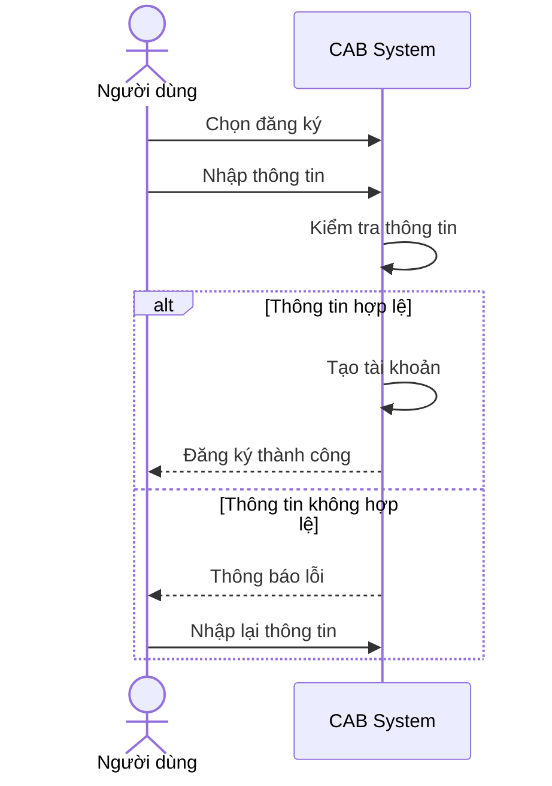
```mermaid
sequenceDiagram
    actor ND as Người dùng
    participant HT as CAB System

    ND->>HT: Chọn đăng ký
    ND->>HT: Nhập thông tin
    HT->>HT: Kiểm tra thông tin

    alt Thông tin hợp lệ
        HT->>HT: Tạo tài khoản
        HT-->>ND: Đăng ký thành công
    else Thông tin không hợp lệ
        HT-->>ND: Thông báo lỗi
        ND->>HT: Nhập lại thông tin
    end
```


# **UC02 – Đăng nhập và xác thực**

### Quy trình nghiệp vụ

Người dùng
→ Nhập tài khoản/mật khẩu
→ Hệ thống xác thực
→ **Thông tin đúng?**

* **Đúng** → Xác định vai trò → Cấp quyền → Đăng nhập thành công.
* **Sai** → Thông báo lỗi → Nhập lại.

### Sequence

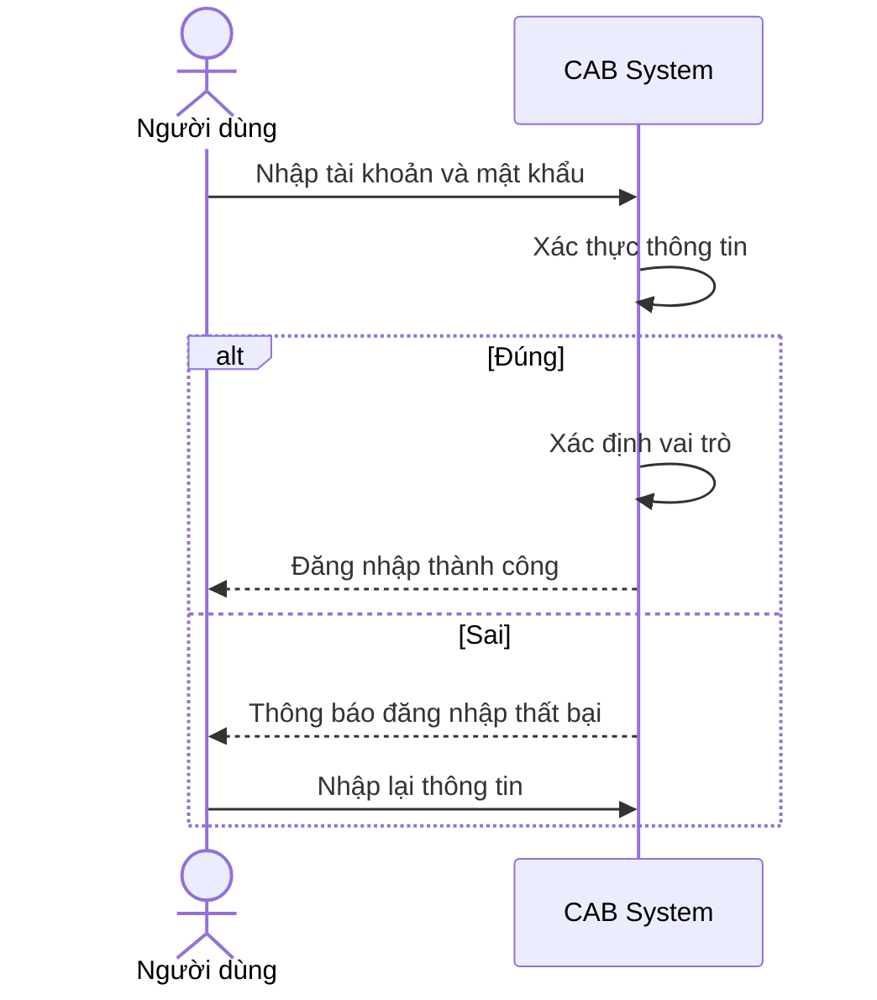
```mermaid
sequenceDiagram
    actor ND as Người dùng
    participant HT as CAB System

    ND->>HT: Nhập tài khoản và mật khẩu
    HT->>HT: Xác thực thông tin

    alt Đúng
        HT->>HT: Xác định vai trò
        HT-->>ND: Đăng nhập thành công
    else Sai
        HT-->>ND: Thông báo đăng nhập thất bại
        ND->>HT: Nhập lại thông tin
    end
```


# **UC03 – Quản lý thông tin khách hàng**

### Quy trình nghiệp vụ

Khách hàng
→ Đăng nhập
→ Xem thông tin cá nhân
→ Chỉnh sửa thông tin
→ Hệ thống kiểm tra
→ **Hợp lệ?**

* **Có** → Lưu thông tin mới.
* **Không** → Thông báo lỗi.

### Sequence

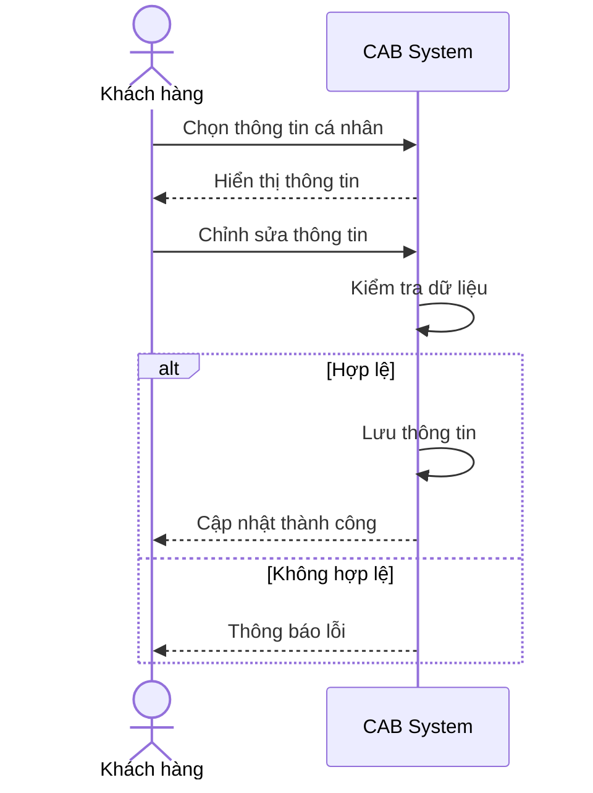
```mermaid
sequenceDiagram
    actor KH as Khách hàng
    participant HT as CAB System

    KH->>HT: Chọn thông tin cá nhân
    HT-->>KH: Hiển thị thông tin
    KH->>HT: Chỉnh sửa thông tin
    HT->>HT: Kiểm tra dữ liệu

    alt Hợp lệ
        HT->>HT: Lưu thông tin
        HT-->>KH: Cập nhật thành công
    else Không hợp lệ
        HT-->>KH: Thông báo lỗi
    end
```


# **UC04 – Quản lý tài xế**

### Quy trình nghiệp vụ

Tài xế/Nhân viên
→ Mở hồ sơ tài xế
→ Thêm/chỉnh sửa thông tin
→ Cập nhật phương tiện
→ Cập nhật trạng thái hoạt động
→ Hệ thống kiểm tra
→ Lưu dữ liệu.

### Sequence

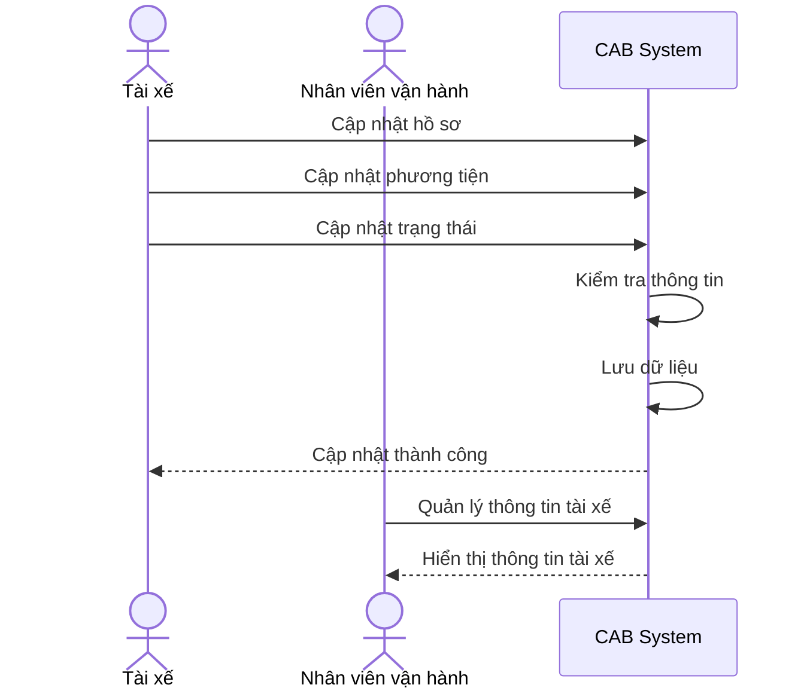
```mermaid
sequenceDiagram
    actor TX as Tài xế
    actor NV as Nhân viên vận hành
    participant HT as CAB System

    TX->>HT: Cập nhật hồ sơ
    TX->>HT: Cập nhật phương tiện
    TX->>HT: Cập nhật trạng thái
    HT->>HT: Kiểm tra thông tin
    HT->>HT: Lưu dữ liệu
    HT-->>TX: Cập nhật thành công

    NV->>HT: Quản lý thông tin tài xế
    HT-->>NV: Hiển thị thông tin tài xế
```


# **UC05 – Đặt xe**

### Quy trình nghiệp vụ

Khách hàng
→ Nhập điểm đón
→ Nhập điểm đến
→ Chọn loại xe
→ Xác nhận đặt xe
→ Hệ thống tạo chuyến
→ **Chuyển sang tìm tài xế.**

### Sequence

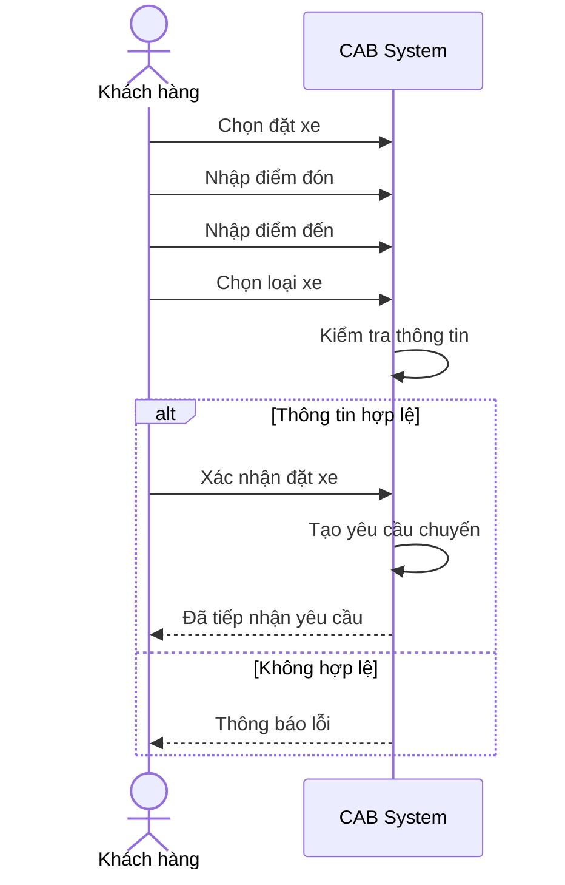
```mermaid
sequenceDiagram
    actor KH as Khách hàng
    participant HT as CAB System

    KH->>HT: Chọn đặt xe
    KH->>HT: Nhập điểm đón
    KH->>HT: Nhập điểm đến
    KH->>HT: Chọn loại xe
    HT->>HT: Kiểm tra thông tin

    alt Thông tin hợp lệ
        KH->>HT: Xác nhận đặt xe
        HT->>HT: Tạo yêu cầu chuyến
        HT-->>KH: Đã tiếp nhận yêu cầu
    else Không hợp lệ
        HT-->>KH: Thông báo lỗi
    end
```

# **UC06 – Tìm và phân công tài xế**

### Quy trình nghiệp vụ

Hệ thống nhận yêu cầu
→ Xác định vị trí khách hàng
→ Quét tài xế sẵn sàng
→ Kiểm tra loại xe
→ Tính khoảng cách
→ Chọn tài xế phù hợp
→ Gửi yêu cầu.

**Tài xế đồng ý** → Phân công tài xế.

**Tài xế từ chối/không phản hồi** → Tìm tài xế khác.

**Không còn tài xế** → Thông báo khách hàng.

### Sequence

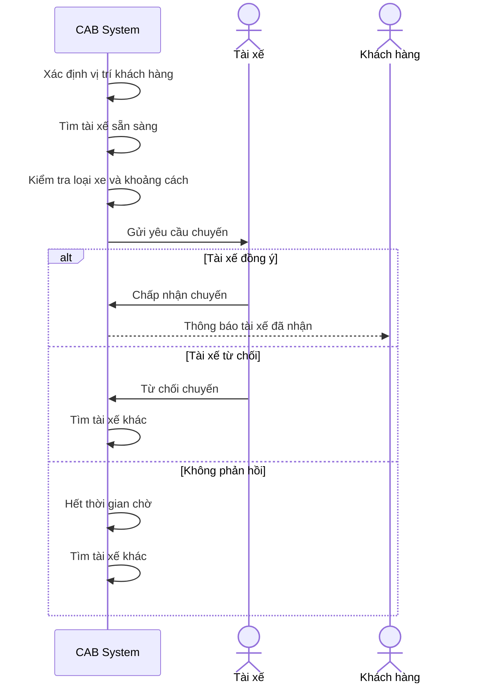
```mermaid
sequenceDiagram
    participant HT as CAB System
    actor TX as Tài xế
    actor KH as Khách hàng

    HT->>HT: Xác định vị trí khách hàng
    HT->>HT: Tìm tài xế sẵn sàng
    HT->>HT: Kiểm tra loại xe và khoảng cách
    HT->>TX: Gửi yêu cầu chuyến

    alt Tài xế đồng ý
        TX->>HT: Chấp nhận chuyến
        HT-->>KH: Thông báo tài xế đã nhận
    else Tài xế từ chối
        TX->>HT: Từ chối chuyến
        HT->>HT: Tìm tài xế khác
    else Không phản hồi
        HT->>HT: Hết thời gian chờ
        HT->>HT: Tìm tài xế khác
    end
```


# **UC07 – Nhận/Từ chối chuyến**

### Quy trình nghiệp vụ

Tài xế
→ Nhận thông báo
→ Xem thông tin chuyến
→ **Quyết định**

* **Nhận** → Xác nhận chuyến.
* **Từ chối** → Hệ thống tìm tài xế khác.
* **Không phản hồi** → Hệ thống chuyển tài xế khác.

### Sequence

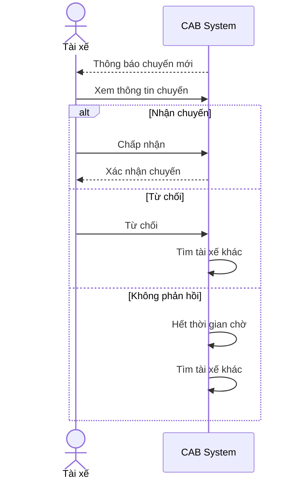
```mermaid
sequenceDiagram
    actor TX as Tài xế
    participant HT as CAB System

    HT-->>TX: Thông báo chuyến mới
    TX->>HT: Xem thông tin chuyến

    alt Nhận chuyến
        TX->>HT: Chấp nhận
        HT-->>TX: Xác nhận chuyến
    else Từ chối
        TX->>HT: Từ chối
        HT->>HT: Tìm tài xế khác
    else Không phản hồi
        HT->>HT: Hết thời gian chờ
        HT->>HT: Tìm tài xế khác
    end
```


# **UC08 – Theo dõi chuyến đi**

### Quy trình nghiệp vụ

Khách hàng
→ Mở chuyến đang thực hiện
→ Xem vị trí tài xế
→ Xem trạng thái chuyến
→ Xem thời gian dự kiến
→ Tiếp tục theo dõi đến khi chuyến hoàn thành.

### Sequence

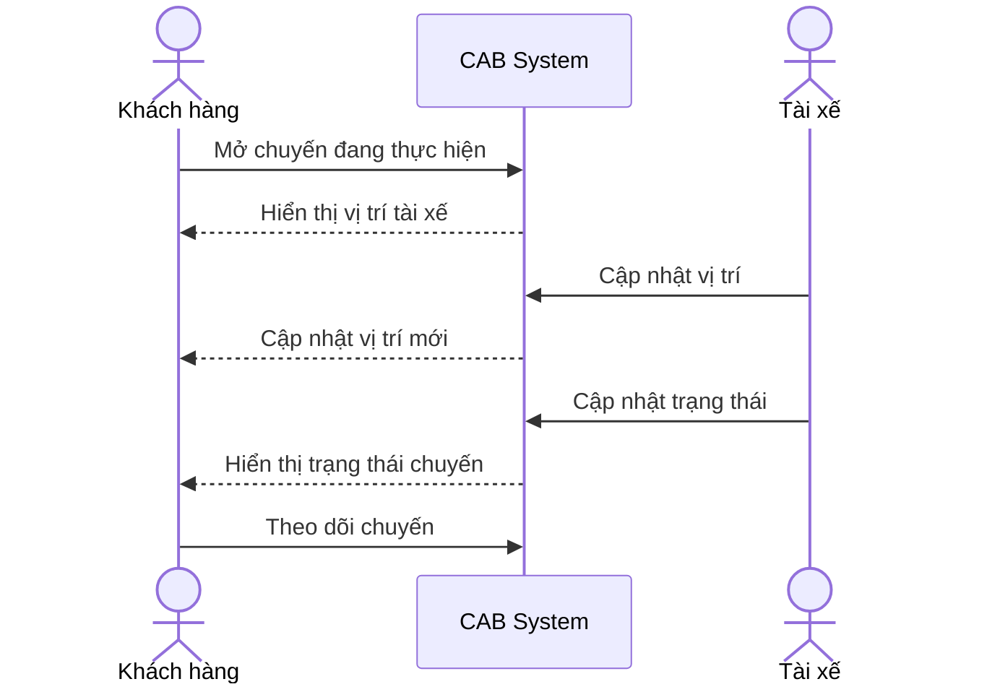
```mermaid
sequenceDiagram
    actor KH as Khách hàng
    participant HT as CAB System
    actor TX as Tài xế

    KH->>HT: Mở chuyến đang thực hiện
    HT-->>KH: Hiển thị vị trí tài xế
    TX->>HT: Cập nhật vị trí
    HT-->>KH: Cập nhật vị trí mới
    TX->>HT: Cập nhật trạng thái
    HT-->>KH: Hiển thị trạng thái chuyến
    KH->>HT: Theo dõi chuyến
```

# **UC09 – Cập nhật trạng thái chuyến**

### Quy trình nghiệp vụ

Tài xế nhận chuyến
→ Đến điểm đón
→ Cập nhật **Đã đến**
→ Đón khách
→ Cập nhật **Đã đón khách**
→ Di chuyển
→ Cập nhật **Đang di chuyển**
→ Đến điểm đến
→ Cập nhật **Hoàn thành**.

### Sequence

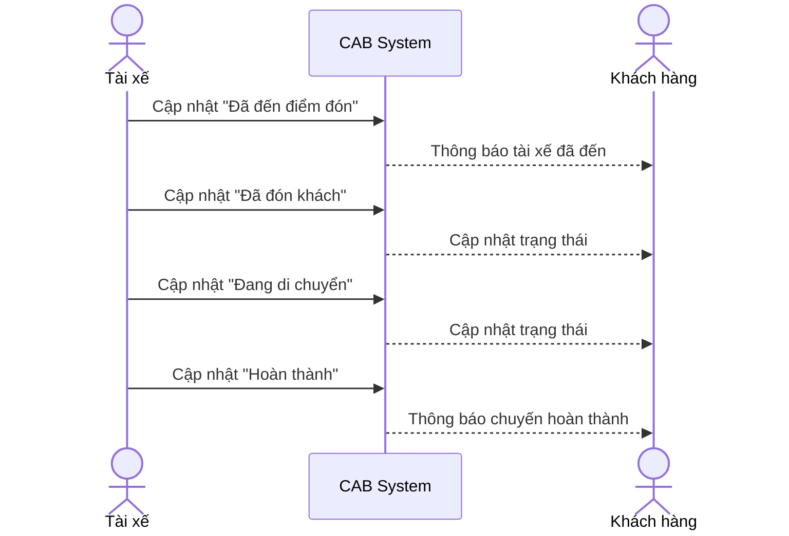
```mermaid
sequenceDiagram
    actor TX as Tài xế
    participant HT as CAB System
    actor KH as Khách hàng

    TX->>HT: Cập nhật "Đã đến điểm đón"
    HT-->>KH: Thông báo tài xế đã đến

    TX->>HT: Cập nhật "Đã đón khách"
    HT-->>KH: Cập nhật trạng thái

    TX->>HT: Cập nhật "Đang di chuyển"
    HT-->>KH: Cập nhật trạng thái

    TX->>HT: Cập nhật "Hoàn thành"
    HT-->>KH: Thông báo chuyến hoàn thành
```


# **UC10 – Quản lý và giám sát chuyến**

### Quy trình nghiệp vụ

Nhân viên vận hành
→ Xem danh sách chuyến
→ Chọn chuyến
→ Kiểm tra trạng thái/vị trí
→ **Có sự cố?**

* **Không** → Tiếp tục giám sát.
* **Có** → Xử lý sự cố → Cập nhật kết quả.

### Sequence

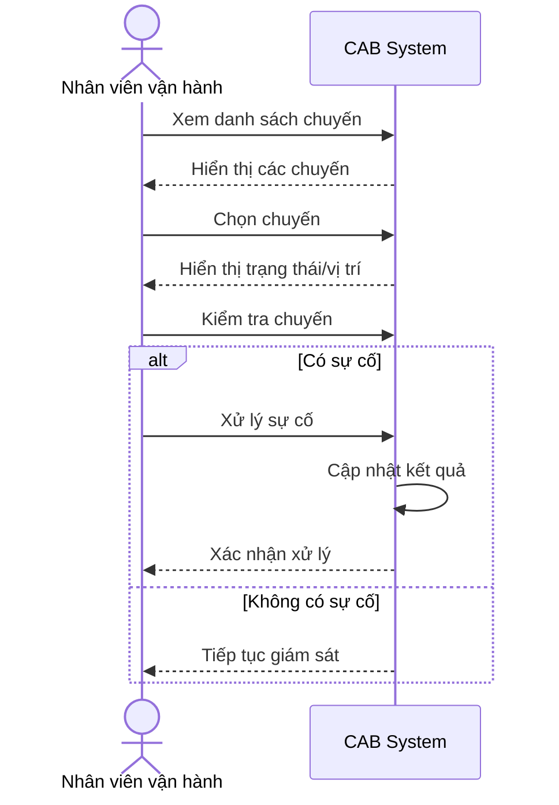
```mermaid
sequenceDiagram
    actor NV as Nhân viên vận hành
    participant HT as CAB System

    NV->>HT: Xem danh sách chuyến
    HT-->>NV: Hiển thị các chuyến
    NV->>HT: Chọn chuyến
    HT-->>NV: Hiển thị trạng thái/vị trí
    NV->>HT: Kiểm tra chuyến

    alt Có sự cố
        NV->>HT: Xử lý sự cố
        HT->>HT: Cập nhật kết quả
        HT-->>NV: Xác nhận xử lý
    else Không có sự cố
        HT-->>NV: Tiếp tục giám sát
    end
```


# **UC11 – Tính cước**

### Quy trình nghiệp vụ

Chuyến hoàn thành
→ Hệ thống lấy thông tin chuyến
→ Xác định loại dịch vụ
→ Tính cước
→ Lưu số tiền
→ Hiển thị cho khách hàng.

### Sequence

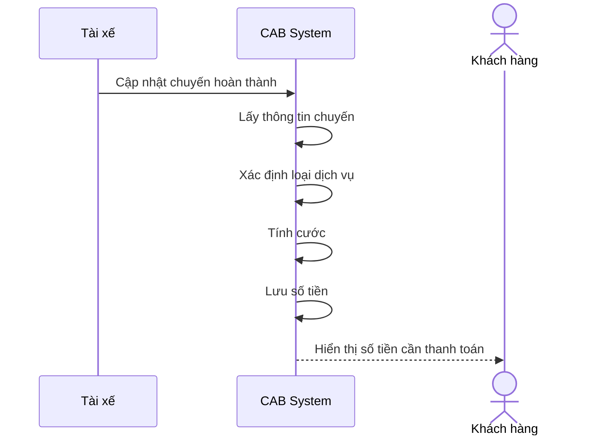
```mermaid
sequenceDiagram
    participant TX as Tài xế
    participant HT as CAB System
    actor KH as Khách hàng

    TX->>HT: Cập nhật chuyến hoàn thành
    HT->>HT: Lấy thông tin chuyến
    HT->>HT: Xác định loại dịch vụ
    HT->>HT: Tính cước
    HT->>HT: Lưu số tiền
    HT-->>KH: Hiển thị số tiền cần thanh toán
```


# **UC12 – Thanh toán**

### Quy trình nghiệp vụ

Chuyến hoàn thành
→ Tính cước
→ Khách hàng chọn phương thức thanh toán.

**Tiền mặt** → Thanh toán cho tài xế → Xác nhận.

**Điện tử** → Gửi nhà cung cấp thanh toán → Nhận kết quả.

### Sequence

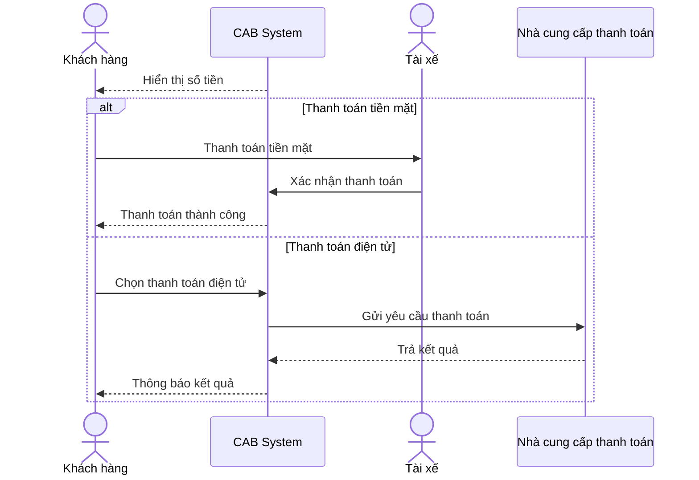
```mermaid
sequenceDiagram
    actor KH as Khách hàng
    participant HT as CAB System
    actor TX as Tài xế
    participant TT as Nhà cung cấp thanh toán

    HT-->>KH: Hiển thị số tiền

    alt Thanh toán tiền mặt
        KH->>TX: Thanh toán tiền mặt
        TX->>HT: Xác nhận thanh toán
        HT-->>KH: Thanh toán thành công
    else Thanh toán điện tử
        KH->>HT: Chọn thanh toán điện tử
        HT->>TT: Gửi yêu cầu thanh toán
        TT-->>HT: Trả kết quả
        HT-->>KH: Thông báo kết quả
    end
```


# **UC13 – Xử lý thanh toán thất bại**

### Quy trình nghiệp vụ

Thanh toán điện tử
→ Nhà cung cấp xử lý
→ **Thành công?**

* **Có** → Ghi nhận thanh toán.
* **Không** → Thông báo khách hàng → Thanh toán lại hoặc xử lý theo chính sách.

### Sequence

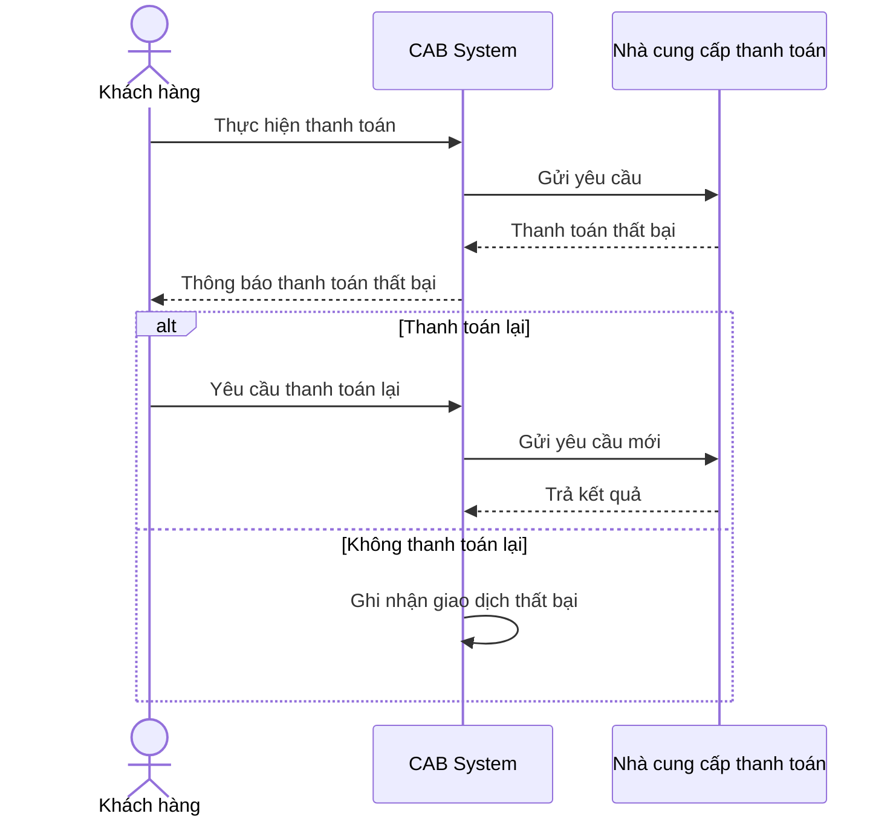
```mermaid
sequenceDiagram
    actor KH as Khách hàng
    participant HT as CAB System
    participant TT as Nhà cung cấp thanh toán

    KH->>HT: Thực hiện thanh toán
    HT->>TT: Gửi yêu cầu
    TT-->>HT: Thanh toán thất bại
    HT-->>KH: Thông báo thanh toán thất bại

    alt Thanh toán lại
        KH->>HT: Yêu cầu thanh toán lại
        HT->>TT: Gửi yêu cầu mới
        TT-->>HT: Trả kết quả
    else Không thanh toán lại
        HT->>HT: Ghi nhận giao dịch thất bại
    end
```


# **UC14 – Gửi thông báo**

### Quy trình nghiệp vụ

Phát sinh sự kiện
→ Hệ thống xác định người nhận
→ Tạo thông báo
→ Gửi thông báo
→ Ghi nhận trạng thái gửi.

### Sequence

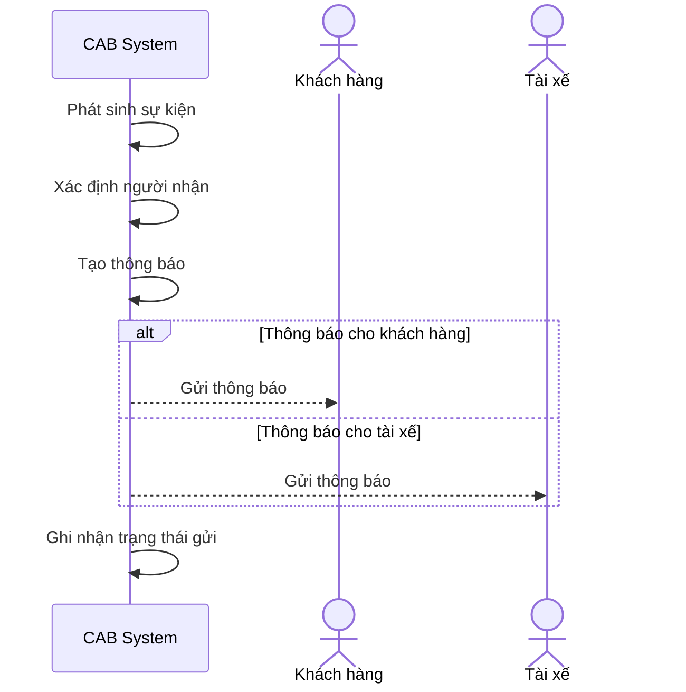
```mermaid
sequenceDiagram
    participant HT as CAB System
    actor KH as Khách hàng
    actor TX as Tài xế

    HT->>HT: Phát sinh sự kiện
    HT->>HT: Xác định người nhận
    HT->>HT: Tạo thông báo

    alt Thông báo cho khách hàng
        HT-->>KH: Gửi thông báo
    else Thông báo cho tài xế
        HT-->>TX: Gửi thông báo
    end

    HT->>HT: Ghi nhận trạng thái gửi
```


# **UC15 – Xem lịch sử chuyến**

### Quy trình nghiệp vụ

Khách hàng
→ Chọn lịch sử chuyến
→ Hệ thống lấy dữ liệu
→ Hiển thị danh sách
→ Khách hàng chọn chuyến
→ Xem chi tiết.

### Sequence

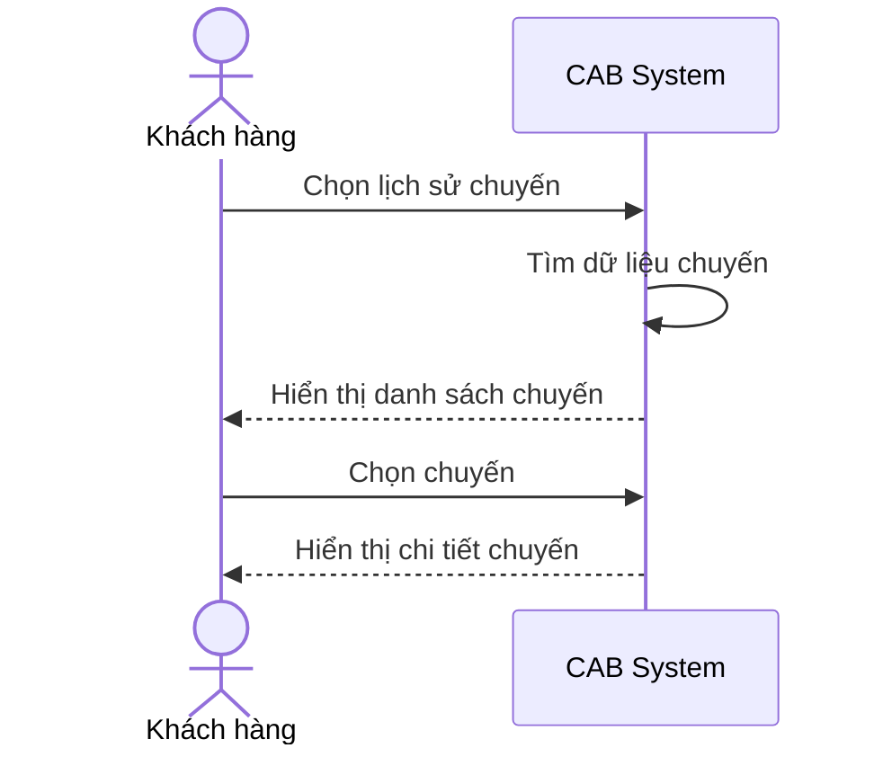
```mermaid
sequenceDiagram
    actor KH as Khách hàng
    participant HT as CAB System

    KH->>HT: Chọn lịch sử chuyến
    HT->>HT: Tìm dữ liệu chuyến
    HT-->>KH: Hiển thị danh sách chuyến
    KH->>HT: Chọn chuyến
    HT-->>KH: Hiển thị chi tiết chuyến
```


# **UC16 – Đánh giá tài xế**

### Quy trình nghiệp vụ

Chuyến hoàn thành
→ Khách hàng chọn đánh giá
→ Chọn số sao
→ Nhập nhận xét
→ Gửi đánh giá
→ Hệ thống kiểm tra
→ Lưu đánh giá.

### Sequence

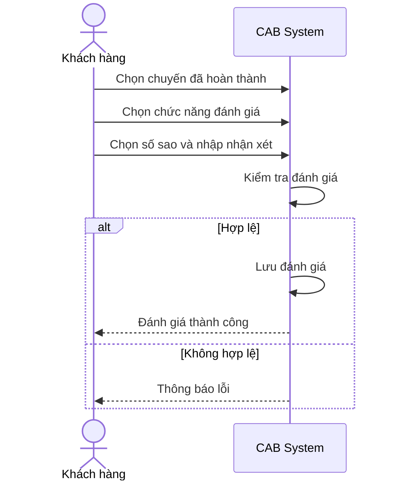
```mermaid
sequenceDiagram
    actor KH as Khách hàng
    participant HT as CAB System

    KH->>HT: Chọn chuyến đã hoàn thành
    KH->>HT: Chọn chức năng đánh giá
    KH->>HT: Chọn số sao và nhập nhận xét
    HT->>HT: Kiểm tra đánh giá

    alt Hợp lệ
        HT->>HT: Lưu đánh giá
        HT-->>KH: Đánh giá thành công
    else Không hợp lệ
        HT-->>KH: Thông báo lỗi
    end
```


# **UC17 – Quản lý vận hành**

### Quy trình nghiệp vụ

Nhân viên vận hành
→ Đăng nhập
→ Chọn chức năng quản lý
→ Quản lý khách hàng/tài xế/phương tiện/chuyến đi/giao dịch
→ Kiểm tra quyền
→ Cập nhật dữ liệu
→ Lưu và ghi vết thao tác.

### Sequence

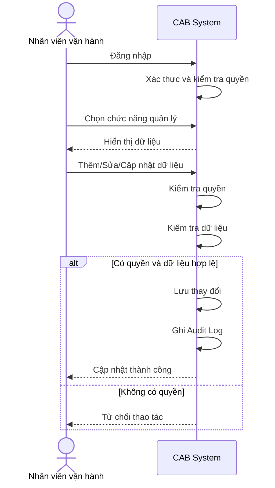
```mermaid
sequenceDiagram
    actor NV as Nhân viên vận hành
    participant HT as CAB System

    NV->>HT: Đăng nhập
    HT->>HT: Xác thực và kiểm tra quyền
    NV->>HT: Chọn chức năng quản lý
    HT-->>NV: Hiển thị dữ liệu
    NV->>HT: Thêm/Sửa/Cập nhật dữ liệu
    HT->>HT: Kiểm tra quyền
    HT->>HT: Kiểm tra dữ liệu

    alt Có quyền và dữ liệu hợp lệ
        HT->>HT: Lưu thay đổi
        HT->>HT: Ghi Audit Log
        HT-->>NV: Cập nhật thành công
    else Không có quyền
        HT-->>NV: Từ chối thao tác
    end
```


# **UC18 – Xem báo cáo hoạt động**

### Quy trình nghiệp vụ

Ban lãnh đạo
→ Chọn báo cáo
→ Chọn khoảng thời gian
→ Hệ thống tổng hợp dữ liệu
→ Tính toán chỉ số
→ Hiển thị báo cáo.

### Sequence

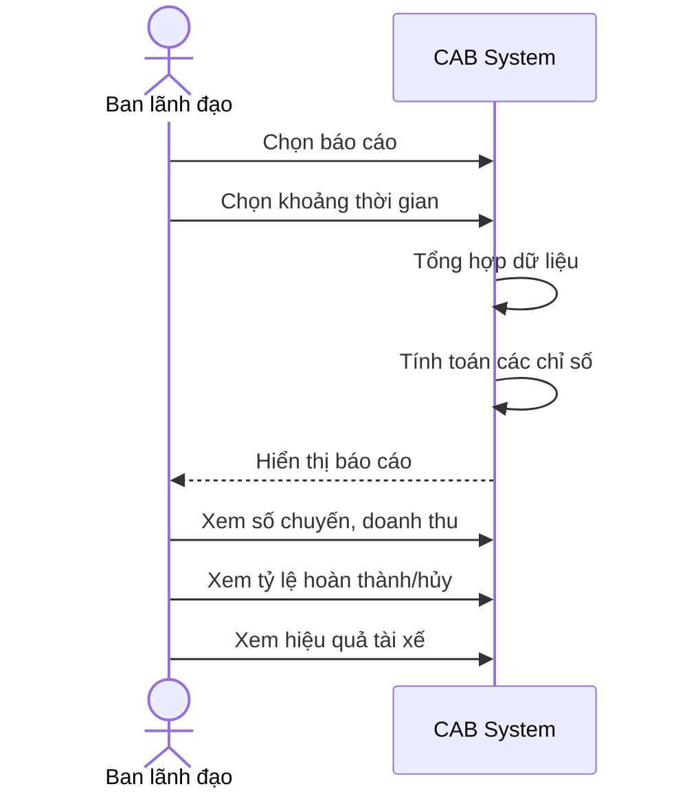
```mermaid
sequenceDiagram
    actor LD as Ban lãnh đạo
    participant HT as CAB System

    LD->>HT: Chọn báo cáo
    LD->>HT: Chọn khoảng thời gian
    HT->>HT: Tổng hợp dữ liệu
    HT->>HT: Tính toán các chỉ số
    HT-->>LD: Hiển thị báo cáo
    LD->>HT: Xem số chuyến, doanh thu
    LD->>HT: Xem tỷ lệ hoàn thành/hủy
    LD->>HT: Xem hiệu quả tài xế
```

### **Luồng nghiệp vụ chính của toàn hệ thống**

```text
Đăng ký/Đăng nhập
        ↓
   Đặt xe
        ↓
  Tìm tài xế
        ↓
 ┌──────┴────────┐
 ↓               ↓
Đồng ý       Từ chối/
 ↓           Không phản hồi
Thực hiện          ↓
chuyến       Tìm tài xế khác
 ↓               ↓
Hoàn thành    Không tìm được
 ↓               ↓
Tính cước     Thông báo KH
 ↓
Thanh toán
 ↓
Đánh giá
 ↓
Kết thúc
```

# **Bước 10: Phân tích quy tắc nghiệp vụ**

|    STT | Nhóm nghiệp vụ        | Quy tắc nghiệp vụ                                                                                                                |
| -----: | --------------------- | -------------------------------------------------------------------------------------------------------------------------------- |
|  **1** | Xác thực              | Người dùng phải đăng nhập và được xác thực trước khi sử dụng các chức năng yêu cầu tài khoản.                                    |
|  **2** | Phân quyền            | Người dùng chỉ được thực hiện các chức năng phù hợp với vai trò và quyền được cấp.                                               |
|  **3** | Trạng thái tài xế     | Chỉ tài xế có trạng thái **Sẵn sàng** mới được hệ thống đưa vào danh sách tìm tài xế.                                            |
|  **4** | Loại xe               | Tài xế được đề xuất phải có phương tiện phù hợp với loại xe mà khách hàng đã lựa chọn.                                           |
|  **5** | Vị trí tài xế         | Hệ thống ưu tiên tài xế có vị trí gần điểm đón của khách hàng.                                                                   |
|  **6** | Đánh giá tài xế       | Khi các tài xế có điều kiện phù hợp, hệ thống có thể **ưu tiên tài xế có rating cao hơn**.                                       |
|  **7** | Phân công tài xế      | Sau khi một tài xế chấp nhận chuyến, hệ thống phải xác nhận tài xế đó và không tiếp tục gửi cùng chuyến cho tài xế khác.         |
|  **8** | Tài xế từ chối        | Nếu tài xế từ chối chuyến, hệ thống phải tiếp tục tìm tài xế phù hợp khác.                                                       |
|  **9** | Tài xế không phản hồi | Nếu tài xế không phản hồi trong thời gian quy định, hệ thống chuyển yêu cầu sang tài xế khác. **Thời gian cụ thể chờ xác nhận.** |
| **10** | Không tìm được tài xế | Nếu không còn tài xế phù hợp, hệ thống phải thông báo rõ ràng cho khách hàng.                                                    |
| **11** | Trạng thái chuyến     | Chuyến đi phải được cập nhật theo trạng thái: **Đã nhận → Đã đến điểm đón → Đã đón khách → Đang di chuyển → Hoàn thành**.        |
| **12** | Theo dõi chuyến       | Khi chuyến đang diễn ra, hệ thống phải lưu/cập nhật thông tin vị trí tài xế để hỗ trợ theo dõi chuyến.                           |
| **13** | Tính cước             | Chỉ thực hiện tính cước sau khi chuyến đi hoàn thành.                                                                            |
| **14** | Thanh toán            | Khách hàng có thể thanh toán bằng **tiền mặt hoặc phương thức thanh toán điện tử**.                                              |
| **15** | Bảo mật thanh toán    | Thông tin nhạy cảm của thẻ hoặc tài khoản thanh toán không được lưu trực tiếp trong hệ thống CAB.                                |
| **16** | Thanh toán thất bại   | Nếu thanh toán điện tử thất bại, hệ thống phải thông báo cho khách hàng và cho phép xử lý lại theo chính sách doanh nghiệp.      |
| **17** | Đánh giá              | Khách hàng chỉ được đánh giá tài xế sau khi chuyến đi đã hoàn thành.                                                             |
| **18** | Quản trị              | Các thao tác quản trị phải được kiểm soát bằng quyền truy cập; thao tác quan trọng phải được lưu vết.                            |
| **19** | Thông báo             | Hệ thống phải gửi thông báo khi có các sự kiện quan trọng như nhận chuyến, tài xế đến, hoàn thành chuyến và kết quả thanh toán.  |
| **20** | Báo cáo               | Ban lãnh đạo được xem các báo cáo về số lượng chuyến, doanh thu, tỷ lệ hoàn thành, tỷ lệ hủy và hiệu quả tài xế.                 |


